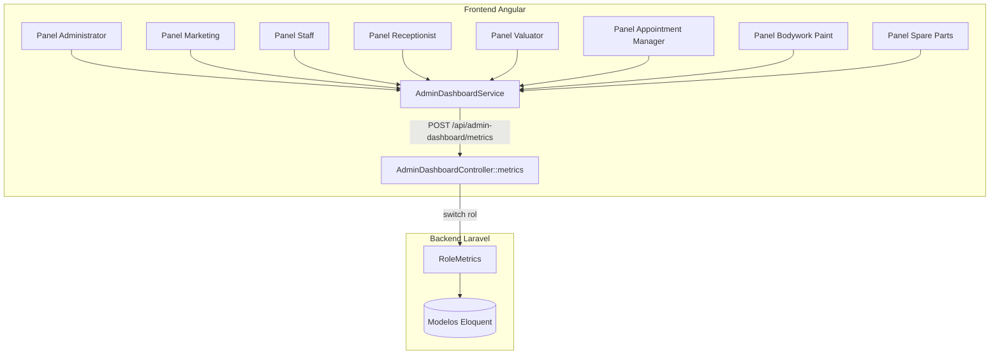
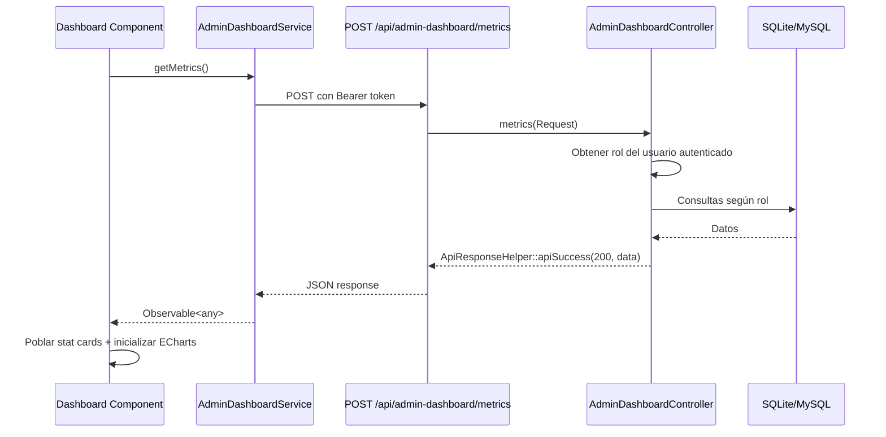

# Documento de Diseño — Dashboards Administrativos con Datos Reales por Rol

## Resumen

Este diseño describe la implementación de dashboards con métricas reales para los 8 paneles administrativos que actualmente solo muestran el componente Overview con tarjetas de navegación estáticas. Se creará un endpoint backend unificado (`AdminDashboardController::metrics`) que retorna métricas según el rol del usuario autenticado, un servicio Angular compartido (`AdminDashboardService`), y se migrará cada panel al patrón de sidebar layout establecido por gestor/store.

Los paneles developer, gestor y store ya cuentan con dashboards funcionales y no se modifican.

## Arquitectura

### Diagrama General



### Flujo de Datos



## Componentes e Interfaces

### Backend

#### AdminDashboardController

- Ubicación: `vecsa-backend/app/Http/Controllers/AdminDashboard/AdminDashboardController.php`
- Método: `metrics(Request $request)`
- Ruta: `POST /api/admin-dashboard/metrics`
- Middleware: `auth:sanctum`
- Lógica: Obtiene el rol del usuario con `$request->user()->getRoleNames()->first()`, ejecuta un switch para retornar métricas específicas por rol.

#### Respuesta por Rol

Cada rol retorna un objeto con `stats` (array de stat cards) y `charts` (datos para gráficas):

```php
// Ejemplo respuesta administrator
{
  "status": 200,
  "message": "Métricas obtenidas",
  "data": {
    "stats": {
      "vehicles": 150,
      "products": 45,
      "orders": 23,
      "users": 12,
      "customers": 340,
      "dealerships": 6,
      "valuations": 18,
      "appointments": 7
    },
    "charts": {
      "orders_by_month": [{"month": "2026-01", "count": 5}, ...],
      "orders_by_status": [{"status": "pendiente", "count": 3}, ...]
    }
  }
}
```

### Frontend

#### AdminDashboardService

- Ubicación: `vecsa-frontend/src/app/admin/shared/services/admin-dashboard.service.ts`
- `providedIn: 'root'`
- Método: `getMetrics(): Observable<any>`
- Headers: `Authorization: Bearer {user_token}`, `Content-Type: application/json`, `X-Requested-With: XMLHttpRequest`
- URL: `${environment.baseUrl}/api/admin-dashboard/metrics`

#### Layout Components (1 por panel)

Cada panel que necesita migración recibe un layout component siguiendo el patrón de `GestorLayoutComponent`:

| Panel | Layout Component | Ruta base |
|-------|-----------------|-----------|
| administrator | `AdminLayoutComponent` | `/admin/administrator` |
| marketing | `MarketingLayoutComponent` | `/admin/marketing` |
| staff | `StaffLayoutComponent` | `/admin/staff` |
| receptionist | `ReceptionistLayoutComponent` | `/admin/receptionist` |
| valuator | `ValuatorLayoutComponent` | `/admin/valuator` |
| appointment_manager | `AppointmentManagerLayoutComponent` | `/admin/appointment_manager` |
| bodywork_paint_technician | `BodyworkLayoutComponent` | `/admin/bodywork_paint_technician` |
| spare_parts | `SparePartsLayoutComponent` | `/admin/spare_parts` |

Cada layout component:
- Usa el HTML/CSS del patrón gestor-layout (sidebar fijo 250px, nav items, avatar, logout)
- Define `navItems` específicos del panel
- Agrega `dynamicItems` para Tienda/Benchmark según permisos en localStorage
- Contiene `<router-outlet>` para las vistas hijas

#### Dashboard Components (actualización)

Cada panel ya tiene un dashboard component existente. Se actualizan para:
1. Inyectar `AdminDashboardService`
2. Definir array `stats` con stat cards (label, value, icon, color, loading)
3. Usar `@ViewChild` para refs de ECharts (donde aplique)
4. Llamar `getMetrics()` en `ngOnInit` y poblar stats + charts
5. Manejar resize de gráficas con `window.addEventListener('resize', ...)`

### Estructura de Stat Card

```typescript
interface StatCard {
  label: string;
  value: string | number;
  icon: string;    // Material Icons name
  color: string;   // Hex color
  loading: boolean;
}
```

### Configuración de Nav Items por Panel

| Panel | Nav Items |
|-------|-----------|
| administrator | Dashboard, Usuarios, Permisos, Boutique |
| marketing | Dashboard, Vehículos, Home Slides, Testimonios |
| staff | Dashboard, Registro de KM, Registro de Compras |
| receptionist | Dashboard, Formulario de Recepción |
| valuator | Dashboard, Citas de Valuación |
| appointment_manager | Dashboard, Asignar Citas |
| bodywork_paint_technician | Dashboard, Hojalatería y Pintura |
| spare_parts | Dashboard, Refacciones |

## Modelos de Datos

### Modelos Eloquent Utilizados por Rol

| Rol | Modelos |
|-----|---------|
| administrator | Vehicle, BoutiqueProduct, BoutiqueOrder, User, Customer, Dealership, VehicleValuation, CustomerAppointment |
| marketing | MarketingCampaign, MarketingPromotion, MarketingEvent, Vehicle |
| staff | Customer, Reward, CustomerReward |
| gestor | MarketingPromotion, MarketingEvent, Reward |
| receptionist | CustomerAppointment |
| valuator | VehicleValuation |
| appointment_manager | CustomerAppointment |
| bodywork_paint_technician | VehicleValuation (filtrado por status_repairs) |
| spare_parts | VehicleValuation (filtrado por status_parts) |

### Consultas SQLite-Compatible

Todas las consultas de fecha usan `Carbon::now()->subMonths($i)->startOfMonth()` / `endOfMonth()` con `whereBetween('created_at', [$start, $end])` en lugar de `YEAR()` / `MONTH()` de MySQL, siguiendo el patrón establecido en `StoreManagementController::dashboard`.

### Stat Cards por Rol

**administrator:**
| Stat | Icon | Color | Query |
|------|------|-------|-------|
| Vehículos | directions_car | #1c69d4 | `Vehicle::count()` |
| Productos | inventory_2 | #7c3aed | `BoutiqueProduct::where('active', true)->count()` |
| Pedidos | receipt_long | #059669 | `BoutiqueOrder::count()` |
| Usuarios | people | #d97706 | `User::count()` |
| Clientes | person | #dc2626 | `Customer::count()` |
| Sucursales | store | #0891b2 | `Dealership::count()` |
| Valuaciones | price_check | #4f46e5 | `VehicleValuation::count()` |
| Citas | event | #be185d | `CustomerAppointment::count()` |

**marketing:**
| Stat | Icon | Color | Query |
|------|------|-------|-------|
| Campañas activas | campaign | #1c69d4 | `MarketingCampaign::where('status', 'active')->count()` |
| Promociones | local_offer | #7c3aed | `MarketingPromotion::count()` |
| Eventos | event | #059669 | `MarketingEvent::count()` |
| Vehículos publicados | directions_car | #d97706 | `Vehicle::where('status', 'available')->count()` |

**staff:**
| Stat | Icon | Color | Query |
|------|------|-------|-------|
| Clientes | people | #1c69d4 | `Customer::count()` |
| Recompensas activas | emoji_events | #059669 | `Reward::where('status', 'active')->count()` |
| Total puntos | stars | #d97706 | `CustomerReward::sum('points')` |

**receptionist:**
| Stat | Icon | Color | Query |
|------|------|-------|-------|
| Citas hoy | today | #1c69d4 | `CustomerAppointment::whereDate('scheduled_date', today())->count()` |
| Citas semana | date_range | #059669 | `CustomerAppointment::whereBetween('scheduled_date', [startOfWeek, endOfWeek])->count()` |
| Total citas | event | #d97706 | `CustomerAppointment::count()` |

**valuator:**
| Stat | Icon | Color | Query |
|------|------|-------|-------|
| Pendientes | pending | #f59e0b | `VehicleValuation::where('status', 'pending')->count()` |
| En progreso | autorenew | #1c69d4 | `VehicleValuation::where('status', 'in_progress')->count()` |
| Completadas | check_circle | #059669 | `VehicleValuation::where('status', 'completed')->count()` |
| Total | price_check | #7c3aed | `VehicleValuation::count()` |

**appointment_manager:**
| Stat | Icon | Color | Query |
|------|------|-------|-------|
| Citas hoy | today | #1c69d4 | `CustomerAppointment::whereDate('scheduled_date', today())->count()` |
| Citas semana | date_range | #059669 | `CustomerAppointment::whereBetween(...)` |
| Pendientes asignar | assignment_late | #f59e0b | `CustomerAppointment::whereNull('valuator_uuid')->count()` |
| Total | event | #7c3aed | `CustomerAppointment::count()` |

**bodywork_paint_technician:**
| Stat | Icon | Color | Query |
|------|------|-------|-------|
| Pendientes | pending | #f59e0b | `VehicleValuation::where('status_repairs', 'pending')->count()` |
| En progreso | autorenew | #1c69d4 | `VehicleValuation::where('status_repairs', 'in_progress')->count()` |
| Completadas | check_circle | #059669 | `VehicleValuation::where('status_repairs', 'completed')->count()` |

**spare_parts:**
| Stat | Icon | Color | Query |
|------|------|-------|-------|
| Pendientes | pending | #f59e0b | `VehicleValuation::where('status_parts', 'pending')->count()` |
| En revisión | search | #1c69d4 | `VehicleValuation::where('status_parts', 'pending_review')->count()` |
| Completadas | check_circle | #059669 | `VehicleValuation::where('status_parts', 'parts_done')->count()` |

### Gráficas por Rol

| Rol | Gráfica 1 | Gráfica 2 |
|-----|-----------|-----------|
| administrator | Barras: pedidos por mes (6 meses) | Pie: pedidos por estatus |
| marketing | Pie: vehículos por marca | — |
| gestor | Barras: eventos por mes (6 meses) | — |
| receptionist | Pie: citas por tipo | — |
| valuator | Pie: valuaciones por estatus | — |
| appointment_manager | Barras: citas por mes (6 meses) | — |
| bodywork_paint_technician | Pie: reparaciones por estatus | — |
| spare_parts | Pie: refacciones por estatus | — |
| staff | — (sin gráficas) | — |


## Propiedades de Correctitud

*Una propiedad es una característica o comportamiento que debe mantenerse verdadero en todas las ejecuciones válidas de un sistema — esencialmente, una declaración formal sobre lo que el sistema debe hacer. Las propiedades sirven como puente entre especificaciones legibles por humanos y garantías de correctitud verificables por máquina.*

### Propiedad 1: Métricas por rol retornan estructura esperada

*Para cualquier* usuario autenticado con un rol reconocido (administrator, marketing, staff, receptionist, valuator, appointment_manager, bodywork_paint_technician, spare_parts), el endpoint de métricas debe retornar un objeto con claves `stats` y `charts`, donde `stats` contiene únicamente valores numéricos (enteros ≥ 0) y `charts` contiene arrays de objetos con las claves esperadas para ese rol.

**Valida: Requisitos 1.1, 1.2, 1.3, 1.4, 1.5, 1.6, 1.7, 1.8, 1.9, 1.10**

### Propiedad 2: Stat cards muestran todos los elementos requeridos

*Para cualquier* configuración de stat card en cualquier panel, la tarjeta renderizada debe contener un icono Material Icons válido, una etiqueta descriptiva no vacía, un valor numérico obtenido de la API, y un color hexadecimal distintivo.

**Valida: Requisitos 2.1, 2.4**

### Propiedad 3: Gráficas se inicializan cuando hay datos

*Para cualquier* panel cuya respuesta de métricas contenga datos de gráficas (arrays no vacíos en `charts`), el componente dashboard debe inicializar una instancia ECharts con los datos recibidos y registrar un listener de resize.

**Valida: Requisitos 3.1, 3.11**

### Propiedad 4: Sidebar contiene todos los elementos estructurales

*Para cualquier* panel con sidebar layout, el sidebar debe contener: nombre del panel, avatar con inicial del usuario, nombre del usuario, rol, al menos un enlace de navegación, enlace "Ir al inicio" y botón "Cerrar sesión".

**Valida: Requisitos 4.1, 4.2**

### Propiedad 5: Items dinámicos del sidebar según permisos

*Para cualquier* conjunto de permisos del usuario almacenados en localStorage, si el conjunto incluye "access store_management" entonces el sidebar debe mostrar el enlace "Tienda", y si incluye "access benchmark" debe mostrar "Benchmark ADS". Si no incluye ninguno, no debe mostrar items dinámicos.

**Valida: Requisitos 4.13, 4.14**

### Propiedad 6: Headers HTTP correctos en solicitudes del servicio

*Para cualquier* solicitud realizada por AdminDashboardService, los headers deben incluir `Authorization: Bearer {token}` con el token de localStorage, `Content-Type: application/json`, y `X-Requested-With: XMLHttpRequest`.

**Valida: Requisitos 5.2, 5.4**

### Propiedad 7: Tarjetas de navegación rápida contienen elementos requeridos

*Para cualquier* tarjeta de navegación rápida en cualquier dashboard, la tarjeta debe contener un icono Material Icons, el nombre del módulo no vacío, y un enlace funcional a la ruta del módulo.

**Valida: Requisitos 6.1, 6.2, 6.3**

## Manejo de Errores

### Backend

| Escenario | Código HTTP | Respuesta |
|-----------|-------------|-----------|
| Usuario no autenticado | 401 | `{"status": 401, "message": "Unauthenticated"}` (Sanctum default) |
| Rol no reconocido | 200 | `{"status": 200, "data": {"stats": {}, "charts": {}}}` |
| Error en consulta DB | 500 | `ApiResponseHelper::apiError(...)` con código `DASHBOARD_METRICS_ERROR` |
| Modelo no encontrado | 200 | Conteo retorna 0 (Eloquent count() nunca falla) |

### Frontend

| Escenario | Comportamiento |
|-----------|---------------|
| API retorna error (4xx/5xx) | Stat cards muestran "Error" como valor, `loading = false` |
| API en progreso | Stat cards muestran "—" con `loading = true` |
| Datos de gráfica vacíos | ECharts muestra título "Sin datos" centrado en gris |
| Token expirado/inválido | 401 → stat cards muestran "Error" |
| Timeout de red | Error handler → stat cards muestran "Error" |

## Estrategia de Testing

### Testing Dual

Se utilizan tanto tests unitarios como tests basados en propiedades para cobertura completa.

### Tests Unitarios (PHPUnit + Jasmine/Karma)

**Backend (PHPUnit):**
- Test por cada rol verificando las claves exactas en la respuesta (1.2-1.10)
- Test de usuario no autenticado retorna 401 (1.11)
- Test de rol no reconocido retorna objeto vacío (1.12)
- Test de error de base de datos retorna 500

**Frontend (Jasmine/Karma):**
- Test de cada dashboard component cargando stat cards correctas para su rol (2.5-2.13)
- Test de estado de carga (loading = true antes de respuesta) (2.2)
- Test de estado de error (API falla → "Error") (2.3)
- Test de gráficas específicas por panel (3.2-3.9)
- Test de gráfica vacía muestra "Sin datos" (3.10)
- Test de nav items específicos por panel (4.5-4.12)
- Test de AdminDashboardService.getMetrics() retorna Observable (5.3)
- Test de clic en tarjeta de navegación navega a ruta correcta (6.3)

### Tests Basados en Propiedades (fast-check)

Librería: `fast-check` para TypeScript/JavaScript

Configuración: mínimo 100 iteraciones por test de propiedad.

Cada test de propiedad debe incluir un comentario de referencia con formato:
`// Feature: admin-dashboards, Property {N}: {título}`

**Propiedades a implementar:**

1. **Feature: admin-dashboards, Property 1: Métricas por rol retornan estructura esperada** — Generar roles aleatorios del conjunto válido, verificar que la respuesta mock contiene `stats` con valores numéricos ≥ 0 y `charts` con arrays.

2. **Feature: admin-dashboards, Property 2: Stat cards muestran todos los elementos requeridos** — Generar configuraciones aleatorias de stat cards, verificar que cada una tiene icon (string no vacío), label (string no vacío), value (número o string), color (hex válido).

3. **Feature: admin-dashboards, Property 3: Gráficas se inicializan cuando hay datos** — Generar datos de charts aleatorios (arrays de {label, value}), verificar que ECharts se inicializa cuando el array no está vacío.

4. **Feature: admin-dashboards, Property 4: Sidebar contiene todos los elementos estructurales** — Generar configuraciones aleatorias de panel (nombre, usuario, rol, navItems), verificar que el template contiene todos los elementos requeridos.

5. **Feature: admin-dashboards, Property 5: Items dinámicos del sidebar según permisos** — Generar subconjuntos aleatorios de permisos, verificar que los dynamic items corresponden exactamente a los permisos presentes.

6. **Feature: admin-dashboards, Property 6: Headers HTTP correctos en solicitudes del servicio** — Generar tokens aleatorios, verificar que las solicitudes incluyen los tres headers requeridos con valores correctos.

7. **Feature: admin-dashboards, Property 7: Tarjetas de navegación rápida contienen elementos requeridos** — Generar configuraciones aleatorias de nav cards, verificar que cada una tiene icon, label no vacío, y route no vacío.
