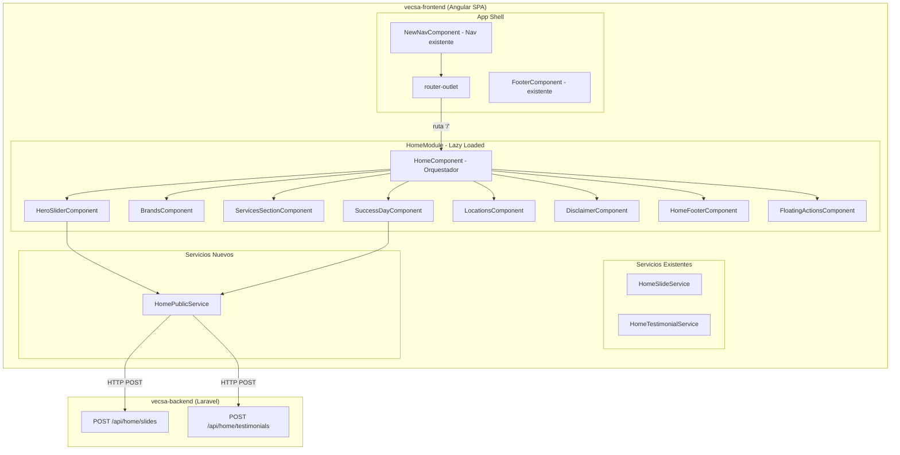
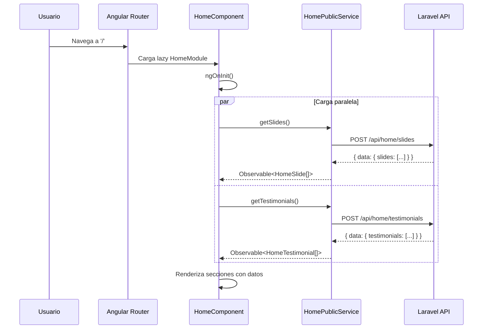
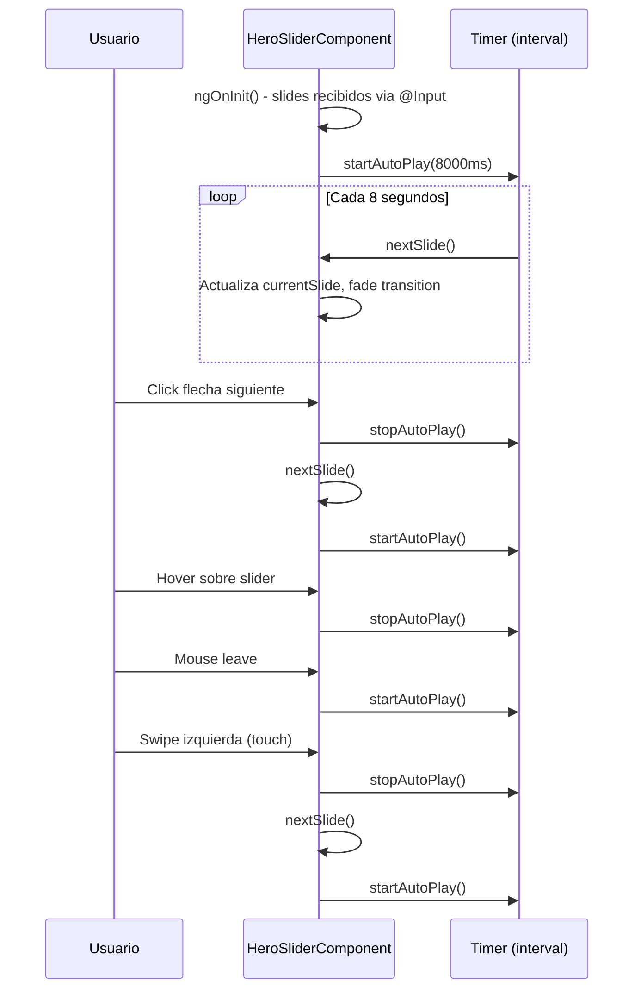

# Documento de Diseño: Migración del Home PHP a Angular

## Resumen

Este diseño describe la migración de la página de inicio actual (`home/index.php`) — un sitio PHP standalone con Tailwind CSS servido en `localhost:8080` — hacia un componente Angular dentro de la aplicación SPA `vecsa-frontend` en `localhost:4200`. La migración convierte cada sección del home PHP (hero slider, marcas, servicios, slider dinámico, testimonios Success Day, sucursales/mapa, disclaimer, footer) en componentes Angular reutilizables que consumen los mismos endpoints de la API Laravel existente.

La aplicación Angular ya cuenta con servicios (`HomeSlideService`, `HomeTestimonialService`), interfaces (`HomeSlide`, `HomeTestimonial`), y un nav compartido (`NewNavComponent`). El diseño se enfoca en crear un módulo `home` lazy-loaded con sub-componentes para cada sección, reutilizando la infraestructura existente y migrando los estilos Tailwind + CSS custom al contexto Angular.

El enfoque principal es replicar fielmente el diseño visual y la funcionalidad interactiva del PHP home (slider con autoplay, carrusel de testimonios con touch/swipe, mapa de sucursales interactivo, header transparente con scroll behavior, sidebar móvil, floating action buttons) usando Angular Material, CDK, y las utilidades de Tailwind ya disponibles en el proyecto Angular.

## Arquitectura



### Decisiones de Diseño

1. **Módulo lazy-loaded separado**: El home se carga como módulo independiente en la ruta raíz `''`, reemplazando el actual `ComprarAutosModule` que ocupa esa ruta. El módulo de compra de autos se moverá a una ruta dedicada como `/compra-tu-auto`.

2. **Servicio público sin autenticación**: Se crea `HomePublicService` para consumir los endpoints públicos (`/api/home/slides`, `/api/home/testimonials`) sin token Bearer, a diferencia de los servicios admin existentes que requieren autenticación.

3. **Componentes standalone**: Cada sección del home es un componente standalone para facilitar tree-shaking y reutilización. El `HomeComponent` orquestador los compone en el template.

4. **Reutilización del nav existente**: El `NewNavComponent` ya maneja la navegación, autenticación y menú móvil. El home se renderiza dentro del `router-outlet` existente, heredando nav y footer del app shell. Sin embargo, el home PHP tiene un header transparente con scroll behavior diferente — esto se manejará con una clase CSS condicional en el nav o un header custom dentro del HomeComponent.

5. **Footer custom del home**: El footer del PHP home es más completo que el footer Angular existente (tiene columnas de vehículos, servicios, legales, redes sociales). Se crea un `HomeFooterComponent` específico y se oculta el footer global cuando se está en la ruta home.

6. **Estilos Tailwind**: El proyecto Angular ya usa Tailwind (evidenciado por las clases en `new-nav.component.html`). Los estilos custom del PHP (`input.css`) se migran a los archivos de estilo del componente correspondiente.

## Diagrama de Secuencia - Carga del Home



## Diagrama de Secuencia - Hero Slider Interacción



## Componentes e Interfaces

### HomeComponent (Orquestador)

**Propósito**: Componente contenedor que carga datos de la API y los distribuye a los sub-componentes via `@Input()`.

**Interfaz**:
```typescript
@Component({
  selector: 'app-home',
  standalone: true,
  imports: [
    CommonModule,
    HeroSliderComponent,
    BrandsComponent,
    ServicesSectionComponent,
    SuccessDayComponent,
    LocationsComponent,
    DisclaimerComponent,
    HomeFooterComponent,
    FloatingActionsComponent,
  ],
})
export class HomeComponent implements OnInit, OnDestroy {
  slides: HomeSlide[] = [];
  testimonials: HomeTestimonial[] = [];
  isLoading = true;

  constructor(private homePublicService: HomePublicService) {}

  ngOnInit(): void {
    // forkJoin para carga paralela de slides y testimonials
  }
}
```

**Responsabilidades**:
- Cargar slides y testimonials desde la API pública al inicializar
- Distribuir datos a sub-componentes via `@Input()`
- Manejar estados de carga y error
- Ocultar el footer global y mostrar el footer custom del home

### HeroSliderComponent

**Propósito**: Slider de imágenes hero con autoplay, navegación por flechas/indicadores, soporte touch/swipe, e imágenes responsive (desktop/mobile).

**Interfaz**:
```typescript
@Component({
  selector: 'app-hero-slider',
  standalone: true,
  imports: [CommonModule],
})
export class HeroSliderComponent implements OnInit, OnDestroy {
  @Input() slides: HomeSlide[] = [];

  currentSlide = 0;
  private autoPlayInterval?: ReturnType<typeof setInterval>;
  private touchStartX = 0;

  // Métodos públicos
  showSlide(index: number): void {}
  nextSlide(): void {}
  prevSlide(): void {}
  startAutoPlay(): void {}
  stopAutoPlay(): void {}

  // Touch handlers
  onTouchStart(event: TouchEvent): void {}
  onTouchEnd(event: TouchEvent): void {}

  // Keyboard navigation
  @HostListener('document:keydown', ['$event'])
  onKeyDown(event: KeyboardEvent): void {}
}
```

**Responsabilidades**:
- Renderizar slides con imágenes desktop/mobile responsive
- Autoplay cada 8 segundos con pausa en hover
- Navegación por flechas, indicadores, teclado y swipe
- Transiciones de opacidad con CSS

### BrandsComponent

**Propósito**: Grid de logos de marcas (BMW, MINI, Motorrad, Premium Selection, ABCars, Chevrolet) con enlaces externos.

**Interfaz**:
```typescript
@Component({
  selector: 'app-brands',
  standalone: true,
  imports: [CommonModule],
})
export class BrandsComponent {
  brands: Brand[] = [
    { name: 'BMW', logo: 'assets/images/home/BMW.png', url: '...' },
    { name: 'MINI', logo: 'assets/images/home/MINI.png', url: '...' },
    // ... etc
  ];
}

interface Brand {
  name: string;
  logo: string;
  url: string;
}
```

### ServicesSectionComponent

**Propósito**: Grid de tarjetas de servicios (Boutique, Rewards, Experience, Car Care, Promociones) con layout asimétrico (Experience ocupa 2 columnas y 2 filas).

**Interfaz**:
```typescript
@Component({
  selector: 'app-services-section',
  standalone: true,
  imports: [CommonModule],
})
export class ServicesSectionComponent {
  services: ServiceCard[] = [
    { title: 'VECSA Boutique', description: '...', image: '...', url: '...', span: '1x1' },
    { title: 'VECSA Experience', description: '...', image: '...', url: '...', span: '2x2' },
    // ...
  ];
}

interface ServiceCard {
  title: string;
  description: string;
  image: string;
  url: string;
  buttonText: string;
  span: '1x1' | '2x2';
}
```

### SuccessDayComponent

**Propósito**: Carrusel horizontal de testimonios Success Day con autoplay, navegación, dots, y soporte touch/swipe.

**Interfaz**:
```typescript
@Component({
  selector: 'app-success-day',
  standalone: true,
  imports: [CommonModule],
})
export class SuccessDayComponent implements OnInit, OnDestroy, AfterViewInit {
  @Input() testimonials: HomeTestimonial[] = [];
  @ViewChild('track') trackElement!: ElementRef<HTMLDivElement>;

  currentIndex = 0;
  private autoInterval?: ReturnType<typeof setInterval>;

  getVisibleCards(): number {}  // 3 en desktop, 1 en mobile
  getMaxIndex(): number {}
  nextSlide(): void {}
  prevSlide(): void {}
  goToSlide(index: number): void {}
  updateCarousel(): void {}  // translateX transform

  // Touch/swipe
  onTouchStart(event: TouchEvent): void {}
  onTouchEnd(event: TouchEvent): void {}

  // Responsive
  @HostListener('window:resize')
  onResize(): void {}
}
```

### LocationsComponent

**Propósito**: Sección de sucursales con lista de ubicaciones, filtros (Todas/Puebla/Otros), mapa interactivo, e información de contacto.

**Interfaz**:
```typescript
@Component({
  selector: 'app-locations',
  standalone: true,
  imports: [CommonModule],
})
export class LocationsComponent implements OnInit {
  locations: Location[] = [...]; // 7 sucursales hardcoded
  activeFilter: 'all' | 'puebla' | 'otros' = 'all';
  selectedLocation: Location | null = null;

  filteredLocations(): Location[] {}
  selectLocation(location: Location): void {}
  setFilter(filter: string): void {}
}

interface Location {
  id: string;
  name: string;
  address: string;
  phone: string;
  email?: string;
  lat: number;
  lng: number;
  image: string;
  filter: 'puebla' | 'otros';
  state: string;
  stateColor: string;
}
```

### HomePublicService (Nuevo)

**Propósito**: Servicio para consumir los endpoints públicos de la API sin autenticación.

**Interfaz**:
```typescript
@Injectable({ providedIn: 'root' })
export class HomePublicService {
  private baseUrl = environment.baseUrl;

  constructor(private http: HttpClient) {}

  getSlides(): Observable<HomeSlide[]> {
    return this.http.post<HomeSlidesResponse>(
      `${this.baseUrl}/api/home/slides`, {}
    ).pipe(map(res => res.data.slides));
  }

  getTestimonials(): Observable<HomeTestimonial[]> {
    return this.http.post<HomeTestimonialsResponse>(
      `${this.baseUrl}/api/home/testimonials`, {}
    ).pipe(map(res => res.data.testimonials));
  }
}
```

### DisclaimerComponent

**Propósito**: Sección de avisos legales (ofertas, disponibilidad, garantías, información legal).

```typescript
@Component({
  selector: 'app-disclaimer',
  standalone: true,
})
export class DisclaimerComponent {
  // Contenido estático, sin lógica
}
```

### HomeFooterComponent

**Propósito**: Footer completo del home con columnas de vehículos, servicios, legales, redes sociales, y copyright dinámico.

```typescript
@Component({
  selector: 'app-home-footer',
  standalone: true,
  imports: [CommonModule],
})
export class HomeFooterComponent {
  currentYear = new Date().getFullYear();

  vehicleLinks: FooterLink[] = [...];
  serviceLinks: FooterLink[] = [...];
  legalLinks: FooterLink[] = [...];
  socialLinks: SocialLink[] = [...];
}
```

### FloatingActionsComponent

**Propósito**: Botones flotantes de WhatsApp, teléfono y email (mobile) y solo WhatsApp (desktop).

```typescript
@Component({
  selector: 'app-floating-actions',
  standalone: true,
  imports: [CommonModule],
})
export class FloatingActionsComponent {
  whatsappUrl = 'https://wa.me/522214316725';
  phoneNumber = 'tel:+522214316725';
  email = 'mailto:contacto@grupovecsa.com';
}
```

## Modelos de Datos

### Interfaces Existentes (reutilizadas)

```typescript
// Ya definidas en admin.interfaces.ts
export interface HomeSlide {
  uuid: string;
  title: string;
  subtitle: string;
  offer_main: string;
  offer_main_text: string;
  offer_sub: string;
  offer_secondary: string;
  offer_secondary_text: string;
  button_text: string;
  button_link: string;
  disclaimer: string;
  desktop_image_path: string;
  mobile_image_path: string;
  active: boolean;
  sort_id: number;
  created_at: string;
}

export interface HomeTestimonial {
  uuid: string;
  image_path: string;
  alt: string;
  active: boolean;
  sort_id: number;
  created_at: string;
}

export interface HomeSlidesResponse extends GralResponse {
  data: { slides: HomeSlide[] };
}

export interface HomeTestimonialsResponse extends GralResponse {
  data: { testimonials: HomeTestimonial[] };
}
```

### Interfaces Nuevas (componentes del home)

```typescript
interface Brand {
  name: string;
  logo: string;
  url: string;
}

interface ServiceCard {
  title: string;
  description: string;
  image: string;
  url: string;
  buttonText: string;
  span: '1x1' | '2x2';
}

interface Location {
  id: string;
  name: string;
  address: string;
  phone: string;
  email?: string;
  lat: number;
  lng: number;
  image: string;
  filter: 'puebla' | 'otros';
  state: string;
  stateColor: string;
}

interface FooterLink {
  label: string;
  url: string;
  external: boolean;
}

interface SocialLink {
  name: string;
  url: string;
  icon: string;
}
```


## Pseudocódigo Algorítmico

### Algoritmo: Carga Inicial del Home

```typescript
// HomeComponent.ngOnInit()
ALGORITHM loadHomeData()
INPUT: ninguno (usa HomePublicService inyectado)
OUTPUT: slides: HomeSlide[], testimonials: HomeTestimonial[]

BEGIN
  isLoading ← true

  forkJoin({
    slides: homePublicService.getSlides(),
    testimonials: homePublicService.getTestimonials()
  }).subscribe({
    next: (result) => {
      slides ← result.slides
      testimonials ← result.testimonials
      isLoading ← false
    },
    error: (err) => {
      console.error('Error cargando datos del home:', err)
      slides ← []
      testimonials ← []
      isLoading ← false
    }
  })
END
```

**Precondiciones:**
- `HomePublicService` está inyectado y disponible
- Los endpoints `/api/home/slides` y `/api/home/testimonials` están accesibles
- `environment.baseUrl` apunta al backend correcto

**Postcondiciones:**
- `slides` contiene los slides activos ordenados por `sort_id`, o array vacío si hay error
- `testimonials` contiene los testimonios activos ordenados por `sort_id`, o array vacío si hay error
- `isLoading` es `false` al completar (éxito o error)

### Algoritmo: Hero Slider Autoplay y Navegación

```typescript
// HeroSliderComponent
ALGORITHM heroSliderNavigation()

// Estado
currentSlide: number = 0
autoPlayInterval: interval | null = null
AUTOPLAY_DELAY = 8000 // ms

PROCEDURE startAutoPlay()
  stopAutoPlay()
  autoPlayInterval ← setInterval(nextSlide, AUTOPLAY_DELAY)
END PROCEDURE

PROCEDURE stopAutoPlay()
  IF autoPlayInterval ≠ null THEN
    clearInterval(autoPlayInterval)
    autoPlayInterval ← null
  END IF
END PROCEDURE

PROCEDURE showSlide(index: number)
  ASSERT 0 ≤ index < slides.length
  currentSlide ← index
  // CSS transition maneja el fade via [class.opacity-100]="i === currentSlide"
END PROCEDURE

PROCEDURE nextSlide()
  next ← (currentSlide + 1) MOD slides.length
  showSlide(next)
END PROCEDURE

PROCEDURE prevSlide()
  prev ← (currentSlide - 1 + slides.length) MOD slides.length
  showSlide(prev)
END PROCEDURE

// Touch/Swipe
PROCEDURE onTouchStart(event: TouchEvent)
  touchStartX ← event.changedTouches[0].screenX
END PROCEDURE

PROCEDURE onTouchEnd(event: TouchEvent)
  touchEndX ← event.changedTouches[0].screenX
  diff ← touchStartX - touchEndX
  IF |diff| > 50 THEN
    stopAutoPlay()
    IF diff > 0 THEN nextSlide()
    ELSE prevSlide()
    END IF
    startAutoPlay()
  END IF
END PROCEDURE
```

**Precondiciones:**
- `slides.length > 0`
- Componente está montado en el DOM

**Postcondiciones:**
- `currentSlide` siempre está en rango `[0, slides.length - 1]`
- Autoplay se reinicia después de cada interacción manual

**Invariante de ciclo:**
- `0 ≤ currentSlide < slides.length` se mantiene en todo momento

### Algoritmo: Carrusel Success Day

```typescript
// SuccessDayComponent
ALGORITHM successDayCarousel()

currentIndex: number = 0
AUTOPLAY_DELAY = 5000 // ms

FUNCTION getVisibleCards(): number
  RETURN window.innerWidth ≥ 768 ? 3 : 1
END FUNCTION

FUNCTION getMaxIndex(): number
  RETURN max(0, testimonials.length - getVisibleCards())
END FUNCTION

PROCEDURE updateCarousel()
  IF testimonials.length = 0 THEN RETURN
  card ← trackElement.firstChild
  gap ← 24 // gap-6 = 1.5rem = 24px
  cardWidth ← card.offsetWidth + gap
  trackElement.style.transform ← `translateX(-${currentIndex * cardWidth}px)`
END PROCEDURE

PROCEDURE nextSlide()
  IF currentIndex ≥ getMaxIndex() THEN
    currentIndex ← 0
  ELSE
    currentIndex ← currentIndex + 1
  END IF
  updateCarousel()
END PROCEDURE

PROCEDURE prevSlide()
  IF currentIndex ≤ 0 THEN
    currentIndex ← getMaxIndex()
  ELSE
    currentIndex ← currentIndex - 1
  END IF
  updateCarousel()
END PROCEDURE
```

**Precondiciones:**
- `testimonials` es un array no vacío
- El elemento `trackElement` está renderizado en el DOM

**Postcondiciones:**
- `currentIndex` siempre está en rango `[0, getMaxIndex()]`
- El transform CSS refleja la posición correcta del carrusel

**Invariante de ciclo:**
- `0 ≤ currentIndex ≤ getMaxIndex()` se mantiene en todo momento

### Algoritmo: Filtrado de Sucursales

```typescript
// LocationsComponent
ALGORITHM locationFiltering()

PROCEDURE filteredLocations(): Location[]
  IF activeFilter = 'all' THEN
    RETURN locations
  ELSE
    RETURN locations.filter(loc => loc.filter = activeFilter)
  END IF
END PROCEDURE

PROCEDURE selectLocation(location: Location)
  selectedLocation ← location
  // Actualizar mapa con coordenadas
END PROCEDURE

PROCEDURE setFilter(filter: string)
  activeFilter ← filter
  // Si la ubicación seleccionada no está en el filtro, deseleccionar
  IF selectedLocation ≠ null AND selectedLocation.filter ≠ filter AND filter ≠ 'all' THEN
    selectedLocation ← null
  END IF
END PROCEDURE
```

**Precondiciones:**
- `locations` es un array no vacío con datos válidos
- `activeFilter` es uno de `'all' | 'puebla' | 'otros'`

**Postcondiciones:**
- `filteredLocations()` retorna solo las ubicaciones que coinciden con el filtro activo
- Si el filtro cambia y la ubicación seleccionada no pertenece al nuevo filtro, se deselecciona

## Funciones Clave con Especificaciones Formales

### HomePublicService.getSlides()

```typescript
getSlides(): Observable<HomeSlide[]>
```

**Precondiciones:**
- `environment.baseUrl` es una URL válida
- El endpoint `/api/home/slides` está disponible

**Postcondiciones:**
- Retorna un `Observable` que emite un array de `HomeSlide` activos, ordenados por `sort_id`
- Si la API falla, el Observable emite un error que debe ser manejado por el suscriptor
- No envía headers de autenticación (endpoint público)

### HeroSliderComponent.showSlide(index)

```typescript
showSlide(index: number): void
```

**Precondiciones:**
- `0 ≤ index < slides.length`
- `slides.length > 0`

**Postcondiciones:**
- `currentSlide === index`
- Solo el slide en posición `index` tiene `opacity: 1` y `z-index: 20`
- Todos los demás slides tienen `opacity: 0` y `z-index: 10`
- El indicador en posición `index` está activo (blanco, opacidad 1)

### SuccessDayComponent.updateCarousel()

```typescript
updateCarousel(): void
```

**Precondiciones:**
- `testimonials.length > 0`
- `trackElement` está renderizado en el DOM
- `0 ≤ currentIndex ≤ getMaxIndex()`

**Postcondiciones:**
- El `transform` CSS del track es `translateX(-${currentIndex * cardWidth}px)`
- Los dots reflejan la posición actual (`currentIndex`)

### LocationsComponent.filteredLocations()

```typescript
filteredLocations(): Location[]
```

**Precondiciones:**
- `locations` es un array válido
- `activeFilter` es `'all'`, `'puebla'`, o `'otros'`

**Postcondiciones:**
- Si `activeFilter === 'all'`: retorna todas las ubicaciones
- Si `activeFilter !== 'all'`: retorna solo ubicaciones donde `location.filter === activeFilter`
- El array retornado mantiene el orden original

## Ejemplo de Uso

```typescript
// home.component.ts - Orquestador principal
@Component({
  selector: 'app-home',
  standalone: true,
  imports: [
    CommonModule,
    HeroSliderComponent,
    BrandsComponent,
    ServicesSectionComponent,
    SuccessDayComponent,
    LocationsComponent,
    DisclaimerComponent,
    HomeFooterComponent,
    FloatingActionsComponent,
  ],
  template: `
    <app-hero-slider [slides]="slides" />
    <app-brands />
    <app-services-section />
    @if (testimonials.length > 0) {
      <app-success-day [testimonials]="testimonials" />
    }
    <app-locations />
    <app-disclaimer />
    <app-home-footer />
    <app-floating-actions />
  `,
})
export class HomeComponent implements OnInit {
  slides: HomeSlide[] = [];
  testimonials: HomeTestimonial[] = [];

  constructor(private homePublicService: HomePublicService) {}

  ngOnInit(): void {
    forkJoin({
      slides: this.homePublicService.getSlides(),
      testimonials: this.homePublicService.getTestimonials(),
    }).subscribe({
      next: ({ slides, testimonials }) => {
        this.slides = slides;
        this.testimonials = testimonials;
      },
      error: (err) => console.error('Error cargando home:', err),
    });
  }
}
```

```typescript
// home-public.service.ts - Servicio público sin auth
@Injectable({ providedIn: 'root' })
export class HomePublicService {
  private baseUrl = environment.baseUrl;

  constructor(private http: HttpClient) {}

  getSlides(): Observable<HomeSlide[]> {
    return this.http
      .post<HomeSlidesResponse>(`${this.baseUrl}/api/home/slides`, {})
      .pipe(map((res) => res.data.slides));
  }

  getTestimonials(): Observable<HomeTestimonial[]> {
    return this.http
      .post<HomeTestimonialsResponse>(`${this.baseUrl}/api/home/testimonials`, {})
      .pipe(map((res) => res.data.testimonials));
  }
}
```

```typescript
// app-routing.module.ts - Ruta actualizada
const routes: Routes = [
  {
    path: '',
    loadComponent: () =>
      import('./home/home.component').then((m) => m.HomeComponent),
  },
  {
    path: 'compra-tu-auto',
    loadChildren: () =>
      import('./dashboard/pages/comprar-autos/comprar-autos.module').then(
        (m) => m.ComprarAutosModule
      ),
  },
  // ... resto de rutas existentes
];
```

## Propiedades de Correctitud

*Una propiedad es una característica o comportamiento que debe mantenerse verdadero en todas las ejecuciones válidas de un sistema — esencialmente, una declaración formal sobre lo que el sistema debe hacer. Las propiedades sirven como puente entre especificaciones legibles por humanos y garantías de correctitud verificables por máquina.*

### Propiedad 1: Servicio público no envía autenticación

*Para cualquier* llamada realizada por `HomePublicService` (getSlides o getTestimonials), la petición HTTP no debe incluir headers `Authorization`, a diferencia de `HomeSlideService` y `HomeTestimonialService` que sí los incluyen.

**Valida: Requisitos 1.1**

### Propiedad 2: Mapeo correcto de datos de la API

*Para cualquier* respuesta válida de la API que contenga slides y testimonials, el `HomeComponent` debe asignar correctamente los datos recibidos a sus respectivos arrays, y el estado `isLoading` debe transicionar a `false` al completar ambas peticiones (ya sea con éxito o error).

**Valida: Requisitos 1.2, 1.5**

### Propiedad 3: Carga de datos resiliente

*Para cualquier* estado de la API (disponible, caída, timeout), el `HomeComponent` debe completar su inicialización sin errores no manejados, asignando arrays vacíos a `slides` y `testimonials` si la API falla, y `isLoading` debe ser `false` al finalizar.

**Valida: Requisitos 1.3, 1.4, 1.5**

### Propiedad 4: Navegación circular y índice válido del slider

*Para cualquier* array de slides con longitud > 0 y cualquier posición actual, invocar `nextSlide()` o `prevSlide()` siempre debe producir un `currentSlide` en el rango `[0, slides.length - 1]`, donde `nextSlide()` desde el último slide lleva al índice 0 y `prevSlide()` desde el primer slide lleva al último índice.

**Valida: Requisitos 2.5, 2.6**

### Propiedad 5: Detección de swipe por umbral

*Para cualquier* par de coordenadas touch (inicio, fin), si la diferencia horizontal absoluta es mayor a 50 píxeles, el slider debe navegar al slide siguiente (swipe izquierda) o anterior (swipe derecha). Si la diferencia es menor o igual a 50 píxeles, no debe haber navegación.

**Valida: Requisito 2.4**

### Propiedad 6: Tarjetas visibles del carrusel por viewport

*Para cualquier* ancho de viewport, `getVisibleCards()` del SuccessDayComponent debe retornar 3 si el ancho es >= 768px, y 1 si el ancho es < 768px.

**Valida: Requisitos 5.2, 5.3**

### Propiedad 7: Índice del carrusel respeta límites con wrap circular y ajuste por resize

*Para cualquier* array de testimonios y cualquier viewport, el `currentIndex` del SuccessDayComponent siempre debe estar en el rango `[0, max(0, testimonials.length - getVisibleCards())]`. Al invocar `nextSlide()` desde el máximo, debe regresar a 0. Al cambiar el viewport, si `currentIndex` excede el nuevo máximo, debe ajustarse al nuevo máximo.

**Valida: Requisitos 5.5, 5.8**

### Propiedad 8: Filtrado de sucursales correcto

*Para cualquier* conjunto de ubicaciones y cualquier valor de filtro (`'all'`, `'puebla'`, `'otros'`), `filteredLocations()` debe retornar exactamente las ubicaciones cuyo atributo `filter` coincida con el filtro activo, o todas las ubicaciones si el filtro es `'all'`. El resultado siempre debe ser un subconjunto de `locations` manteniendo el orden original.

**Valida: Requisitos 6.2, 6.3, 6.4**

### Propiedad 9: Deselección de sucursal al cambiar filtro

*Para cualquier* sucursal seleccionada y cualquier cambio de filtro, si la sucursal seleccionada no pertenece al nuevo filtro (y el nuevo filtro no es `'all'`), la selección debe limpiarse a `null`.

**Valida: Requisito 6.6**

### Propiedad 10: Limpieza de timers al destruir componentes

*Para cualquier* componente con timers activos (HeroSliderComponent, SuccessDayComponent), al invocar `ngOnDestroy()`, todos los intervalos de autoplay deben ser limpiados, resultando en cero intervalos activos.

**Valida: Requisitos 10.1, 10.2**

## Manejo de Errores

| Escenario | Condición | Respuesta | Recuperación |
|-----------|-----------|-----------|--------------|
| API de slides no disponible | HTTP error o timeout | `slides = []`, hero slider no se renderiza | Sección se oculta, resto del home funciona |
| API de testimonials no disponible | HTTP error o timeout | `testimonials = []`, Success Day no se renderiza | Sección se oculta, resto del home funciona |
| Imagen de slide no carga | `` error event | Mostrar placeholder o slide sin imagen | CSS fallback con background color |
| Imagen de testimonial no carga | `` error event | Mostrar placeholder genérico | CSS fallback |
| Google Maps no disponible | Script no carga | Mostrar mapa estático con pin y dirección | Fallback visual con coordenadas |
| Viewport resize durante carrusel | `window.resize` event | Recalcular `getVisibleCards()` y `getMaxIndex()` | Ajustar `currentIndex` si excede nuevo máximo |

## Estrategia de Testing

### Tests Unitarios

- **HomeComponent**: Verificar que `forkJoin` se ejecuta en `ngOnInit`, que los datos se asignan correctamente, y que errores de API resultan en arrays vacíos.
- **HeroSliderComponent**: Verificar navegación circular, autoplay start/stop, touch/swipe detection, y keyboard navigation.
- **SuccessDayComponent**: Verificar cálculo de `getVisibleCards()` y `getMaxIndex()`, navegación, y responsive behavior.
- **LocationsComponent**: Verificar filtrado por categoría, selección de ubicación, y deselección al cambiar filtro.
- **HomePublicService**: Verificar que las llamadas HTTP se hacen sin headers de autenticación y que el mapping de respuesta es correcto.

### Tests de Propiedades

**Librería**: Jasmine + custom generators (consistente con el setup existente del proyecto Angular)

- Propiedad 2 (índice válido): Generar secuencias aleatorias de next/prev/showSlide y verificar que `currentSlide` siempre está en rango.
- Propiedad 3 (navegación circular): Para arrays de slides de longitud aleatoria, verificar que next desde el último lleva al primero y prev desde el primero lleva al último.
- Propiedad 5 (filtrado): Para conjuntos aleatorios de ubicaciones con filtros mixtos, verificar que el filtrado retorna el subconjunto correcto.
- Propiedad 6 (límites carrusel): Para arrays de testimonios de longitud aleatoria y viewports aleatorios, verificar que `currentIndex` nunca excede `getMaxIndex()`.

### Tests de Integración

- Verificar que la ruta `'/'` carga el `HomeComponent` correctamente.
- Verificar que el `HomePublicService` se comunica con los endpoints correctos.
- Verificar que el footer global se oculta y el `HomeFooterComponent` se muestra en la ruta home.

## Consideraciones de Rendimiento

- **Lazy loading**: El `HomeModule` se carga solo cuando el usuario navega a `/`, reduciendo el bundle inicial.
- **Imágenes**: Usar `loading="lazy"` en imágenes debajo del fold (marcas, servicios, testimonios, sucursales). El hero slider usa `loading="eager"` para el primer slide.
- **OnPush**: Usar `ChangeDetectionStrategy.OnPush` en componentes estáticos (Brands, Services, Disclaimer, Footer, FloatingActions) para reducir ciclos de detección de cambios.
- **Cleanup**: Limpiar intervalos y suscripciones en `ngOnDestroy` para evitar memory leaks.

## Consideraciones de Seguridad

- **Sanitización**: Usar `[src]` binding de Angular para URLs de imágenes (sanitización automática). No usar `innerHTML` para contenido dinámico.
- **Enlaces externos**: Todos los enlaces externos usan `target="_blank"` con `rel="noopener noreferrer"` implícito en Angular.
- **API pública**: Los endpoints `/api/home/slides` y `/api/home/testimonials` no requieren autenticación, pero están protegidos por el middleware `bandwidth_usage` del backend.

## Dependencias

- **Existentes**: Angular 16+, Angular Material, CDK, Tailwind CSS, RxJS, HttpClient
- **Nuevas**: Ninguna librería nueva requerida. Todo se implementa con Angular core + Tailwind.
- **Assets**: Las imágenes estáticas del home PHP (`home/assets/images/`) deben copiarse a `vecsa-frontend/src/assets/images/home/`.
- **Fuentes**: Inter y Oswald ya están disponibles via Google Fonts (referenciadas en `index.html` o importadas en styles).

## Estructura de Archivos

```
vecsa-frontend/src/app/home/
├── home.component.ts          # Orquestador principal
├── home.component.html        # Template con sub-componentes
├── home.component.scss        # Estilos globales del home
├── components/
│   ├── hero-slider/
│   │   ├── hero-slider.component.ts
│   │   ├── hero-slider.component.html
│   │   └── hero-slider.component.scss
│   ├── brands/
│   │   ├── brands.component.ts
│   │   └── brands.component.html
│   ├── services-section/
│   │   ├── services-section.component.ts
│   │   ├── services-section.component.html
│   │   └── services-section.component.scss
│   ├── success-day/
│   │   ├── success-day.component.ts
│   │   ├── success-day.component.html
│   │   └── success-day.component.scss
│   ├── locations/
│   │   ├── locations.component.ts
│   │   ├── locations.component.html
│   │   └── locations.component.scss
│   ├── disclaimer/
│   │   ├── disclaimer.component.ts
│   │   └── disclaimer.component.html
│   ├── home-footer/
│   │   ├── home-footer.component.ts
│   │   └── home-footer.component.html
│   └── floating-actions/
│       ├── floating-actions.component.ts
│       └── floating-actions.component.html
└── services/
    └── home-public.service.ts
```
