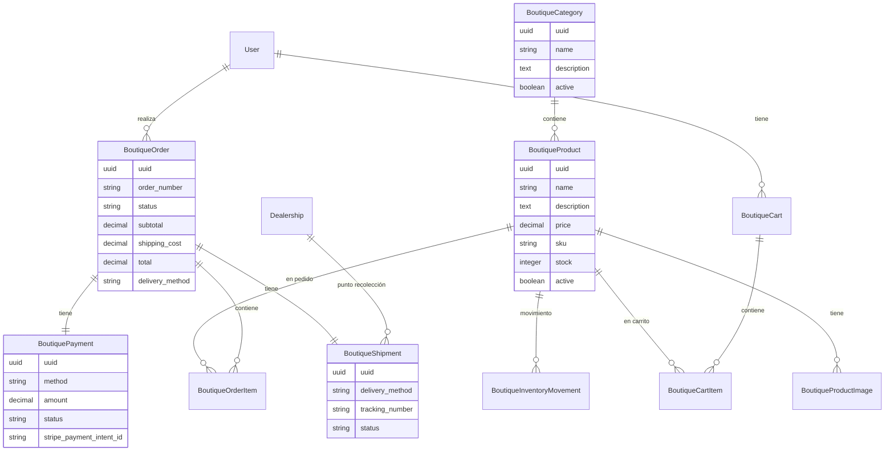
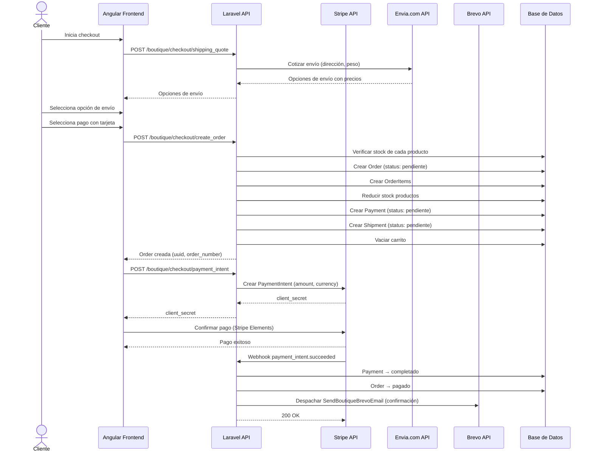
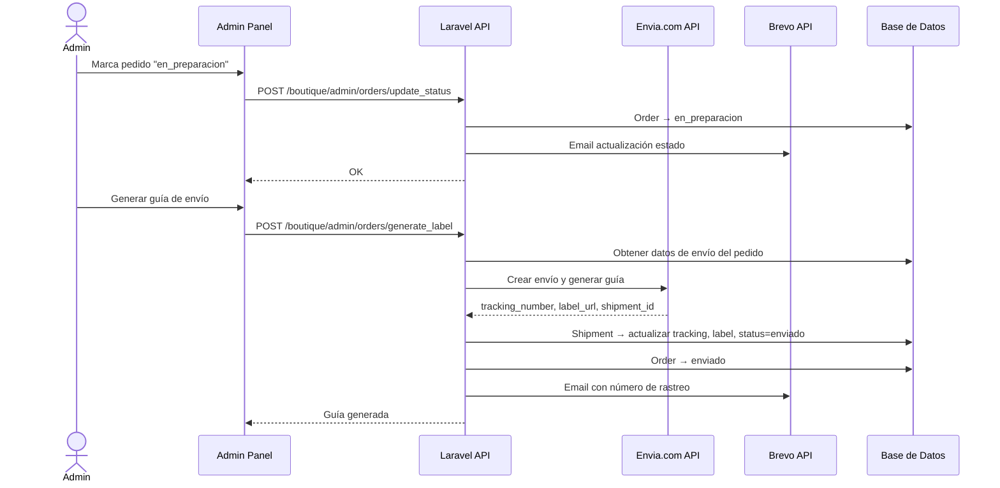
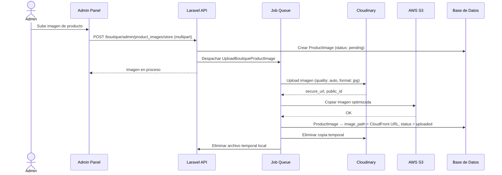

# Documento de Diseño — Boutique E-commerce

## Resumen General

Este documento describe el diseño técnico del módulo de e-commerce "Boutique" para la plataforma Grupo VECSA. El sistema permite la venta de mercancía, accesorios y productos lifestyle BMW a través de un catálogo público, carrito de compras, checkout con pagos vía Stripe y envíos vía Envia.com. Se integra con el sistema existente de autenticación Sanctum, roles Spatie, pipeline de imágenes Cloudinary/S3, y sigue todas las convenciones del proyecto (prefijo `app_vecsa_`, UUIDs, soft deletes, rutas POST, ApiResponseHelper).

Integraciones externas: Stripe (pagos con tarjeta), Envia.com (cotización y guías de envío), Tidio (chat en vivo) y Brevo (emails transaccionales y marketing).

---

## Arquitectura

### Diagrama de Arquitectura General

```mermaid
graph TB
    subgraph Frontend["Frontend Angular"]
        BM[Boutique Module<br/>/boutique]
        ABM[Admin Boutique Module<br/>/admin/administrator/boutique]
        Tidio[Tidio Widget]
    end

    subgraph Backend["Backend Laravel"]
        subgraph PublicAPI["API Pública (bandwidth_usage)"]
            CatalogCtrl[BoutiqueCatalogController]
            CartCtrl[BoutiqueCartController]
            CheckoutCtrl[BoutiqueCheckoutController]
            OrderCtrl[BoutiqueOrderController]
            ShippingCtrl[BoutiqueShippingController]
        end
        subgraph AdminAPI["API Admin (auth:sanctum)"]
            CatAdminCtrl[BoutiqueCategoryController]
            ProdAdminCtrl[BoutiqueProductController]
            ImgAdminCtrl[BoutiqueProductImageController]
            OrdAdminCtrl[BoutiqueAdminOrderController]
            InvCtrl[BoutiqueInventoryController]
            PayAdminCtrl[BoutiquePaymentController]
        end
        subgraph Jobs["Jobs en Cola"]
            ImgJob[UploadBoutiqueProductImage]
            EmailJob[SendBoutiqueBrevoEmail]
            CancelJob[CancelUnpaidBoutiqueOrders]
        end
    end

    subgraph External["Servicios Externos"]
        Stripe[Stripe API]
        Envia[Envia.com API]
        Cloudinary[Cloudinary]
        S3[AWS S3/CloudFront]
        Brevo[Brevo API]
    end

    BM --> CatalogCtrl
    BM --> CartCtrl
    BM --> CheckoutCtrl
    BM --> OrderCtrl
    BM --> ShippingCtrl
    ABM --> CatAdminCtrl
    ABM --> ProdAdminCtrl
    ABM --> ImgAdminCtrl
    ABM --> OrdAdminCtrl
    ABM --> InvCtrl
    ABM --> PayAdminCtrl

    CheckoutCtrl --> Stripe
    CheckoutCtrl --> Envia
    ImgJob --> Cloudinary
    ImgJob --> S3
    EmailJob --> Brevo
    ShippingCtrl --> Envia
```



### Decisiones de Diseño

1. **Rutas POST exclusivas**: Todos los endpoints son POST, siguiendo la convención existente del proyecto.
2. **Carrito persistente en BD**: El carrito se almacena en base de datos (no en localStorage) para permitir recuperación entre sesiones y dispositivos.
3. **Stripe PaymentIntent**: Se usa el flujo server-side PaymentIntent + Stripe Elements en frontend para cumplir con PCI DSS.
4. **Envia.com**: Cotización en checkout, generación de guía cuando el admin marca "en_preparacion".
5. **Jobs en cola**: Imágenes (Cloudinary→S3), emails (Brevo), y cancelación automática de pedidos impagos (72h).
6. **Número de pedido legible**: Formato `BOUT-YYYYMMDD-XXXX` (secuencial diario).
7. **Módulo admin bajo administrator**: Las páginas de admin de boutique se agregan como rutas hijas dentro del módulo `administrador` existente en `/admin/administrator/boutique/`.

---

## Componentes e Interfaces

### Backend — Modelos

| Modelo | Tabla (sin prefijo) | Relaciones principales |
|--------|---------------------|----------------------|
| `BoutiqueCategory` | `boutique_categories` | hasMany → BoutiqueProduct |
| `BoutiqueProduct` | `boutique_products` | belongsTo → BoutiqueCategory, hasMany → BoutiqueProductImage, hasMany → BoutiqueCartItem, hasMany → BoutiqueOrderItem |
| `BoutiqueProductImage` | `boutique_product_images` | belongsTo → BoutiqueProduct |
| `BoutiqueCart` | `boutique_carts` | belongsTo → User, hasMany → BoutiqueCartItem |
| `BoutiqueCartItem` | `boutique_cart_items` | belongsTo → BoutiqueCart, belongsTo → BoutiqueProduct |
| `BoutiqueOrder` | `boutique_orders` | belongsTo → User, hasMany → BoutiqueOrderItem, hasOne → BoutiquePayment, hasOne → BoutiqueShipment |
| `BoutiqueOrderItem` | `boutique_order_items` | belongsTo → BoutiqueOrder, belongsTo → BoutiqueProduct |
| `BoutiquePayment` | `boutique_payments` | belongsTo → BoutiqueOrder |
| `BoutiqueShipment` | `boutique_shipments` | belongsTo → BoutiqueOrder, belongsTo → Dealership (nullable) |
| `BoutiqueInventoryMovement` | `boutique_inventory_movements` | belongsTo → BoutiqueProduct |

Todos los modelos siguen las convenciones:
- UUID v4 en `static::creating`
- `SoftDeletes`
- Tabla con prefijo `env('DB_TABLE_PREFIX', '') . 'boutique_xxx'`
- `findByUuid($uuid)` estático
- `$hidden = ['id', 'pivot', 'updated_at', 'deleted_at']`
- Accessors Carbon `Y-m-d H:i:s`

### Backend — Controllers

| Controller | Middleware | Responsabilidad |
|-----------|-----------|----------------|
| `BoutiqueCatalogController` | `bandwidth_usage` | Catálogo público: listar productos, detalle, filtros |
| `BoutiqueCartController` | `auth:sanctum` | CRUD carrito del cliente autenticado |
| `BoutiqueCheckoutController` | `auth:sanctum` | Proceso de checkout, crear pedido, Stripe PaymentIntent, cotización Envia.com |
| `BoutiqueOrderController` | `auth:sanctum` | Historial de pedidos del cliente |
| `BoutiqueShippingController` | `auth:sanctum` | Consulta de rastreo vía Envia.com |
| `BoutiqueCategoryController` | `auth:sanctum` + role admin/staff | CRUD categorías (admin) |
| `BoutiqueProductController` | `auth:sanctum` + role admin/staff | CRUD productos (admin) |
| `BoutiqueProductImageController` | `auth:sanctum` + role admin/staff | Gestión imágenes producto (admin) |
| `BoutiqueAdminOrderController` | `auth:sanctum` + role admin/staff | Gestión pedidos, cambio de estado, generar guía (admin) |
| `BoutiqueInventoryController` | `auth:sanctum` + role admin/staff | Ajustes manuales de inventario (admin) |
| `BoutiquePaymentController` | `auth:sanctum` + role admin/staff | Confirmar pagos manuales, webhook Stripe (admin) |

### Backend — FormRequests

| FormRequest | Uso |
|------------|-----|
| `StoreBoutiqueCategoryRequest` | Crear/editar categoría |
| `DeleteBoutiqueCategoryRequest` | Eliminar categoría (uuid) |
| `StoreBoutiqueProductRequest` | Crear/editar producto |
| `DeleteBoutiqueProductRequest` | Eliminar producto (uuid) |
| `StoreBoutiqueProductImageRequest` | Subir imagen (image file + product_uuid) |
| `SortBoutiqueProductImageRequest` | Reordenar imágenes |
| `AddToCartRequest` | Agregar producto al carrito (product_uuid, quantity) |
| `UpdateCartItemRequest` | Modificar cantidad en carrito |
| `RemoveCartItemRequest` | Eliminar item del carrito |
| `CreateBoutiqueOrderRequest` | Checkout: datos de envío, método de pago, método de entrega |
| `UpdateBoutiqueOrderStatusRequest` | Cambiar estado de pedido (admin) |
| `ConfirmManualPaymentRequest` | Confirmar pago manual (admin) |
| `UpdateInventoryRequest` | Ajuste manual de inventario (admin) |
| `ShippingQuoteRequest` | Cotización de envío (dirección destino) |

### Backend — Jobs

| Job | Descripción |
|-----|------------|
| `UploadBoutiqueProductImage` | Sube imagen a Cloudinary, copia a S3, elimina de Cloudinary, actualiza BD. Sigue el patrón de `UploadHomeSlideImage`. |
| `SendBoutiqueBrevoEmail` | Envía email transaccional vía API de Brevo. Reintento automático en caso de fallo. |
| `CancelUnpaidBoutiqueOrders` | Scheduled job (cada hora): cancela pedidos con pago manual pendiente >72h y restaura inventario. |

### Backend — Services

| Service | Responsabilidad |
|---------|----------------|
| `StripeService` | Crear PaymentIntent, verificar webhook signature, procesar eventos |
| `EnviacomService` | Cotizar envío, generar guía, consultar rastreo |
| `BrevoService` | Enviar email transaccional, agregar contacto a lista |
| `BoutiqueInventoryService` | Lógica de reducción/restauración de inventario con registro de movimientos |


### Backend — API Endpoints

Todos los endpoints son `POST`. Agrupados bajo el prefijo `boutique`.

#### Rutas Públicas (`bandwidth_usage`)

```
POST /api/boutique/catalog/search          → BoutiqueCatalogController@search
POST /api/boutique/catalog/detail          → BoutiqueCatalogController@detail
POST /api/boutique/catalog/categories      → BoutiqueCatalogController@categories
```

#### Rutas Cliente Autenticado (`auth:sanctum`)

```
POST /api/boutique/cart/get                → BoutiqueCartController@get
POST /api/boutique/cart/add                → BoutiqueCartController@add
POST /api/boutique/cart/update             → BoutiqueCartController@update
POST /api/boutique/cart/remove             → BoutiqueCartController@remove

POST /api/boutique/checkout/shipping_quote → BoutiqueCheckoutController@shippingQuote
POST /api/boutique/checkout/create_order   → BoutiqueCheckoutController@createOrder
POST /api/boutique/checkout/payment_intent → BoutiqueCheckoutController@createPaymentIntent

POST /api/boutique/orders/search           → BoutiqueOrderController@search
POST /api/boutique/orders/detail           → BoutiqueOrderController@detail

POST /api/boutique/shipping/track          → BoutiqueShippingController@track
```

#### Ruta Webhook Stripe (sin auth, verificación por signature)

```
POST /api/boutique/webhook/stripe          → BoutiquePaymentController@stripeWebhook
```

#### Rutas Admin (`auth:sanctum` + role `administrator|staff`)

```
POST /api/boutique/admin/categories/search       → BoutiqueCategoryController@search
POST /api/boutique/admin/categories/store        → BoutiqueCategoryController@store
POST /api/boutique/admin/categories/update       → BoutiqueCategoryController@update
POST /api/boutique/admin/categories/delete       → BoutiqueCategoryController@delete

POST /api/boutique/admin/products/search         → BoutiqueProductController@search
POST /api/boutique/admin/products/store          → BoutiqueProductController@store
POST /api/boutique/admin/products/update         → BoutiqueProductController@update
POST /api/boutique/admin/products/delete         → BoutiqueProductController@delete

POST /api/boutique/admin/product_images/store    → BoutiqueProductImageController@store
POST /api/boutique/admin/product_images/sort     → BoutiqueProductImageController@sortUpdate
POST /api/boutique/admin/product_images/delete   → BoutiqueProductImageController@delete

POST /api/boutique/admin/orders/search           → BoutiqueAdminOrderController@search
POST /api/boutique/admin/orders/detail           → BoutiqueAdminOrderController@detail
POST /api/boutique/admin/orders/update_status    → BoutiqueAdminOrderController@updateStatus
POST /api/boutique/admin/orders/generate_label   → BoutiqueAdminOrderController@generateLabel
POST /api/boutique/admin/orders/metrics          → BoutiqueAdminOrderController@metrics

POST /api/boutique/admin/payments/confirm_manual → BoutiquePaymentController@confirmManual

POST /api/boutique/admin/inventory/update        → BoutiqueInventoryController@update
POST /api/boutique/admin/inventory/movements     → BoutiqueInventoryController@movements
```

### Frontend — Estructura de Módulos Angular

#### Módulo Boutique (público/cliente) — Lazy-loaded en `/boutique`

```
vecsa-frontend/src/app/boutique/
├── boutique-routing.module.ts
├── boutique.module.ts
├── services/
│   ├── boutique-catalog.service.ts
│   ├── boutique-cart.service.ts
│   ├── boutique-checkout.service.ts
│   ├── boutique-order.service.ts
│   └── boutique-shipping.service.ts
├── interfaces/
│   └── boutique.interfaces.ts
├── guards/
│   └── boutique-auth.guard.ts
├── pages/
│   ├── catalog/
│   │   ├── catalog.component.ts|html|css
│   ├── product-detail/
│   │   ├── product-detail.component.ts|html|css
│   ├── cart/
│   │   ├── cart.component.ts|html|css
│   ├── checkout/
│   │   ├── checkout.component.ts|html|css
│   ├── order-history/
│   │   ├── order-history.component.ts|html|css
│   └── order-detail/
│       ├── order-detail.component.ts|html|css
└── components/
    ├── product-card/
    ├── cart-summary/
    ├── stripe-payment/
    ├── shipping-options/
    └── order-status-tracker/
```

Rutas del módulo boutique:
```
/boutique                    → CatalogComponent
/boutique/product/:uuid      → ProductDetailComponent
/boutique/cart               → CartComponent (guard: auth)
/boutique/checkout           → CheckoutComponent (guard: auth)
/boutique/orders             → OrderHistoryComponent (guard: auth)
/boutique/orders/:uuid       → OrderDetailComponent (guard: auth)
```

#### Módulo Admin Boutique — Dentro de `/admin/administrator/boutique`

```
vecsa-frontend/src/app/admin/administrador/pages/boutique/
├── boutique-admin-routing.module.ts
├── boutique-admin.module.ts
├── services/
│   ├── boutique-admin-category.service.ts
│   ├── boutique-admin-product.service.ts
│   ├── boutique-admin-order.service.ts
│   └── boutique-admin-inventory.service.ts
├── pages/
│   ├── categories/
│   │   ├── categories.component.ts|html|css
│   ├── products/
│   │   ├── products.component.ts|html|css
│   ├── product-form/
│   │   ├── product-form.component.ts|html|css
│   ├── orders/
│   │   ├── orders.component.ts|html|css
│   ├── order-detail/
│   │   ├── order-detail.component.ts|html|css
│   └── inventory/
│       ├── inventory.component.ts|html|css
└── components/
    ├── product-image-manager/
    ├── order-status-badge/
    └── inventory-alert/
```

Rutas admin boutique:
```
/admin/administrator/boutique/categories     → CategoriesComponent
/admin/administrator/boutique/products       → ProductsComponent
/admin/administrator/boutique/products/new   → ProductFormComponent
/admin/administrator/boutique/products/:uuid → ProductFormComponent
/admin/administrator/boutique/orders         → OrdersComponent
/admin/administrator/boutique/orders/:uuid   → OrderDetailComponent
/admin/administrator/boutique/inventory      → InventoryComponent
```

### Integración Tidio

- Script cargado asíncronamente en `BoutiqueModule` vía un servicio `TidioService`
- El `TidioService` inyecta el script solo cuando se navega a rutas `/boutique/*`
- Si el usuario está autenticado, se pasan `name` y `email` al widget vía `tidioChatApi.setVisitorData()`
- El ID del proyecto Tidio se configura en `environment.ts` → `tidioProjectId`

### Integración Brevo

- `BrevoService` (backend) usa la API REST de Brevo con API key desde `env('BREVO_API_KEY')`
- Emails transaccionales usan template IDs configurados en `.env`:
  - `BREVO_TEMPLATE_ORDER_CONFIRMATION`
  - `BREVO_TEMPLATE_ORDER_STATUS_UPDATE`
- El job `SendBoutiqueBrevoEmail` se despacha en cola con reintentos (3 intentos, backoff 60s)
- En primera compra, se agrega el contacto a la lista de Brevo vía `BREVO_BOUTIQUE_LIST_ID`

---

## Modelos de Datos

### Esquema de Base de Datos

Todas las tablas usan el prefijo `app_vecsa_` vía `env('DB_TABLE_PREFIX', '')`.

#### `boutique_categories`

```sql
id                  BIGINT UNSIGNED AUTO_INCREMENT PRIMARY KEY
uuid                CHAR(36) UNIQUE NOT NULL
name                VARCHAR(255) NOT NULL
description         TEXT NULLABLE
active              BOOLEAN DEFAULT TRUE
created_at          TIMESTAMP NULLABLE
updated_at          TIMESTAMP NULLABLE
deleted_at          TIMESTAMP NULLABLE
```

#### `boutique_products`

```sql
id                  BIGINT UNSIGNED AUTO_INCREMENT PRIMARY KEY
uuid                CHAR(36) UNIQUE NOT NULL
category_id         BIGINT UNSIGNED NOT NULL → FK boutique_categories(id)
name                VARCHAR(255) NOT NULL
description         TEXT NULLABLE
price               DECIMAL(10,2) NOT NULL
sku                 VARCHAR(100) NOT NULL
stock               INTEGER UNSIGNED DEFAULT 0
active              BOOLEAN DEFAULT TRUE
created_at          TIMESTAMP NULLABLE
updated_at          TIMESTAMP NULLABLE
deleted_at          TIMESTAMP NULLABLE
```

#### `boutique_product_images`

```sql
id                  BIGINT UNSIGNED AUTO_INCREMENT PRIMARY KEY
uuid                CHAR(36) UNIQUE NOT NULL
product_id          BIGINT UNSIGNED NOT NULL → FK boutique_products(id)
image_path          VARCHAR(500) NOT NULL
cloudinary_public_id VARCHAR(500) NULLABLE
sort_id             INTEGER UNSIGNED DEFAULT 0
status              VARCHAR(20) DEFAULT 'pending'  -- pending, uploaded, failed
created_at          TIMESTAMP NULLABLE
updated_at          TIMESTAMP NULLABLE
deleted_at          TIMESTAMP NULLABLE
```

#### `boutique_carts`

```sql
id                  BIGINT UNSIGNED AUTO_INCREMENT PRIMARY KEY
uuid                CHAR(36) UNIQUE NOT NULL
user_id             BIGINT UNSIGNED NOT NULL → FK users(id)
created_at          TIMESTAMP NULLABLE
updated_at          TIMESTAMP NULLABLE
deleted_at          TIMESTAMP NULLABLE
```

#### `boutique_cart_items`

```sql
id                  BIGINT UNSIGNED AUTO_INCREMENT PRIMARY KEY
uuid                CHAR(36) UNIQUE NOT NULL
cart_id             BIGINT UNSIGNED NOT NULL → FK boutique_carts(id)
product_id          BIGINT UNSIGNED NOT NULL → FK boutique_products(id)
quantity            INTEGER UNSIGNED NOT NULL DEFAULT 1
created_at          TIMESTAMP NULLABLE
updated_at          TIMESTAMP NULLABLE
deleted_at          TIMESTAMP NULLABLE
```

#### `boutique_orders`

```sql
id                  BIGINT UNSIGNED AUTO_INCREMENT PRIMARY KEY
uuid                CHAR(36) UNIQUE NOT NULL
user_id             BIGINT UNSIGNED NOT NULL → FK users(id)
order_number        VARCHAR(50) UNIQUE NOT NULL  -- Formato: BOUT-YYYYMMDD-XXXX
status              VARCHAR(30) NOT NULL DEFAULT 'pendiente'
                    -- pendiente, pagado, en_preparacion, enviado, entregado, cancelado
subtotal            DECIMAL(10,2) NOT NULL
shipping_cost       DECIMAL(10,2) DEFAULT 0.00
total               DECIMAL(10,2) NOT NULL
delivery_method     VARCHAR(20) NOT NULL  -- envio_domicilio, recoleccion_sucursal
shipping_name       VARCHAR(255) NULLABLE
shipping_address    VARCHAR(500) NULLABLE
shipping_city       VARCHAR(100) NULLABLE
shipping_state      VARCHAR(100) NULLABLE
shipping_zip        VARCHAR(10) NULLABLE
shipping_phone      VARCHAR(20) NULLABLE
notes               TEXT NULLABLE
created_at          TIMESTAMP NULLABLE
updated_at          TIMESTAMP NULLABLE
deleted_at          TIMESTAMP NULLABLE
```

#### `boutique_order_items`

```sql
id                  BIGINT UNSIGNED AUTO_INCREMENT PRIMARY KEY
uuid                CHAR(36) UNIQUE NOT NULL
order_id            BIGINT UNSIGNED NOT NULL → FK boutique_orders(id)
product_id          BIGINT UNSIGNED NOT NULL → FK boutique_products(id)
product_name        VARCHAR(255) NOT NULL  -- snapshot del nombre al momento de compra
product_sku         VARCHAR(100) NOT NULL  -- snapshot del SKU
quantity            INTEGER UNSIGNED NOT NULL
unit_price          DECIMAL(10,2) NOT NULL
subtotal            DECIMAL(10,2) NOT NULL
created_at          TIMESTAMP NULLABLE
updated_at          TIMESTAMP NULLABLE
deleted_at          TIMESTAMP NULLABLE
```

#### `boutique_payments`

```sql
id                  BIGINT UNSIGNED AUTO_INCREMENT PRIMARY KEY
uuid                CHAR(36) UNIQUE NOT NULL
order_id            BIGINT UNSIGNED NOT NULL → FK boutique_orders(id)
method              VARCHAR(30) NOT NULL  -- stripe, transferencia, sucursal
amount              DECIMAL(10,2) NOT NULL
status              VARCHAR(20) NOT NULL DEFAULT 'pendiente'
                    -- pendiente, completado, fallido, reembolsado
stripe_payment_intent_id VARCHAR(255) NULLABLE
transaction_reference    VARCHAR(255) NULLABLE
confirmed_at        TIMESTAMP NULLABLE
created_at          TIMESTAMP NULLABLE
updated_at          TIMESTAMP NULLABLE
deleted_at          TIMESTAMP NULLABLE
```

#### `boutique_shipments`

```sql
id                  BIGINT UNSIGNED AUTO_INCREMENT PRIMARY KEY
uuid                CHAR(36) UNIQUE NOT NULL
order_id            BIGINT UNSIGNED NOT NULL → FK boutique_orders(id)
delivery_method     VARCHAR(20) NOT NULL  -- envio_domicilio, recoleccion_sucursal
carrier_name        VARCHAR(100) NULLABLE
tracking_number     VARCHAR(255) NULLABLE
envia_label_url     VARCHAR(500) NULLABLE
envia_shipment_id   VARCHAR(255) NULLABLE
dealership_id       BIGINT UNSIGNED NULLABLE → FK dealerships(id)
status              VARCHAR(30) NOT NULL DEFAULT 'pendiente'
                    -- pendiente, en_preparacion, enviado, entregado
estimated_delivery  DATE NULLABLE
created_at          TIMESTAMP NULLABLE
updated_at          TIMESTAMP NULLABLE
deleted_at          TIMESTAMP NULLABLE
```

#### `boutique_inventory_movements`

```sql
id                  BIGINT UNSIGNED AUTO_INCREMENT PRIMARY KEY
uuid                CHAR(36) UNIQUE NOT NULL
product_id          BIGINT UNSIGNED NOT NULL → FK boutique_products(id)
previous_stock      INTEGER NOT NULL
new_stock           INTEGER NOT NULL
quantity_change     INTEGER NOT NULL  -- positivo = entrada, negativo = salida
reason              VARCHAR(255) NOT NULL  -- venta, cancelacion, ajuste_manual, devolucion
reference_type      VARCHAR(50) NULLABLE  -- order, manual
reference_uuid      CHAR(36) NULLABLE     -- uuid del pedido o null
created_at          TIMESTAMP NULLABLE
updated_at          TIMESTAMP NULLABLE
deleted_at          TIMESTAMP NULLABLE
```

### Diagrama Entidad-Relación




### Diagramas de Flujo de Datos

#### Flujo de Checkout y Pago con Stripe



#### Flujo de Generación de Guía y Envío



#### Flujo de Subida de Imágenes



### Variables de Entorno Nuevas

```env
# Stripe
STRIPE_SECRET_KEY=sk_test_xxx
STRIPE_PUBLISHABLE_KEY=pk_test_xxx
STRIPE_WEBHOOK_SECRET=whsec_xxx
STRIPE_CURRENCY=mxn

# Envia.com
ENVIACOM_API_KEY=xxx
ENVIACOM_API_URL=https://api.envia.com/
ENVIACOM_ORIGIN_NAME="Grupo VECSA"
ENVIACOM_ORIGIN_STREET="Dirección de origen"
ENVIACOM_ORIGIN_CITY="Pachuca"
ENVIACOM_ORIGIN_STATE="HG"
ENVIACOM_ORIGIN_ZIP="42000"
ENVIACOM_ORIGIN_PHONE="7711234567"
ENVIACOM_ORIGIN_COUNTRY="MX"

# Brevo
BREVO_API_KEY=xkeysib-xxx
BREVO_TEMPLATE_ORDER_CONFIRMATION=1
BREVO_TEMPLATE_ORDER_STATUS_UPDATE=2
BREVO_BOUTIQUE_LIST_ID=3
BREVO_SENDER_NAME="Boutique VECSA"
BREVO_SENDER_EMAIL=boutique@grupovecsa.com

# Cloudinary Boutique
CLOUDINARY_BOUTIQUE_FOLDER_BASE=vecsa_boutique_products

# Tidio (frontend environment.ts)
# TIDIO_PROJECT_ID=xxx
```

---

## Propiedades de Correctitud

*Una propiedad es una característica o comportamiento que debe mantenerse verdadero en todas las ejecuciones válidas de un sistema — esencialmente, una declaración formal sobre lo que el sistema debe hacer. Las propiedades sirven como puente entre especificaciones legibles por humanos y garantías de correctitud verificables por máquina.*

### Propiedad 1: Asignación de UUID en todos los modelos

*Para cualquier* modelo del módulo Boutique (Category, Product, ProductImage, Cart, CartItem, Order, OrderItem, Payment, Shipment, InventoryMovement), al crearlo, el campo `uuid` debe contener un UUID v4 válido y único.

**Valida: Requisitos 1.5, 2.5, 6.7, 7.7, 8.9, 9.9, 14.2**

### Propiedad 2: Soft delete oculta registros sin eliminarlos

*Para cualquier* modelo del módulo Boutique, al aplicar soft delete, el registro no debe aparecer en consultas normales, pero debe existir en la base de datos con `deleted_at` no nulo.

**Valida: Requisitos 1.3, 2.3, 14.3**

### Propiedad 3: Round-trip de categorías

*Para cualquier* datos válidos de categoría (nombre no vacío, descripción, estado), crear la categoría y luego consultarla por UUID debe retornar los mismos datos. Actualizar cualquier campo y volver a consultar debe reflejar los nuevos valores.

**Valida: Requisitos 1.1, 1.2, 1.4**

### Propiedad 4: Protección de eliminación de categoría con productos

*Para cualquier* categoría que tiene al menos un producto asociado activo, intentar eliminarla debe fallar con un error. Para cualquier categoría sin productos asociados, la eliminación debe tener éxito.

**Valida: Requisito 1.7**

### Propiedad 5: Unicidad de SKU entre productos activos

*Para cualquier* par de productos activos, sus SKUs deben ser distintos. Intentar crear un producto con un SKU que ya existe en un producto activo debe ser rechazado por el sistema.

**Valida: Requisito 2.7**

### Propiedad 6: Filtrado correcto del catálogo público

*Para cualquier* combinación de filtros (categoría, rango de precio, término de búsqueda) aplicada al catálogo, todos los productos retornados deben: (a) estar activos, (b) pertenecer a la categoría filtrada si se especificó, (c) tener precio dentro del rango si se especificó, (d) contener el término de búsqueda en nombre o descripción si se especificó. Además, la cantidad de resultados por página no debe exceder el tamaño de página solicitado.

**Valida: Requisitos 4.1, 4.2, 4.5, 2.4**

### Propiedad 7: Completitud de datos en respuestas de producto

*Para cualquier* producto retornado por el catálogo o el endpoint de detalle, la respuesta debe incluir: nombre, precio, disponibilidad en inventario, categoría, e imagen principal (si existe). El endpoint de detalle debe incluir adicionalmente: descripción completa y galería de imágenes.

**Valida: Requisitos 4.3, 5.1**

### Propiedad 8: Productos agotados marcados correctamente

*Para cualquier* producto con stock igual a cero, el catálogo y el detalle deben indicar que está agotado, y el sistema no debe permitir agregarlo al carrito.

**Valida: Requisitos 5.4, 12.3**

### Propiedad 9: Productos relacionados pertenecen a la misma categoría

*Para cualquier* producto consultado en detalle, los productos relacionados sugeridos deben pertenecer a la misma categoría que el producto consultado y no incluir al producto mismo.

**Valida: Requisito 5.5**

### Propiedad 10: Round-trip del carrito de compras

*Para cualquier* usuario autenticado y producto válido con stock > 0, agregar el producto al carrito y luego consultar el carrito debe mostrar ese producto con la cantidad correcta. Modificar la cantidad y volver a consultar debe reflejar la nueva cantidad. Eliminar el item y consultar debe mostrar el carrito sin ese producto.

**Valida: Requisitos 6.1, 6.2, 6.3, 6.6**

### Propiedad 11: Invariante de totales del carrito

*Para cualquier* carrito con items, el total general debe ser igual a la suma de (cantidad × precio_unitario) de todos los items del carrito.

**Valida: Requisito 6.4**

### Propiedad 12: Cantidad en carrito limitada al stock disponible

*Para cualquier* solicitud de agregar al carrito donde la cantidad solicitada excede el stock disponible del producto, la cantidad resultante en el carrito debe ser igual al stock disponible del producto.

**Valida: Requisito 6.5**

### Propiedad 13: Validación de datos de envío en checkout

*Para cualquier* solicitud de checkout que omita algún campo obligatorio de envío (nombre, dirección, ciudad, estado, código postal, teléfono), el sistema debe rechazar la solicitud con error de validación.

**Valida: Requisito 7.1**

### Propiedad 14: Invariantes de creación de pedido

*Para cualquier* checkout exitoso, el sistema debe: (a) crear un pedido con estado "pendiente", (b) crear order_items que coincidan en cantidad y productos con el carrito original, (c) reducir el stock de cada producto por la cantidad comprada, (d) vaciar el carrito del cliente, (e) crear un registro de pago con estado "pendiente", (f) asignar un order_number con formato BOUT-YYYYMMDD-XXXX.

**Valida: Requisitos 7.3, 7.4, 7.6, 7.7, 8.1**

### Propiedad 15: Rechazo de pedido por stock insuficiente

*Para cualquier* intento de checkout donde al menos un producto tiene stock insuficiente para la cantidad solicitada, el sistema debe rechazar el pedido completo sin modificar el inventario ni crear registros.

**Valida: Requisito 7.5**

### Propiedad 16: Métodos de pago válidos

*Para cualquier* pedido, el método de pago debe ser uno de: "stripe", "transferencia", "sucursal". Cualquier otro valor debe ser rechazado por validación.

**Valida: Requisito 8.2**

### Propiedad 17: Transición de estado por webhook de Stripe

*Para cualquier* evento válido de Stripe `payment_intent.succeeded` con un `payment_intent_id` que corresponde a un pago existente, el pago debe transicionar a "completado" y el pedido asociado a "pagado".

**Valida: Requisito 8.4**

### Propiedad 18: Confirmación de pago manual transiciona estados

*Para cualquier* pedido con método de pago manual (transferencia/sucursal) en estado "pendiente", cuando el administrador confirma el pago, el pago debe transicionar a "completado" y el pedido a "pagado".

**Valida: Requisito 8.6**

### Propiedad 19: Cancelación de pedidos restaura inventario

*Para cualquier* pedido cancelado (ya sea por admin o por timeout de 72h de pago manual), el stock de cada producto del pedido debe incrementarse por la cantidad que fue comprada, y se deben crear registros de movimiento de inventario con razón "cancelacion".

**Valida: Requisitos 8.7, 11.4**

### Propiedad 20: Completitud de datos del registro de pago

*Para cualquier* registro de pago, debe contener: método de pago, monto, y fecha de creación. Si el método es "stripe", debe contener `stripe_payment_intent_id`. Si fue confirmado, debe contener `confirmed_at`.

**Valida: Requisito 8.8**

### Propiedad 21: Métodos de entrega válidos y datos asociados

*Para cualquier* pedido, el método de entrega debe ser "envio_domicilio" o "recoleccion_sucursal". Si es "recoleccion_sucursal", el shipment debe tener un `dealership_id` válido. Si es "envio_domicilio", el shipment debe tener la dirección completa.

**Valida: Requisitos 9.1, 9.2, 9.8**

### Propiedad 22: Estructura de respuesta de cotización de envío

*Para cualquier* respuesta de cotización de envío, cada opción debe contener: nombre de paquetería, precio y tiempo estimado de entrega.

**Valida: Requisito 9.4**

### Propiedad 23: Máquina de estados válida para pedidos y envíos

*Para cualquier* actualización de estado de pedido, la transición debe seguir el flujo válido: pendiente → pagado → en_preparacion → enviado → entregado (o pendiente → cancelado, pagado → cancelado). Para envíos: pendiente → en_preparacion → enviado → entregado. Transiciones inválidas deben ser rechazadas.

**Valida: Requisitos 9.7, 11.3**

### Propiedad 24: Ordenamiento de pedidos del cliente

*Para cualquier* cliente con múltiples pedidos, la lista retornada debe estar ordenada por fecha de creación descendente.

**Valida: Requisito 10.1**

### Propiedad 25: Completitud de datos en lista y detalle de pedidos

*Para cualquier* pedido en la lista, la respuesta debe incluir: número de pedido, fecha, estado, total y cantidad de artículos. En el detalle, debe incluir adicionalmente: order_items, información de envío, estado de pago y estado de envío.

**Valida: Requisitos 10.2, 10.3, 11.2**

### Propiedad 26: Filtrado correcto de pedidos en admin

*Para cualquier* combinación de filtros (estado, rango de fechas, término de búsqueda) aplicada a la lista de pedidos del admin, todos los pedidos retornados deben cumplir todos los filtros aplicados.

**Valida: Requisito 11.1**

### Propiedad 27: Consistencia de métricas de pedidos

*Para cualquier* conjunto de pedidos, las métricas deben ser matemáticamente consistentes: total_pedidos = conteo real de pedidos, pedidos_pendientes = conteo donde status="pendiente", ingresos = suma de totales donde status está en estados pagados (pagado, en_preparacion, enviado, entregado).

**Valida: Requisito 11.5**

### Propiedad 28: Registro de movimientos de inventario

*Para cualquier* cambio de stock de un producto (venta, cancelación, ajuste manual), debe crearse un registro de movimiento de inventario con: stock anterior correcto, stock nuevo correcto, cantidad de cambio = nuevo - anterior, y razón del cambio.

**Valida: Requisitos 12.2, 12.5**

### Propiedad 29: Alerta de stock bajo

*Para cualquier* producto con stock <= 5 y > 0, la respuesta del admin debe incluir un indicador de stock bajo.

**Valida: Requisito 12.4**

### Propiedad 30: Protección de endpoints por autenticación y roles

*Para cualquier* solicitud no autenticada a endpoints protegidos, el sistema debe retornar 401. Para cualquier usuario autenticado sin rol "administrator" o "staff" que accede a endpoints admin, el sistema debe retornar 403.

**Valida: Requisitos 13.2, 13.3**

### Propiedad 31: Gestión de imágenes de producto

*Para cualquier* producto, agregar N imágenes debe resultar en N imágenes asociadas. Reordenar las imágenes con nuevos sort_ids y consultarlas debe retornarlas en el nuevo orden. Eliminar una imagen debe reducir el conteo en uno.

**Valida: Requisitos 3.2, 3.3, 3.4**

### Propiedad 32: Detección de primera compra

*Para cualquier* usuario que no tiene pedidos previos completados, al crear su primer pedido exitoso, el sistema debe marcarlo para ser agregado a la lista de contactos de Brevo.

**Valida: Requisito 16.4**

---

## Manejo de Errores

### Errores de Validación
- Todos los FormRequest retornan `422` con detalle de campos inválidos vía `ApiResponseHelper`
- SKU duplicado: error específico `SKU_ALREADY_EXISTS`
- Categoría con productos: error `CATEGORY_HAS_PRODUCTS`

### Errores de Stock
- Stock insuficiente en carrito: se limita la cantidad y se notifica (no es error fatal)
- Stock insuficiente en checkout: se rechaza el pedido con `INSUFFICIENT_STOCK` y lista de productos afectados

### Errores de Pago
- Stripe PaymentIntent falla: se retorna error al frontend, pedido permanece "pendiente"
- Webhook Stripe con signature inválida: se retorna 400 sin procesar
- Pago manual timeout 72h: job cancela pedido y restaura inventario automáticamente

### Errores de Envío
- Envia.com API no disponible: se retorna error al usuario con mensaje de reintento
- Generación de guía falla: se registra en log, admin puede reintentar manualmente

### Errores de Imágenes
- Upload a Cloudinary falla: job reintenta (5 intentos, backoff 60s), imagen queda en status "pending"
- Archivo temporal no encontrado: se registra error y se marca imagen como "failed"

### Errores de Email (Brevo)
- API de Brevo no disponible: job reintenta (3 intentos, backoff 60s)
- Template no encontrado: se registra error en log, no se bloquea el flujo principal

### Formato de Respuesta de Error

Todas las respuestas de error siguen el formato de `ApiResponseHelper::apiError()`:
```json
{
  "status": 500,
  "message": "Hubo un problema con su solicitud: [mensaje descriptivo]",
  "data": null
}
```

---

## Estrategia de Testing

### Enfoque Dual: Tests Unitarios + Tests de Propiedades

El módulo Boutique requiere tanto tests unitarios como tests basados en propiedades para cobertura completa.

### Tests Unitarios (PHPUnit)

Enfocados en ejemplos específicos, edge cases y condiciones de error:

- **Categorías**: Crear categoría válida, intentar eliminar categoría con productos, editar categoría inexistente
- **Productos**: Crear producto con SKU duplicado, producto con precio negativo, producto sin categoría
- **Carrito**: Agregar producto agotado, agregar cantidad 0, carrito de usuario inexistente
- **Checkout**: Checkout con carrito vacío, checkout con datos de envío incompletos, checkout con producto eliminado entre agregar al carrito y confirmar
- **Pagos**: Webhook con signature inválida, confirmar pago ya completado, timeout de pago manual
- **Envíos**: Transición de estado inválida (ej. pendiente → entregado), generar guía sin dirección
- **Inventario**: Ajuste manual a cantidad negativa, movimiento con producto inexistente
- **Auth**: Acceso a admin sin rol, acceso a carrito sin autenticación

### Tests de Propiedades (PHPUnit + phpunit-quickcheck o similar)

Cada propiedad de correctitud se implementa como un test basado en propiedades con mínimo 100 iteraciones. Se recomienda usar la librería `innmind/property-based-testing` o `eris/eris` para PHP.

Cada test debe estar etiquetado con un comentario referenciando la propiedad del diseño:

```php
/**
 * Feature: boutique-ecommerce, Property 1: Asignación de UUID en todos los modelos
 * Para cualquier modelo del módulo Boutique, al crearlo, el campo uuid debe contener un UUID v4 válido y único.
 * @test
 */
```

#### Propiedades prioritarias para implementar:

1. **Propiedad 1**: UUID válido en todos los modelos — Generar datos aleatorios para cada modelo y verificar UUID v4
2. **Propiedad 5**: SKU único — Generar pares de productos con SKUs aleatorios y verificar constraint
3. **Propiedad 6**: Filtrado del catálogo — Generar productos aleatorios con diferentes categorías/precios y verificar filtros
4. **Propiedad 11**: Totales del carrito — Generar carritos con items aleatorios y verificar suma
5. **Propiedad 14**: Invariantes de creación de pedido — Generar checkouts aleatorios y verificar todos los efectos secundarios
6. **Propiedad 15**: Rechazo por stock insuficiente — Generar escenarios con stock aleatorio y verificar rechazo
7. **Propiedad 19**: Cancelación restaura inventario — Generar pedidos aleatorios, cancelar y verificar restauración
8. **Propiedad 23**: Máquina de estados — Generar secuencias aleatorias de transiciones y verificar validez
9. **Propiedad 27**: Consistencia de métricas — Generar conjuntos aleatorios de pedidos y verificar cálculos
10. **Propiedad 28**: Movimientos de inventario — Generar cambios aleatorios de stock y verificar registros

### Configuración de Tests

- Framework: PHPUnit (ya existente en el proyecto)
- Librería PBT: `eris/eris` para generadores y shrinking
- Mínimo 100 iteraciones por test de propiedad
- Mocks para servicios externos: Stripe, Envia.com, Brevo, Cloudinary
- Base de datos de test: SQLite in-memory para velocidad
- Cada test de propiedad etiquetado con formato: `Feature: boutique-ecommerce, Property {N}: {título}`
