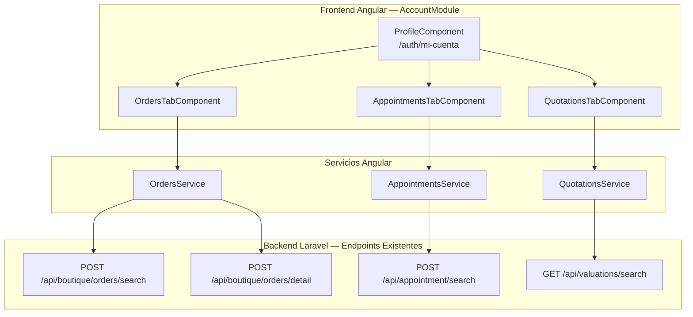
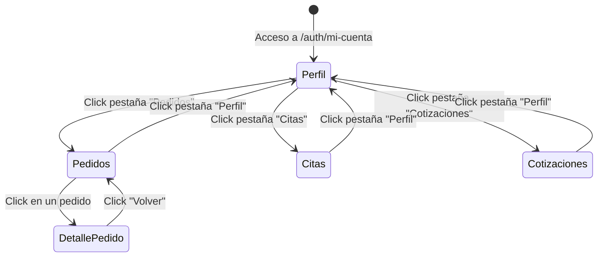

# Documento de Diseño — Secciones del Perfil de Cliente

## Resumen General

Este documento describe el diseño técnico para agregar navegación por pestañas a la página de perfil del cliente (`/auth/mi-cuenta`). Se implementarán cuatro pestañas: Perfil (contenido existente), Pedidos (historial de compras Boutique), Citas (citas agendadas) y Cotizaciones (valuaciones de vehículos). El frontend Angular consumirá endpoints existentes del backend Laravel protegidos con Sanctum. Se mantiene el sistema de diseño actual: tarjetas blancas con `border-radius: 16px`, color primario `#1c69d4`, Material Icons, y toda la interfaz en español.

### Hallazgos de Investigación

- **ProfileComponent** (`vecsa-frontend/src/app/auth/pages/account/pages/profile/`) es el componente principal de la ruta `/auth/mi-cuenta`. Contiene hero, tarjeta de usuario, puntos rewards, gráfica echarts, leaderboard y eventos.
- **AccountModule** usa `CUSTOM_ELEMENTS_SCHEMA` y declara componentes como `ProfileComponent`, `SettingsComponent`, barras de gráficas y swipers.
- **Endpoints existentes**:
  - `POST /api/boutique/orders/search` — filtra por `user_id` del token Sanctum, retorna `orders[]` con `order_number`, `status`, `created_at`, `total`, `order_items_count`.
  - `POST /api/boutique/orders/detail` — recibe `uuid`, verifica propiedad del usuario, retorna `order` con `orderItems`, `payment`, `shipment`.
  - `POST /api/appointment/search` — recibe `type`, `keyword`, `paginate`, retorna `appointments` paginados con datos de customer, vehicle, dealership.
  - `GET /api/valuations/search` — filtra por `auth()->user()->valuations()`, retorna valuaciones paginadas con `appointment.customer`, `appointment.vehicle`, `valuator`, `vehicle`.
- **Patrón de autenticación**: el token se almacena como `user_token` en localStorage. Las llamadas autenticadas usan `Authorization: Bearer {token}` en headers.
- **Modelos relevantes**: `BoutiqueOrder` (uuid, order_number, status, subtotal, shipping_cost, total, delivery_method, shipping_*), `CustomerAppointment` (uuid, type, scheduled_date, dealership_name, status), `VehicleValuation` (uuid, status, created_at, vehicle relation con brand/model/year).

---

## Arquitectura

### Diagrama de Arquitectura



### Decisiones de Diseño

1. **Tabs en ProfileComponent**: La navegación por pestañas se implementa directamente en `ProfileComponent` usando una variable `activeTab` y `*ngIf` para mostrar/ocultar secciones. No se usa Angular Material Tabs para evitar dependencias de Material form fields en el diseño nuevo.
2. **Componentes por pestaña**: Cada sección nueva (Pedidos, Citas, Cotizaciones) es un componente hijo declarado en `AccountModule`. La pestaña Perfil mantiene el contenido inline existente.
3. **Servicios dedicados**: Se crean tres servicios (`OrdersService`, `AppointmentsService`, `QuotationsService`) en `vecsa-frontend/src/app/auth/pages/account/services/` para encapsular las llamadas HTTP a cada endpoint.
4. **Caché por sesión**: Cada componente hijo almacena los datos en memoria tras la primera carga. Al cambiar de pestaña y volver, no se re-consulta la API (Requisito 7.5).
5. **Patrón de headers**: Se replica el patrón existente de `localStorage.getItem('user_token')` + `Bearer` header, consistente con `AuthService` del proyecto.

---

## Componentes e Interfaces

### Componentes Nuevos

| Componente | Ubicación | Responsabilidad |
|---|---|---|
| `OrdersTabComponent` | `account/components/orders-tab/` | Lista de pedidos + vista de detalle |
| `AppointmentsTabComponent` | `account/components/appointments-tab/` | Lista de citas del cliente |
| `QuotationsTabComponent` | `account/components/quotations-tab/` | Lista de cotizaciones/valuaciones |

### Modificaciones a Componentes Existentes

| Componente | Cambio |
|---|---|
| `ProfileComponent` | Agregar barra de tabs debajo del hero, variable `activeTab`, `*ngIf` para cada sección |
| `AccountModule` | Declarar los 3 nuevos componentes |

### Servicios Nuevos

| Servicio | Ubicación | Métodos |
|---|---|---|
| `OrdersService` | `account/services/orders.service.ts` | `search(): Observable<OrdersResponse>`, `detail(uuid: string): Observable<OrderDetailResponse>` |
| `AppointmentsService` | `account/services/appointments.service.ts` | `search(): Observable<AppointmentsResponse>` |
| `QuotationsService` | `account/services/quotations.service.ts` | `search(): Observable<QuotationsResponse>` |

### Interfaces

```typescript
// orders.interface.ts
interface Order {
  uuid: string;
  order_number: string;
  status: string;
  subtotal: string;
  shipping_cost: string;
  total: string;
  delivery_method: string;
  created_at: string;
  order_items_count: number;
}

interface OrderDetail {
  uuid: string;
  order_number: string;
  status: string;
  subtotal: string;
  shipping_cost: string;
  total: string;
  delivery_method: string;
  shipping_name: string;
  shipping_address: string;
  shipping_city: string;
  shipping_state: string;
  shipping_zip: string;
  shipping_phone: string;
  notes: string;
  created_at: string;
  order_items: OrderItem[];
  payment: Payment | null;
  shipment: Shipment | null;
}

interface OrderItem {
  uuid: string;
  product_name: string;
  quantity: number;
  unit_price: string;
  total: string;
}

interface Payment {
  uuid: string;
  method: string;
  status: string;
  amount: string;
}

interface Shipment {
  uuid: string;
  carrier: string;
  tracking_number: string;
  status: string;
}

interface OrdersResponse {
  status: number;
  message: string;
  data: { orders: Order[] };
}

interface OrderDetailResponse {
  status: number;
  message: string;
  data: { order: OrderDetail };
}


// appointments.interface.ts
interface Appointment {
  appointment_uuid: string;
  customer_name: string;
  customer_lastname: string;
  phone_1: string;
  vehicle_brandname: string;
  vehicle_modelname: string;
  vehicle_year: string;
  vehicle_mileage: string;
  appointment_type: string;
  appointment_scheduled_date: string;
  dealership_name: string;
  valuator_name: string | null;
  valuator_last_name: string | null;
}

interface AppointmentsResponse {
  status: number;
  message: string;
  data: {
    appointments: {
      data: Appointment[];
      current_page: number;
      last_page: number;
      total: number;
    };
  };
}

// quotations.interface.ts
interface Quotation {
  uuid: string;
  status: string;
  created_at: string;
  appointment: {
    customer: { name: string; last_name: string; };
    vehicle: { brand_name: string; model_name: string; year: string; mileage: string; };
  } | null;
  vehicle: {
    brand: { name: string } | null;
    line: { name: string } | null;
    model: { name: string } | null;
    year: string;
  } | null;
}

interface QuotationsResponse {
  status: number;
  message: string;
  data: {
    data: Quotation[];
    current_page: number;
    last_page: number;
    total: number;
  };
}
```

### Flujo de Navegación por Pestañas



---

## Modelos de Datos

### Modelos Backend (Existentes — Sin Modificaciones)

Los modelos de Laravel ya existen y no requieren cambios:

| Modelo | Tabla | Campos Relevantes para el Cliente |
|---|---|---|
| `BoutiqueOrder` | `app_vecsa_boutique_orders` | uuid, order_number, status, subtotal, shipping_cost, total, delivery_method, created_at |
| `BoutiqueOrderItem` | `app_vecsa_boutique_order_items` | uuid, product_name, quantity, unit_price, total |
| `BoutiquePayment` | `app_vecsa_boutique_payments` | uuid, method, status, amount |
| `BoutiqueShipment` | `app_vecsa_boutique_shipments` | uuid, carrier, tracking_number, status |
| `CustomerAppointment` | `app_vecsa_customer_appointments` | uuid, type, scheduled_date, dealership_name, status |
| `VehicleValuation` | `app_vecsa_vehicle_valuations` | uuid, status, created_at |

### Mapeo de Estados de Pedido a Colores

| Estado | Badge Color | Texto |
|---|---|---|
| `pendiente` | `#94a3b8` (gris) | Pendiente |
| `pagado` | `#1c69d4` (azul) | Pagado |
| `en_preparacion` | `#eab308` (amarillo) | En preparación |
| `enviado` | `#f97316` (naranja) | Enviado |
| `entregado` | `#22c55e` (verde) | Entregado |
| `cancelado` | `#ef4444` (rojo) | Cancelado |

### Mapeo de Tipos de Cita a Íconos

| Tipo | Material Icon | Texto |
|---|---|---|
| `valuation` | `directions_car` | Valuación |
| `service` | `build` | Servicio |
| `general` | `event` | General |
| (otro) | `event_note` | (capitalizado) |

---

## Propiedades de Correctitud

*Una propiedad es una característica o comportamiento que debe mantenerse verdadero en todas las ejecuciones válidas de un sistema — esencialmente, una declaración formal sobre lo que el sistema debe hacer. Las propiedades sirven como puente entre especificaciones legibles por humanos y garantías de correctitud verificables por máquina.*

### Propiedad 1: Exclusividad de selección de pestaña

*Para cualquier* selección de pestaña del conjunto {perfil, pedidos, citas, cotizaciones}, al activar esa pestaña, únicamente el contenido de la sección correspondiente debe ser visible y las demás secciones deben estar ocultas.

**Valida: Requisito 1.3**

### Propiedad 2: Campos requeridos en tarjeta de pedido

*Para cualquier* pedido con datos válidos (order_number, created_at, status, order_items_count, total), la función de renderizado de la tarjeta de pedido debe producir una salida que contenga todos estos campos.

**Valida: Requisito 3.3**

### Propiedad 3: Campos requeridos en tarjeta de cita

*Para cualquier* cita con datos válidos (scheduled_date, type, dealership_name, vehicle_brandname, vehicle_modelname), la función de renderizado de la tarjeta de cita debe producir una salida que contenga todos estos campos.

**Valida: Requisito 4.3**

### Propiedad 4: Campos requeridos en tarjeta de cotización

*Para cualquier* cotización con datos válidos (marca del vehículo, modelo, año, kilometraje, status, created_at), la función de renderizado de la tarjeta de cotización debe producir una salida que contenga todos estos campos.

**Valida: Requisito 5.3**

### Propiedad 5: Mapeo de estado/tipo a indicador visual

*Para cualquier* estado de pedido del conjunto {pendiente, pagado, en_preparacion, enviado, entregado, cancelado}, la función de mapeo debe retornar el color de badge correcto. *Para cualquier* tipo de cita del conjunto {valuation, service, general}, la función de mapeo debe retornar el ícono Material correcto. *Para cualquier* estado de cotización, la función de mapeo debe retornar el color de badge correcto.

**Valida: Requisitos 3.4, 4.4, 5.4**

### Propiedad 6: Ordenamiento descendente por fecha

*Para cualquier* lista de elementos (pedidos, citas o cotizaciones) con dos o más registros, los elementos deben estar ordenados por su campo de fecha (created_at o scheduled_date) de forma descendente — es decir, el elemento más reciente aparece primero.

**Valida: Requisitos 3.8, 4.7, 5.7**

### Propiedad 7: Filtrado por propiedad del usuario autenticado

*Para cualquier* usuario autenticado, las respuestas de la API de pedidos, citas y cotizaciones deben contener únicamente registros que pertenezcan a ese usuario. Ningún registro de otro usuario debe aparecer en los resultados.

**Valida: Requisitos 6.1, 6.3, 6.5**

### Propiedad 8: Caché de datos por pestaña

*Para cualquier* secuencia de cambios de pestaña, si los datos de una sección ya fueron cargados exitosamente, al volver a esa pestaña no se debe mostrar el estado de carga ni realizar una nueva llamada a la API.

**Valida: Requisito 7.5**

---

## Manejo de Errores

### Errores de Red / API

| Escenario | Comportamiento |
|---|---|
| API retorna error 401 (no autenticado) | Redirigir a `/auth/login` |
| API retorna error 500 o timeout | Mostrar mensaje "Error al cargar [sección]. Intenta de nuevo." con botón de reintentar |
| API retorna lista vacía | Mostrar estado vacío con ícono y mensaje descriptivo por sección |
| Error de red (sin conexión) | Mostrar mensaje de error genérico con botón de reintentar |

### Mensajes de Estado Vacío por Sección

| Sección | Ícono | Mensaje Principal | Mensaje Secundario |
|---|---|---|---|
| Pedidos | `shopping_bag` | "Aún no tienes pedidos en la Boutique" | "Explora nuestra tienda para encontrar productos exclusivos" |
| Citas | `event_busy` | "No tienes citas agendadas" | "Agenda una cita para tu próximo servicio" |
| Cotizaciones | `directions_car` | "No tienes cotizaciones registradas" | "Solicita una valuación de tu vehículo" |

### Mensajes de Error por Sección

| Sección | Mensaje | Acción |
|---|---|---|
| Pedidos | "Error al cargar los pedidos. Intenta de nuevo." | Botón "Reintentar" que re-ejecuta `loadOrders()` |
| Citas | "Error al cargar las citas. Intenta de nuevo." | Botón "Reintentar" que re-ejecuta `loadAppointments()` |
| Cotizaciones | "Error al cargar las cotizaciones. Intenta de nuevo." | Botón "Reintentar" que re-ejecuta `loadQuotations()` |

---

## Estrategia de Testing

### Testing Unitario

Se usarán tests unitarios con Jasmine + Karma (stack existente de Angular) para:

- **Ejemplos específicos**: Verificar que el componente renderiza las 4 pestañas, que la pestaña por defecto es "Perfil", que al hacer click en "Pedidos" se llama al servicio correspondiente.
- **Edge cases**: Lista vacía muestra estado vacío, error de API muestra mensaje de error con botón reintentar, usuario no autenticado redirige a login.
- **Integración de componentes**: Verificar que `ProfileComponent` pasa correctamente los datos a los componentes hijos.

### Testing Basado en Propiedades

Se usará **fast-check** como librería de property-based testing para TypeScript/Angular.

Configuración:
- Mínimo 100 iteraciones por test de propiedad
- Cada test debe referenciar la propiedad del documento de diseño

Tests de propiedad a implementar:

1. **Feature: client-profile-sections, Property 1: Exclusividad de selección de pestaña** — Generar selecciones aleatorias de pestañas y verificar que solo una sección es visible.
2. **Feature: client-profile-sections, Property 2: Campos requeridos en tarjeta de pedido** — Generar pedidos aleatorios y verificar que la función de renderizado incluye todos los campos requeridos.
3. **Feature: client-profile-sections, Property 3: Campos requeridos en tarjeta de cita** — Generar citas aleatorias y verificar que la función de renderizado incluye todos los campos requeridos.
4. **Feature: client-profile-sections, Property 4: Campos requeridos en tarjeta de cotización** — Generar cotizaciones aleatorias y verificar que la función de renderizado incluye todos los campos requeridos.
5. **Feature: client-profile-sections, Property 5: Mapeo de estado/tipo a indicador visual** — Generar estados/tipos aleatorios y verificar que el mapeo retorna el valor visual correcto.
6. **Feature: client-profile-sections, Property 6: Ordenamiento descendente por fecha** — Generar listas aleatorias de elementos y verificar que tras ordenar, cada elemento tiene fecha >= al siguiente.
7. **Feature: client-profile-sections, Property 7: Filtrado por propiedad del usuario autenticado** — Generar conjuntos de datos con múltiples usuarios y verificar que el filtrado retorna solo datos del usuario autenticado.
8. **Feature: client-profile-sections, Property 8: Caché de datos por pestaña** — Generar secuencias aleatorias de cambios de pestaña y verificar que las llamadas API solo ocurren en la primera visita.

### Balance Unit Tests vs Property Tests

- **Unit tests**: Casos concretos de UI (renderizado de tabs, estados de carga, navegación), edge cases (listas vacías, errores), integración con servicios.
- **Property tests**: Propiedades universales (mapeos, ordenamiento, filtrado, campos requeridos) que deben cumplirse para cualquier dato válido.
- Ambos enfoques son complementarios: los unit tests capturan bugs concretos, los property tests verifican correctitud general.
