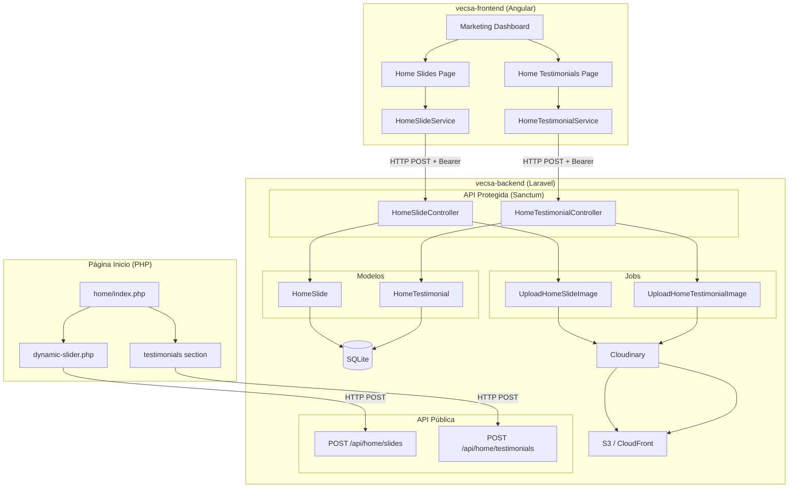

# Documento de Diseño Técnico: Home Content Manager

## Resumen

Este diseño describe la migración de la gestión de contenido de la página de inicio (slides del hero y testimonios Success Day) desde un panel PHP standalone con archivos JSON hacia la arquitectura existente de vecsa-backend (Laravel) + vecsa-frontend (Angular). Se crean dos nuevas entidades (HomeSlide, HomeTestimonial) con sus respectivos CRUDs, carga de imágenes vía Cloudinary/S3, endpoints públicos para la página PHP, y módulos de administración en Angular.

La migración sigue estrictamente los patrones ya establecidos en el sistema: modelos con UUID, prefijo de tabla `app_vecsa_`, Jobs en cola para imágenes, ApiResponseHelper, rutas POST, FormRequests, y módulos Angular lazy-loaded con Material + CDK DragDrop.

## Arquitectura



### Decisiones de Diseño

1. **Dos Jobs separados** (UploadHomeSlideImage, UploadHomeTestimonialImage) en lugar de uno genérico, para mantener consistencia con el patrón existente de UploadPromotionImage y permitir configuración independiente de carpetas Cloudinary.

2. **Endpoints POST** para todas las operaciones, siguiendo la convención existente del proyecto (no RESTful).

3. **HomeController público** separado de los controllers protegidos, para mantener la separación entre API pública y protegida.

4. **Reutilización del Módulo Marketing** existente en Angular, agregando rutas y componentes dentro del mismo módulo lazy-loaded.

## Componentes e Interfaces

### Backend - Laravel

#### Migraciones
- `create_home_slides_table.php` - Tabla `{prefix}home_slides`
- `create_home_testimonials_table.php` - Tabla `{prefix}home_testimonials`

#### Modelos
- `HomeSlide` - Modelo Eloquent con UUID boot, SoftDeletes, findByUuid()
- `HomeTestimonial` - Modelo Eloquent con UUID boot, SoftDeletes, findByUuid()

#### Controllers
- `HomeSlideController` (protegido) - search, store, update, delete, sortUpdate, toggle
- `HomeTestimonialController` (protegido) - search, store, delete, sortUpdate, toggle
- `HomePublicController` (público) - slides, testimonials

#### FormRequests
- `StoreHomeSlideRequest` - Validación para crear/actualizar slides
- `StoreHomeTestimonialRequest` - Validación para crear testimonios
- `DeleteHomeSlideRequest` - Validación de uuid para eliminar slide
- `DeleteHomeTestimonialRequest` - Validación de uuid para eliminar testimonio
- `UpdateSortHomeSlideRequest` - Validación para reordenar slides
- `UpdateSortHomeTestimonialRequest` - Validación para reordenar testimonios
- `ToggleHomeSlideRequest` - Validación de uuid para toggle
- `ToggleHomeTestimonialRequest` - Validación de uuid para toggle

#### Jobs
- `UploadHomeSlideImage` - Sube imagen desktop/mobile a Cloudinary → S3, actualiza campo en modelo
- `UploadHomeTestimonialImage` - Sube imagen a Cloudinary → S3, actualiza campo en modelo

#### Rutas API (api.php)
```php
// Público
Route::prefix('home')->middleware('bandwidth_usage')->group(function () {
    Route::post('/slides', [HomePublicController::class, 'slides']);
    Route::post('/testimonials', [HomePublicController::class, 'testimonials']);
});

// Protegido
Route::prefix('home_slides')->middleware(['bandwidth_usage', 'auth:sanctum'])->group(function () {
    Route::post('/', [HomeSlideController::class, 'store']);
    Route::post('/search', [HomeSlideController::class, 'search']);
    Route::post('/update', [HomeSlideController::class, 'update']);
    Route::post('/delete', [HomeSlideController::class, 'delete']);
    Route::post('/sort_update', [HomeSlideController::class, 'sortUpdate']);
    Route::post('/toggle', [HomeSlideController::class, 'toggle']);
});

Route::prefix('home_testimonials')->middleware(['bandwidth_usage', 'auth:sanctum'])->group(function () {
    Route::post('/', [HomeTestimonialController::class, 'store']);
    Route::post('/search', [HomeTestimonialController::class, 'search']);
    Route::post('/delete', [HomeTestimonialController::class, 'delete']);
    Route::post('/sort_update', [HomeTestimonialController::class, 'sortUpdate']);
    Route::post('/toggle', [HomeTestimonialController::class, 'toggle']);
});
```

### Frontend - Angular

#### Servicios
- `HomeSlideService` - Métodos: search, store, update, delete, sortUpdate, toggle
- `HomeTestimonialService` - Métodos: search, store, delete, sortUpdate, toggle

#### Interfaces (en admin.interfaces.ts)
```typescript
export interface HomeSlide {
  uuid: string;
  title: string;
  subtitle: string;
  offer_main: string;
  offer_main_text: string;
  offer_sub: string;
  offer_secondary: string;
  offer_secondary_text: string;
  button_text: string;
  button_link: string;
  disclaimer: string;
  desktop_image_path: string;
  mobile_image_path: string;
  active: boolean;
  sort_id: number;
  created_at: string;
}

export interface HomeTestimonial {
  uuid: string;
  image_path: string;
  alt: string;
  active: boolean;
  sort_id: number;
  created_at: string;
}

export interface HomeSlidesResponse extends GralResponse {
  data: { slides: HomeSlide[] };
}

export interface HomeTestimonialsResponse extends GralResponse {
  data: { testimonials: HomeTestimonial[] };
}
```

#### Componentes
- `HomeSlidesComponent` - Página de gestión de slides (tabla con drag-drop, formulario modal, toggle)
- `HomeTestimonialsComponent` - Página de gestión de testimonios (grid con drag-drop, upload, toggle)

#### Rutas (marketing-routing.module.ts)
```typescript
{ path: 'home-slides', component: HomeSlidesComponent },
{ path: 'home-testimonials', component: HomeTestimonialsComponent },
```

#### Dashboard
Agregar dos tarjetas de navegación al `DashboardComponent`:
- "Home Slides" → `/admin/marketing/home-slides` con icono `fi fi-rr-picture`
- "Testimonios" → `/admin/marketing/home-testimonials` con icono `fi fi-rr-star`

### Página PHP

#### Modificaciones a `dynamic-slider.php`
- Reemplazar lectura de `slides.json` por llamada HTTP a `{API_BASE_URL}/api/home/slides`
- Usar `file_get_contents()` o `curl` para consumir la API
- Renderizar imágenes desde URLs de CloudFront (desktop_image_path, mobile_image_path)
- Fallback a sección vacía si la API falla

#### Modificaciones a `index.php` (sección testimonials)
- Reemplazar lectura de `testimonials.json` por llamada HTTP a `{API_BASE_URL}/api/home/testimonials`
- Renderizar imágenes desde URLs de CloudFront (image_path)
- Fallback a sección vacía si la API falla

#### Configuración
- Crear variable `$api_base_url` en un archivo de configuración PHP o al inicio de `index.php`

## Modelos de Datos

### Tabla: `{DB_TABLE_PREFIX}home_slides`

| Campo | Tipo | Restricciones |
|-------|------|---------------|
| id | INTEGER | PK, autoincrement |
| sort_id | INTEGER (unsigned) | nullable |
| uuid | UUID | unique |
| title | VARCHAR(255) | not null |
| subtitle | VARCHAR(255) | nullable |
| offer_main | VARCHAR(100) | nullable |
| offer_main_text | VARCHAR(255) | nullable |
| offer_sub | VARCHAR(255) | nullable |
| offer_secondary | VARCHAR(100) | nullable |
| offer_secondary_text | VARCHAR(255) | nullable |
| button_text | VARCHAR(255) | nullable, default: 'Más Información' |
| button_link | VARCHAR(500) | nullable |
| disclaimer | TEXT | nullable |
| desktop_image_path | VARCHAR(500) | nullable |
| mobile_image_path | VARCHAR(500) | nullable |
| active | BOOLEAN | default: true |
| created_at | TIMESTAMP | nullable |
| updated_at | TIMESTAMP | nullable |
| deleted_at | TIMESTAMP | nullable (soft delete) |

### Tabla: `{DB_TABLE_PREFIX}home_testimonials`

| Campo | Tipo | Restricciones |
|-------|------|---------------|
| id | INTEGER | PK, autoincrement |
| sort_id | INTEGER (unsigned) | nullable |
| uuid | UUID | unique |
| image_path | VARCHAR(500) | not null |
| alt | VARCHAR(255) | nullable |
| active | BOOLEAN | default: true |
| created_at | TIMESTAMP | nullable |
| updated_at | TIMESTAMP | nullable |
| deleted_at | TIMESTAMP | nullable (soft delete) |

### Modelo HomeSlide

```php
class HomeSlide extends Model {
    use HasFactory, SoftDeletes;

    protected $table; // {DB_TABLE_PREFIX}home_slides

    protected $fillable = [
        'title', 'subtitle', 'offer_main', 'offer_main_text',
        'offer_sub', 'offer_secondary', 'offer_secondary_text',
        'button_text', 'button_link', 'disclaimer',
        'desktop_image_path', 'mobile_image_path',
        'active', 'sort_id'
    ];

    protected $hidden = ['id', 'updated_at', 'deleted_at'];

    protected $casts = ['active' => 'boolean'];

    // UUID boot, findByUuid(), Carbon accessors (mismo patrón que MarketingPromotion)
}
```

### Modelo HomeTestimonial

```php
class HomeTestimonial extends Model {
    use HasFactory, SoftDeletes;

    protected $table; // {DB_TABLE_PREFIX}home_testimonials

    protected $fillable = ['image_path', 'alt', 'active', 'sort_id'];

    protected $hidden = ['id', 'updated_at', 'deleted_at'];

    protected $casts = ['active' => 'boolean'];

    // UUID boot, findByUuid(), Carbon accessors (mismo patrón que MarketingPromotion)
}
```

### Variables de Entorno Nuevas

```env
CLOUDINARY_HOME_SLIDES_FOLDER_BASE=prueba_vecsa_home_slides
CLOUDINARY_HOME_TESTIMONIALS_FOLDER_BASE=prueba_vecsa_home_testimonials
```

## Propiedades de Correctitud

*Una propiedad es una característica o comportamiento que debe mantenerse verdadero en todas las ejecuciones válidas de un sistema — esencialmente, una declaración formal sobre lo que el sistema debe hacer. Las propiedades sirven como puente entre especificaciones legibles por humanos y garantías de correctitud verificables por máquina.*

### Propiedad 1: Generación automática de UUID

*Para cualquier* registro de HomeSlide o HomeTestimonial creado, el sistema debe asignar automáticamente un UUID v4 válido y único al campo `uuid`.

**Valida: Requerimientos 1.3, 2.3**

### Propiedad 2: Búsqueda ordenada por sort_id

*Para cualquier* conjunto de registros (slides o testimonios) con sort_ids arbitrarios, el endpoint `search` debe retornar todos los registros ordenados ascendentemente por `sort_id`.

**Valida: Requerimientos 3.2, 4.2**

### Propiedad 3: Creación de Slide preserva datos

*Para cualquier* datos válidos de slide (con título no vacío), al enviar una solicitud POST al endpoint store, el sistema debe crear un registro cuyo título, subtítulo y demás campos coincidan exactamente con los datos enviados.

**Valida: Requerimiento 3.1**

### Propiedad 4: Actualización de Slide modifica campos correctamente

*Para cualquier* slide existente y cualquier conjunto de campos válidos de actualización, al enviar una solicitud POST al endpoint update con el uuid del slide, los campos del registro deben reflejar los nuevos valores proporcionados.

**Valida: Requerimiento 3.3**

### Propiedad 5: Soft delete excluye de consultas normales

*Para cualquier* registro (slide o testimonio) existente, al eliminarlo mediante el endpoint delete, el registro debe tener `deleted_at` asignado y no debe aparecer en los resultados del endpoint search.

**Valida: Requerimientos 3.4, 4.3**

### Propiedad 6: Reordenamiento actualiza sort_ids correctamente

*Para cualquier* conjunto de registros (slides o testimonios) y cualquier permutación de su orden, al enviar la nueva ordenación al endpoint sort_update, cada registro debe tener el sort_id correspondiente a su nueva posición.

**Valida: Requerimientos 3.5, 4.4**

### Propiedad 7: Toggle de estado es round-trip

*Para cualquier* registro (slide o testimonio), aplicar toggle dos veces consecutivas debe retornar el campo `active` a su valor original.

**Valida: Requerimientos 3.6, 4.5**

### Propiedad 8: Validación rechaza datos inválidos de Slide

*Para cualquier* solicitud de creación de slide que no incluya el campo `title` (o lo incluya vacío), el sistema debe rechazar la solicitud con un error de validación 422.

**Valida: Requerimiento 3.7**

### Propiedad 9: Validación de imagen rechaza archivos inválidos

*Para cualquier* archivo que no sea de tipo jpeg, png, jpg, gif o webp, o que exceda 5 MB, el sistema debe rechazar la solicitud de creación de testimonio con un error de validación 422.

**Valida: Requerimiento 4.6**

### Propiedad 10: UUID inexistente retorna 404

*Para cualquier* UUID generado aleatoriamente que no corresponda a un registro existente, las operaciones de delete, update, y toggle deben retornar un error 404.

**Valida: Requerimientos 3.8, 4.7**

### Propiedad 11: API pública filtra solo activos y ordena por sort_id

*Para cualquier* conjunto de registros (slides o testimonios) con estados `active` mixtos (true/false) y sort_ids arbitrarios, el endpoint público debe retornar únicamente los registros con `active = true`, ordenados ascendentemente por `sort_id`.

**Valida: Requerimientos 7.1, 7.2**

## Manejo de Errores

| Escenario | Código HTTP | Respuesta | Patrón |
|-----------|-------------|-----------|--------|
| UUID no encontrado (slide/testimonio) | 404 | `ApiResponseHelper::apiError(mensaje, null, 404, 'NOT_FOUND')` | Igual que PromotionController |
| Validación de formulario falla | 422 | `ApiResponseHelper::validationError($e)` | FormRequest automático |
| Error en carga de imagen (Job) | 500 (log) | Log de error + `ApiResponseHelper::imageError(...)` | Igual que UploadPromotionImage |
| Job en cola duplicado | 429 | `ApiResponseHelper::apiError(mensaje, null, 429, 'UPLOAD_IN_PROGRESS')` | Igual que PromotionController |
| API pública no disponible (PHP) | N/A | Secciones vacías, página sigue cargando | `try/catch` en PHP con fallback |
| Error genérico del servidor | 500 | `ApiResponseHelper::apiError(mensaje, $e->getMessage(), 500, 'ERROR_CODE')` | Patrón estándar |

### Estrategia de Fallback en PHP

```php
function fetchFromApi($endpoint) {
    $url = $api_base_url . $endpoint;
    $context = stream_context_create([
        'http' => ['timeout' => 5, 'method' => 'POST']
    ]);
    $response = @file_get_contents($url, false, $context);
    if ($response === false) return [];
    $data = json_decode($response, true);
    return $data['data'] ?? [];
}
```

## Estrategia de Testing

### Tests Unitarios (PHPUnit)

Tests específicos para verificar ejemplos concretos y edge cases:

- **Migraciones**: Verificar que las tablas se crean con las columnas correctas y el prefijo de tabla
- **Modelos**: Verificar que el prefijo de tabla se aplica, que los casts funcionan, que `findByUuid()` retorna el modelo correcto
- **FormRequests**: Verificar reglas de validación específicas (title requerido, tipos de imagen permitidos, tamaño máximo)
- **Jobs**: Verificar que el job se despacha correctamente al crear slides/testimonios con imágenes (usando `Queue::fake()`)
- **Rutas**: Verificar que los endpoints existen con los middlewares correctos
- **Fallback PHP**: Verificar que la página no se rompe cuando la API no responde

### Tests de Propiedades (PHPUnit + custom generators)

Cada propiedad de correctitud se implementa como un test con mínimo 100 iteraciones usando datos generados aleatoriamente. Se usará PHPUnit con generadores personalizados (factory + Faker) para generar datos aleatorios, ya que el proyecto ya usa PHPUnit como framework de testing.

Configuración:
- Mínimo 100 iteraciones por test de propiedad
- Cada test debe referenciar su propiedad del documento de diseño
- Formato de tag: `Feature: home-content-manager, Property {number}: {texto de la propiedad}`

Ejemplo de estructura:

```php
/**
 * Feature: home-content-manager, Property 1: UUID auto-generation
 * For any HomeSlide or HomeTestimonial created, the system must auto-assign a valid UUID v4.
 */
public function test_property_1_uuid_auto_generation(): void
{
    for ($i = 0; $i < 100; $i++) {
        $slide = HomeSlide::create([
            'title' => fake()->sentence(),
            // ... random data
        ]);
        $this->assertNotNull($slide->uuid);
        $this->assertTrue(Uuid::isValid($slide->uuid));
    }
}
```

### Cobertura de Propiedades

| Propiedad | Tipo de Test | Iteraciones |
|-----------|-------------|-------------|
| 1: UUID auto-generation | Property | 100 |
| 2: Search ordered by sort_id | Property | 100 |
| 3: Store preserves data | Property | 100 |
| 4: Update modifies fields | Property | 100 |
| 5: Soft delete excludes | Property | 100 |
| 6: Sort update reassigns | Property | 100 |
| 7: Toggle round-trip | Property | 100 |
| 8: Validation rejects invalid | Property | 100 |
| 9: Image validation | Property | 100 |
| 10: Non-existent UUID → 404 | Property | 100 |
| 11: Public filters active + orders | Property | 100 |
