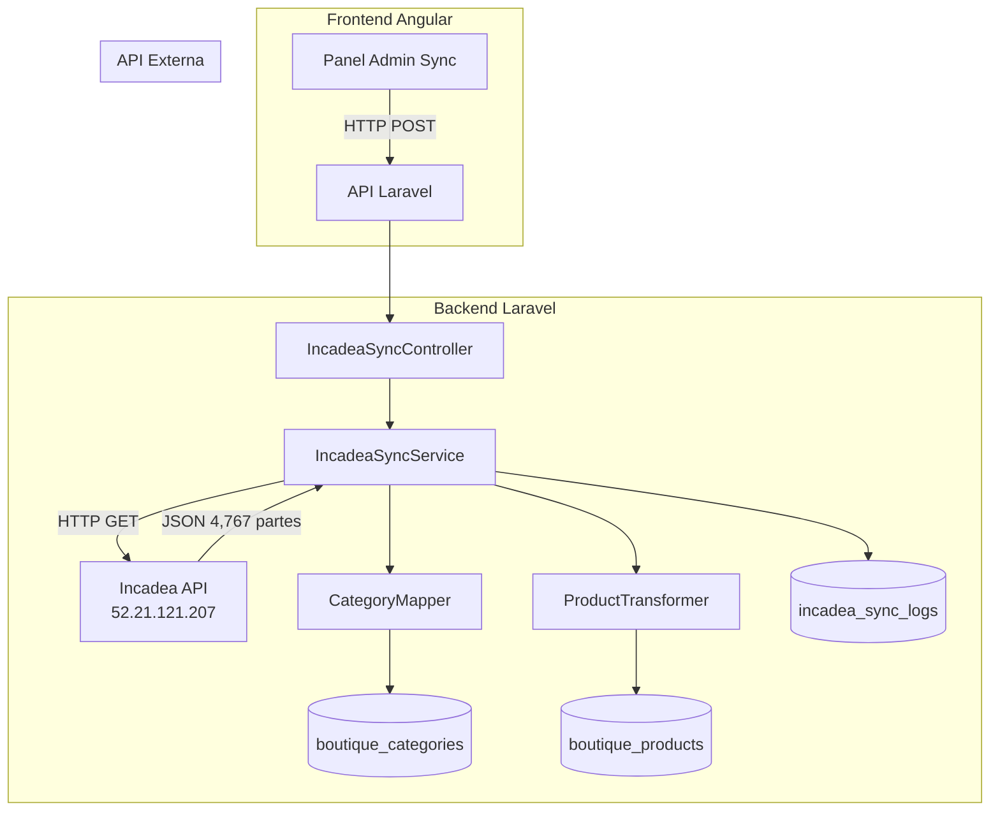
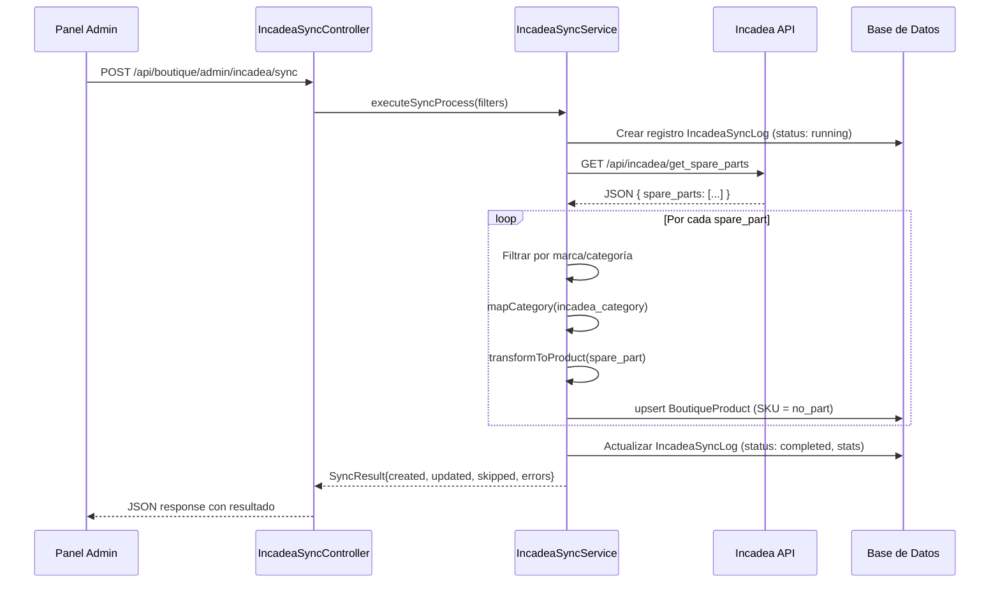
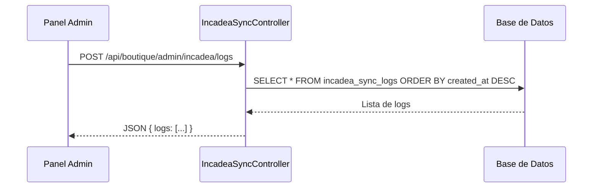

# Documento de Diseño: Sincronización Incadea → Boutique

## Resumen General

Esta funcionalidad permite sincronizar el inventario de refacciones desde la API externa de Incadea hacia el catálogo de productos de la Boutique existente. El proceso consume el endpoint `GET http://52.21.121.207/api/incadea/get_spare_parts`, transforma los datos de refacciones al formato de `BoutiqueProduct`, mapea las categorías de Incadea a las categorías existentes de la Boutique, y realiza operaciones de creación/actualización (upsert) basándose en el campo `no_part` como SKU único.

El sistema incluye un panel administrativo en Angular para disparar la sincronización manualmente, visualizar el estado del proceso, configurar filtros de marcas/categorías, y revisar un log de cambios realizados en cada ejecución.

## Arquitectura



## Diagrama de Secuencia — Flujo Principal de Sincronización



## Diagrama de Secuencia — Consulta de Estado



## Componentes e Interfaces

### Componente 1: IncadeaSyncController

**Propósito**: Exponer endpoints REST para disparar la sincronización y consultar logs.

**Interfaz**:
```php
class IncadeaSyncController extends Controller
{
    // Dispara el proceso de sincronización
    // POST /api/boutique/admin/incadea/sync
    public function sync(Request $request): JsonResponse;

    // Obtiene el historial de sincronizaciones
    // POST /api/boutique/admin/incadea/logs
    public function logs(Request $request): JsonResponse;

    // Obtiene la configuración actual de filtros
    // POST /api/boutique/admin/incadea/config
    public function getConfig(): JsonResponse;

    // Actualiza la configuración de filtros
    // POST /api/boutique/admin/incadea/update_config
    public function updateConfig(Request $request): JsonResponse;
}
```

**Responsabilidades**:
- Validar permisos del usuario (roles: developer, administrator)
- Delegar la lógica al servicio `IncadeaSyncService`
- Retornar respuestas estandarizadas con `ApiResponseHelper`

### Componente 2: IncadeaSyncService

**Propósito**: Orquestar todo el proceso de sincronización: consumir API, transformar datos, y persistir.

**Interfaz**:
```php
class IncadeaSyncService
{
    public function executeSyncProcess(array $filters): SyncResult;
    public function fetchSpareParts(): array;
    public function filterParts(array $parts, array $filters): array;
    public function syncPart(array $part): string; // 'created' | 'updated' | 'skipped'
}
```

**Responsabilidades**:
- Consumir la API de Incadea vía HTTP
- Aplicar filtros de marca y categoría
- Coordinar el mapeo de categorías y la transformación de productos
- Registrar logs de sincronización
- Manejar errores individuales sin detener el proceso completo

### Componente 3: CategoryMapper

**Propósito**: Mapear categorías de Incadea a categorías existentes de la Boutique.

**Interfaz**:
```php
class CategoryMapper
{
    // Retorna el category_id de Boutique para una categoría de Incadea
    public function resolve(string $incadeaCategory): ?int;

    // Retorna la tabla completa de mapeo
    public function getMappingTable(): array;
}
```

**Tabla de Mapeo**:
| Categoría Incadea | Categoría Boutique |
|---|---|
| Tires | Llantas y Rines |
| Complete wheels/Rim | Llantas y Rines |
| Car accesories | Accesorios |
| Life Style Accesories | Life Style |
| Workshop Equipment | Accesorios |
| Operating/Auxiliary material | Clean & Care |
| Original Part | Accesorios |
| Exchange part | Accesorios |
| Unknown category | *(se omite o se asigna a "Accesorios" según config)* |

### Componente 4: IncadeaSyncLog (Modelo)

**Propósito**: Registrar cada ejecución de sincronización con estadísticas.

## Modelos de Datos

### Modelo: IncadeaSyncLog

```php
// Migración: create_incadea_sync_logs_table
Schema::create('incadea_sync_logs', function (Blueprint $table) {
    $table->id();
    $table->uuid()->unique();
    $table->foreignId('user_id')->constrained('users')->onDelete('cascade');
    $table->enum('status', ['running', 'completed', 'failed'])->default('running');
    $table->unsignedInteger('total_fetched')->default(0);
    $table->unsignedInteger('total_created')->default(0);
    $table->unsignedInteger('total_updated')->default(0);
    $table->unsignedInteger('total_skipped')->default(0);
    $table->unsignedInteger('total_errors')->default(0);
    $table->json('filters_applied')->nullable();
    $table->json('error_details')->nullable();
    $table->timestamp('started_at')->nullable();
    $table->timestamp('finished_at')->nullable();
    $table->timestamps();
});
```

**Reglas de Validación**:
- `status` solo puede ser: running, completed, failed
- `total_*` deben ser >= 0
- `started_at` siempre se registra al iniciar

### Modelo: BoutiqueProduct (existente — campos relevantes)

```php
// Campos usados en la sincronización:
[
    'category_id' => int,       // FK → boutique_categories.id (mapeado)
    'name'        => string,    // ← description de Incadea
    'description' => string,    // ← "Marca: {brand} | Ubicación: {location_code} | Caja: {box_code}"
    'price'       => decimal,   // ← unit_price de Incadea
    'sku'         => string,    // ← no_part de Incadea (clave única para upsert)
    'stock'       => int,       // ← exists_parts de Incadea
    'active'      => boolean,   // true si exists_parts > 0
]
```

### Modelo: IncadeaSyncConfig (tabla system_settings)

Se reutiliza la tabla `system_settings` existente para almacenar la configuración:

```php
// Clave: 'incadea_sync_config'
// Valor JSON:
{
    "excluded_brands": ["OTRAS"],
    "excluded_categories": ["Unknown category"],
    "sync_inactive_when_zero_stock": true,
    "default_category_slug": "Accesorios"
}
```

## Pseudocódigo Algorítmico

### Algoritmo Principal: executeSyncProcess

```php
/**
 * Ejecuta el proceso completo de sincronización.
 *
 * Precondiciones:
 *   - El usuario tiene rol developer o administrator
 *   - La API de Incadea es accesible
 *
 * Postcondiciones:
 *   - Se crea un registro IncadeaSyncLog con estadísticas finales
 *   - Los productos en boutique_products reflejan el estado actual de Incadea
 *   - Productos existentes se actualizan (precio, stock, categoría)
 *   - Productos nuevos se crean con SKU = no_part
 */
public function executeSyncProcess(array $filters): SyncResult
{
    $log = IncadeaSyncLog::create([
        'user_id'    => auth()->id(),
        'status'     => 'running',
        'started_at' => now(),
        'filters_applied' => $filters,
    ]);

    try {
        // Paso 1: Obtener datos de Incadea
        $response = Http::timeout(30)->get('http://52.21.121.207/api/incadea/get_spare_parts');
        $spareParts = $response->json('data.spare_parts');
        $log->update(['total_fetched' => count($spareParts)]);

        // Paso 2: Filtrar por marca y categoría
        $filtered = $this->filterParts($spareParts, $filters);

        $stats = ['created' => 0, 'updated' => 0, 'skipped' => 0, 'errors' => 0];
        $errorDetails = [];

        // Paso 3: Procesar cada parte
        // Invariante de bucle: $stats refleja el conteo acumulado correcto
        foreach ($filtered as $part) {
            try {
                $result = $this->syncPart($part);
                $stats[$result]++;
            } catch (\Exception $e) {
                $stats['errors']++;
                $errorDetails[] = [
                    'no_part' => $part['no_part'],
                    'error'   => $e->getMessage(),
                ];
            }
        }

        // Paso 4: Registrar resultado
        $log->update([
            'status'         => 'completed',
            'total_created'  => $stats['created'],
            'total_updated'  => $stats['updated'],
            'total_skipped'  => $stats['skipped'],
            'total_errors'   => $stats['errors'],
            'error_details'  => $errorDetails ?: null,
            'finished_at'    => now(),
        ]);

        return new SyncResult($stats);

    } catch (\Exception $e) {
        $log->update([
            'status'        => 'failed',
            'error_details' => [['error' => $e->getMessage()]],
            'finished_at'   => now(),
        ]);
        throw $e;
    }
}
```

### Algoritmo: syncPart (Upsert individual)

```php
/**
 * Sincroniza una refacción individual al catálogo Boutique.
 *
 * Precondiciones:
 *   - $part contiene: no_part, description, unit_price, exists_parts, brand, category, location_code, box_code
 *   - no_part es un string no vacío
 *
 * Postcondiciones:
 *   - Si el SKU no existe → se crea un nuevo BoutiqueProduct, retorna 'created'
 *   - Si el SKU existe y hay cambios → se actualiza, retorna 'updated'
 *   - Si el SKU existe y no hay cambios → retorna 'skipped'
 *   - El campo active se establece según exists_parts > 0
 */
public function syncPart(array $part): string
{
    $categoryId = $this->categoryMapper->resolve($part['category']);

    if ($categoryId === null) {
        return 'skipped'; // Categoría no mapeada
    }

    $productData = [
        'category_id' => $categoryId,
        'name'        => $part['description'],
        'description' => "Marca: {$part['brand']} | Ubicación: {$part['location_code']} | Caja: {$part['box_code']}",
        'price'       => $part['unit_price'],
        'stock'       => $part['exists_parts'],
        'active'      => $part['exists_parts'] > 0,
    ];

    $existing = BoutiqueProduct::where('sku', $part['no_part'])->first();

    if (!$existing) {
        BoutiqueProduct::create(array_merge($productData, ['sku' => $part['no_part']]));
        return 'created';
    }

    // Verificar si hay cambios reales
    $hasChanges = false;
    foreach ($productData as $key => $value) {
        if ($existing->{$key} != $value) {
            $hasChanges = true;
            break;
        }
    }

    if ($hasChanges) {
        $existing->update($productData);
        return 'updated';
    }

    return 'skipped';
}
```

### Algoritmo: filterParts

```php
/**
 * Filtra las refacciones según la configuración.
 *
 * Precondiciones:
 *   - $parts es un array de refacciones de Incadea
 *   - $filters contiene excluded_brands y excluded_categories
 *
 * Postcondiciones:
 *   - Retorna solo las partes cuya marca NO está en excluded_brands
 *     Y cuya categoría NO está en excluded_categories
 */
public function filterParts(array $parts, array $filters): array
{
    $excludedBrands     = $filters['excluded_brands'] ?? [];
    $excludedCategories = $filters['excluded_categories'] ?? [];

    return array_filter($parts, function ($part) use ($excludedBrands, $excludedCategories) {
        if (in_array($part['brand'], $excludedBrands)) {
            return false;
        }
        if (in_array($part['category'], $excludedCategories)) {
            return false;
        }
        return true;
    });
}
```

### Algoritmo: CategoryMapper::resolve

```php
/**
 * Resuelve la categoría de Incadea a un ID de categoría Boutique.
 *
 * Precondiciones:
 *   - $incadeaCategory es un string no vacío
 *   - Las categorías Boutique existen en la base de datos
 *
 * Postcondiciones:
 *   - Retorna el ID de la categoría Boutique correspondiente, o null si no hay mapeo
 */
public function resolve(string $incadeaCategory): ?int
{
    $mapping = [
        'Tires'                       => 'Llantas y Rines',
        'Complete wheels/Rim'         => 'Llantas y Rines',
        'Car accesories'              => 'Accesorios',
        'Life Style Accesories'       => 'Life Style',
        'Workshop Equipment'          => 'Accesorios',
        'Operating/Auxiliary material' => 'Clean & Care',
        'Original Part'               => 'Accesorios',
        'Exchange part'               => 'Accesorios',
    ];

    $boutiqueName = $mapping[$incadeaCategory] ?? null;

    if ($boutiqueName === null) {
        return null;
    }

    return BoutiqueCategory::where('name', $boutiqueName)->value('id');
}
```

## Funciones Clave con Especificaciones Formales

### fetchSpareParts()

```php
public function fetchSpareParts(): array
```

**Precondiciones:**
- La URL de la API de Incadea es accesible
- El endpoint retorna JSON con estructura `{ data: { spare_parts: [...] } }`

**Postcondiciones:**
- Retorna un array de refacciones (puede estar vacío)
- Cada elemento contiene: no_part, description, unit_price, exists_parts, brand, category, location_code, box_code
- Lanza excepción si la API no responde o retorna error

**Invariantes de Bucle:** N/A

### executeSyncProcess()

**Precondiciones:**
- Usuario autenticado con rol developer o administrator
- Conexión a base de datos activa

**Postcondiciones:**
- Se crea exactamente un registro en `incadea_sync_logs`
- `total_created + total_updated + total_skipped + total_errors = total_filtered`
- Ningún producto duplicado por SKU
- Si falla la API, el log queda con status 'failed'

**Invariantes de Bucle:**
- En cada iteración del foreach: `stats['created'] + stats['updated'] + stats['skipped'] + stats['errors'] = número de partes procesadas hasta el momento`

## Ejemplo de Uso

### Backend — Disparar sincronización

```php
// POST /api/boutique/admin/incadea/sync
// Headers: Authorization: Bearer {token}
// Body:
{
    "excluded_brands": ["OTRAS"],
    "excluded_categories": ["Unknown category"]
}

// Response:
{
    "status": 200,
    "message": "Sincronización completada exitosamente",
    "data": {
        "total_fetched": 4767,
        "total_filtered": 4200,
        "created": 4198,
        "updated": 0,
        "skipped": 2,
        "errors": 0,
        "duration_seconds": 45,
        "log_uuid": "abc-123-def"
    }
}
```

### Backend — Consultar logs

```php
// POST /api/boutique/admin/incadea/logs
// Response:
{
    "status": 200,
    "message": "Logs obtenidos exitosamente",
    "data": {
        "logs": [
            {
                "uuid": "abc-123-def",
                "status": "completed",
                "total_fetched": 4767,
                "total_created": 4198,
                "total_updated": 0,
                "total_skipped": 2,
                "total_errors": 0,
                "started_at": "2026-04-01 10:00:00",
                "finished_at": "2026-04-01 10:00:45"
            }
        ]
    }
}
```

### Frontend — Componente Angular

```typescript
// incadea-sync.component.ts
export class IncadeaSyncComponent {
  syncing = false;
  lastResult: SyncResult | null = null;
  logs: SyncLog[] = [];

  constructor(private syncService: IncadeaSyncService) {}

  onSync(): void {
    this.syncing = true;
    this.syncService.triggerSync({
      excluded_brands: this.excludedBrands,
      excluded_categories: this.excludedCategories,
    }).subscribe({
      next: (result) => {
        this.lastResult = result.data;
        this.syncing = false;
        this.loadLogs();
      },
      error: () => { this.syncing = false; }
    });
  }
}
```

## Propiedades de Correctitud

1. **Unicidad de SKU**: ∀ producto p en boutique_products: no existe otro producto p' donde p.sku = p'.sku ∧ p.id ≠ p'.id
2. **Consistencia de contadores**: Después de cada sync: `log.total_created + log.total_updated + log.total_skipped + log.total_errors = total de partes filtradas procesadas`
3. **Idempotencia**: Ejecutar sync dos veces consecutivas sin cambios en Incadea → segunda ejecución produce `created=0, updated=0, skipped=N`
4. **Integridad referencial**: ∀ producto creado por sync: `product.category_id` referencia una categoría existente y activa en `boutique_categories`
5. **Mapeo completo**: ∀ categoría de Incadea que no está en excluded_categories: existe un mapeo definido a una categoría Boutique, o la parte se marca como 'skipped'
6. **Atomicidad de log**: Cada ejecución de sync produce exactamente un registro en `incadea_sync_logs` con status final 'completed' o 'failed'

## Manejo de Errores

### Error 1: API de Incadea no disponible

**Condición**: La API no responde o retorna status != 200
**Respuesta**: Se registra el log con status 'failed' y el mensaje de error
**Recuperación**: El admin puede reintentar desde el panel

### Error 2: Categoría no mapeada

**Condición**: Una refacción tiene una categoría que no existe en la tabla de mapeo
**Respuesta**: La parte se cuenta como 'skipped', no se crea producto
**Recuperación**: El admin puede actualizar la configuración de mapeo y re-sincronizar

### Error 3: Error individual al procesar una parte

**Condición**: Falla la creación/actualización de un producto específico (ej: violación de constraint)
**Respuesta**: Se registra en `error_details` del log, el proceso continúa con las demás partes
**Recuperación**: Revisar el log de errores y corregir datos manualmente si es necesario

### Error 4: Timeout de la API

**Condición**: La API tarda más de 30 segundos en responder
**Respuesta**: Se lanza excepción, el log queda como 'failed'
**Recuperación**: Reintentar; considerar aumentar timeout si es recurrente

## Estrategia de Testing

### Testing Unitario

- `CategoryMapper::resolve()` — verificar cada mapeo de categoría
- `IncadeaSyncService::filterParts()` — verificar filtrado por marca y categoría
- `IncadeaSyncService::syncPart()` — verificar creación, actualización y skip
- Verificar que `syncPart` detecta correctamente cuándo no hay cambios

### Testing Basado en Propiedades

**Librería**: PHPUnit con data providers

- Propiedad: Para cualquier conjunto de partes, `filterParts` nunca retorna partes con marcas excluidas
- Propiedad: `syncPart` llamado dos veces con los mismos datos retorna 'created' la primera vez y 'skipped' la segunda
- Propiedad: Los contadores del log siempre suman el total de partes procesadas

### Testing de Integración

- Test end-to-end: mock de la API de Incadea → ejecutar sync → verificar productos en BD
- Test de re-sync: crear productos, cambiar precios en mock, re-sincronizar → verificar actualizaciones
- Test de permisos: verificar que solo roles autorizados pueden disparar sync

## Consideraciones de Rendimiento

- La API retorna ~4,767 registros en una sola llamada. El procesamiento se hace en un solo request HTTP al backend, iterando secuencialmente. Para este volumen, no se requiere procesamiento en cola (queue).
- Se usa `firstOrCreate` / `update` individual por producto. Si el rendimiento es insuficiente, se puede migrar a `upsert` en batch con `DB::table()->upsert()`.
- El timeout de la API externa se configura en 30 segundos.
- Se recomienda agregar un índice único en `boutique_products.sku` si no existe ya.

## Consideraciones de Seguridad

- Los endpoints de sincronización requieren autenticación (`auth:sanctum`) y rol `developer|administrator`.
- La URL de la API de Incadea se almacena en `.env` como `INCADEA_API_URL`, no hardcodeada.
- Los logs de sincronización no exponen datos sensibles del cliente.
- Se valida la respuesta de la API externa antes de procesarla.

## Dependencias

- **Laravel HTTP Client** (Illuminate\Support\Facades\Http) — para consumir la API de Incadea
- **Modelos existentes**: BoutiqueProduct, BoutiqueCategory
- **ApiResponseHelper** — para respuestas estandarizadas
- **Angular HttpClient** — para el frontend
- **Tabla system_settings** — para almacenar configuración de filtros
