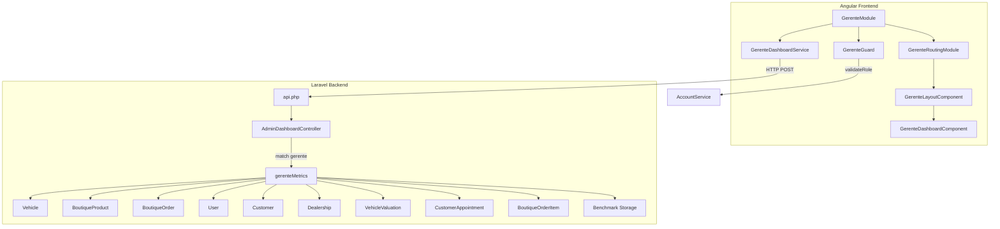
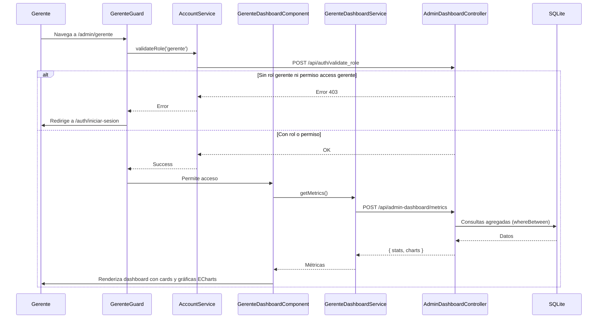

# Documento de Diseño: Panel de Operaciones del Gerente

## Resumen General

El Panel de Operaciones del Gerente es un módulo administrativo dedicado dentro de la aplicación VECSA Angular/Laravel, accesible en `/admin/gerente`. Centraliza métricas operativas de todas las áreas del negocio: vehículos, boutique, pedidos, usuarios, clientes, sucursales, valuaciones, citas y benchmark de competencia.

El gerente tiene acceso de lectura a todos los paneles de otros roles (gestor, recepción, valuador, citas, staff, hojalatería, refacciones, tienda, benchmark, marketing) pero sin capacidad de gestión de usuarios (sin permisos `list/create/update/delete users`).

El módulo sigue el patrón establecido por los paneles existentes: módulo Angular lazy-loaded con guard, layout con sidebar, dashboard con stat cards y gráficas ECharts. El backend reutiliza el `AdminDashboardController` existente agregando un caso `gerente` en el `match` de la función `metrics`, invocando un método privado `gerenteMetrics()` que retorna datos operativos completos.

## Arquitectura



## Diagrama de Secuencia: Flujo Principal



## Componentes e Interfaces

### Componente 1: GerenteGuard

**Propósito**: Proteger el acceso al módulo verificando el rol `gerente` mediante `validateRole`.

```typescript
@Injectable({ providedIn: 'root' })
export class GerenteGuard {
  constructor(private router: Router, private accountService: AccountService) {}

  canActivate(): Observable<boolean> {
    const subject = new Subject<boolean>();
    this.accountService.validateRole('gerente').subscribe({
      next: () => subject.next(true),
      error: () => {
        this.router.navigateByUrl('/auth/iniciar-sesion');
        subject.next(false);
      }
    });
    return subject.asObservable();
  }

  canLoad(): Observable<boolean> {
    // Misma lógica que canActivate
  }
}
```

**Responsabilidades**:
- Invocar `validateRole('gerente')` que valida en backend si el usuario tiene rol `gerente` o permiso `access gerente`
- Redirigir a `/auth/iniciar-sesion` si no tiene acceso
- Usuarios con rol `developer` o `administrator` acceden automáticamente si tienen el permiso `access gerente`

### Componente 2: GerenteDashboardService

**Propósito**: Servicio para llamadas HTTP al endpoint de métricas gerenciales.

```typescript
@Injectable({ providedIn: 'root' })
export class GerenteDashboardService {
  private baseUrl = environment.baseUrl;

  constructor(private http: HttpClient) {}

  private get headers(): HttpHeaders {
    const token = localStorage.getItem('user_token') || '';
    return new HttpHeaders({
      'Content-Type': 'application/json',
      'X-Requested-With': 'XMLHttpRequest',
      Authorization: `Bearer ${token}`,
    });
  }

  getMetrics(): Observable<any> {
    return this.http.post(`${this.baseUrl}/api/admin-dashboard/metrics`, {}, { headers: this.headers });
  }
}
```

**Responsabilidades**:
- Leer token de `localStorage` con clave `user_token`
- Incluir header `Authorization: Bearer {token}` en todas las peticiones
- Reutilizar el endpoint existente `POST /api/admin-dashboard/metrics`

### Componente 3: GerenteLayoutComponent

**Propósito**: Layout con sidebar y `<router-outlet>` siguiendo el patrón de `AdminLayoutComponent` y `GestorLayoutComponent`.

```typescript
@Component({
  selector: 'app-gerente-layout',
  templateUrl: './gerente-layout.component.html',
  styleUrls: ['./gerente-layout.component.css'],
  standalone: false,
})
export class GerenteLayoutComponent {
  user: any = null;
  role = '';
  name = '';
  permissions: string[] = [];

  readonly navItems = [
    { label: 'Dashboard', icon: 'dashboard', route: '/admin/gerente' },
  ];

  panelItems: { label: string; icon: string; route: string }[] = [];
  dynamicItems: { label: string; icon: string; route: string }[] = [];

  constructor(private router: Router) {
    // Lee user, permissions, role, profile de localStorage
    // Construye panelItems filtrados por permisos: gestor, recepción, valuador, citas, staff, hojalatería, refacciones
    // Construye dynamicItems filtrados por permisos: tienda, benchmark, marketing
  }

  logout(): void { localStorage.clear(); this.router.navigateByUrl('/auth/login'); }
}
```

**Responsabilidades**:
- Mostrar sidebar con secciones: navegación principal, paneles de roles, herramientas
- Filtrar panelItems y dynamicItems según permisos del usuario en localStorage
- Mostrar nombre y rol del usuario autenticado
- Botón de cerrar sesión que limpia localStorage y redirige a `/auth/login`

### Componente 4: GerenteDashboardComponent

**Propósito**: Vista principal con métricas agregadas, gráficas ECharts y accesos rápidos.

```typescript
interface DashboardStat {
  label: string;
  value: string | number;
  icon: string;
  color: string;
  loading: boolean;
}
```

**Responsabilidades**:
- Mostrar stat cards con: vehículos, productos activos, pedidos, usuarios, clientes, sucursales, valuaciones, citas
- Mostrar stat cards de boutique: total ventas, pedidos pendientes, productos activos
- Mostrar stat cards de citas/valuaciones: citas hoy, citas semana, valuaciones pendientes, valuaciones en progreso
- Mostrar stat cards de benchmark: competidores, escaneos
- Renderizar gráficas ECharts:
  - Barras: pedidos por mes (últimos 6 meses)
  - Dona: distribución de pedidos por estado
  - Barras horizontales: top 5 productos más vendidos
  - Barras: valuaciones por sucursal
  - Barras: citas por sucursal
  - Línea: citas por mes (últimos 6 meses)
- Estado de carga (skeleton) mientras se cargan métricas
- Mensaje de error con botón de reintentar si la API falla
- Enlace directo al módulo de Benchmark ADS

### Componente 5: AdminDashboardController::gerenteMetrics() (Backend)

**Propósito**: Método privado en el controlador existente que retorna métricas operativas completas para el gerente.

```php
private function gerenteMetrics(): array
{
    // Stats generales
    $stats = [
        'vehicles' => Vehicle::count(),
        'products' => BoutiqueProduct::where('active', true)->count(),
        'orders' => BoutiqueOrder::count(),
        'users' => User::count(),
        'customers' => Customer::count(),
        'dealerships' => Dealership::count(),
        'valuations' => VehicleValuation::count(),
        'appointments' => CustomerAppointment::count(),
    ];

    // Boutique stats
    $paidStatuses = ['pagado', 'en_preparacion', 'enviado', 'entregado'];
    $stats['total_sales'] = (float) BoutiqueOrder::whereIn('status', $paidStatuses)->sum('total');
    $stats['pending_orders'] = BoutiqueOrder::where('status', 'pendiente')->count();

    // Citas y valuaciones recientes
    $today = Carbon::today();
    $weekStart = Carbon::now()->startOfWeek();
    $weekEnd = Carbon::now()->endOfWeek();
    $stats['appointments_today'] = CustomerAppointment::whereDate('scheduled_date', $today)->count();
    $stats['appointments_week'] = CustomerAppointment::whereBetween('scheduled_date', [$weekStart, $weekEnd])->count();
    $stats['valuations_pending'] = VehicleValuation::where('status', 'pending')->count();
    $stats['valuations_in_progress'] = VehicleValuation::where('status', 'in_progress')->count();

    // Benchmark stats
    $stats['benchmark_competitors'] = count($this->getBenchmarkCompetitors());
    $stats['benchmark_scans'] = count($this->getBenchmarkScans());

    // Charts...
    return ['stats' => $stats, 'charts' => [...]];
}
```

**Responsabilidades**:
- Retornar stats generales, boutique, citas/valuaciones y benchmark
- Usar `whereBetween` para compatibilidad con SQLite
- Calcular gráficas: pedidos por mes, pedidos por estado, top 5 productos, valuaciones por sucursal, citas por sucursal, citas por mes


## Modelos de Datos

### Interfaces TypeScript (Frontend)

```typescript
// Stat card del dashboard
interface DashboardStat {
  label: string;
  value: string | number;
  icon: string;
  color: string;
  loading: boolean;
}

// Quick link para accesos rápidos
interface QuickLink {
  label: string;
  icon: string;
  route: string;
}

// Nav item del sidebar
interface NavItem {
  label: string;
  icon: string;
  route: string;
}

// Respuesta de la API de métricas
interface GerenteMetricsResponse {
  stats: {
    vehicles: number;
    products: number;
    orders: number;
    users: number;
    customers: number;
    dealerships: number;
    valuations: number;
    appointments: number;
    total_sales: number;
    pending_orders: number;
    appointments_today: number;
    appointments_week: number;
    valuations_pending: number;
    valuations_in_progress: number;
    benchmark_competitors: number;
    benchmark_scans: number;
  };
  charts: {
    orders_by_month: { month: string; count: number }[];
    orders_by_status: { status: string; count: number }[];
    top_products: { name: string; quantity: number }[];
    valuations_by_dealership: { name: string; count: number }[];
    appointments_by_dealership: { name: string; count: number }[];
    appointments_by_month: { month: string; count: number }[];
  };
}
```

### Modelos Backend (Existentes reutilizados)

Los siguientes modelos ya existen y se reutilizan sin modificación:
- `Vehicle` — vehículos del inventario
- `BoutiqueProduct` — productos de la boutique con campo `active`
- `BoutiqueOrder` — pedidos con campo `status` y `total`
- `BoutiqueOrderItem` — items de pedido con `product_name`, `quantity`, `product_id`
- `User` — usuarios del sistema
- `Customer` — clientes registrados
- `Dealership` — sucursales con campo `name`
- `VehicleValuation` — valuaciones con `status`, `dealership_id`
- `CustomerAppointment` — citas con `scheduled_date`, `dealership_id`

### Permisos y Rol (Backend)

El rol `gerente` se crea en `DeveloperUserSeeder` con los siguientes permisos:
- `access gerente`, `access gestor`, `access receptionist`, `access valuator`
- `access appointment_manager`, `access staff`, `access bodywork_paint_technician`
- `access spare_parts`, `access store_management`, `access benchmark`, `access marketing`

Excluidos explícitamente: `list users`, `create users`, `update users`, `delete users`

### Estructura de Directorios

```
vecsa-frontend/src/app/admin/gerente/
├── guards/
│   └── gerente.guard.ts
├── pages/
│   ├── layout/
│   │   ├── gerente-layout.component.ts
│   │   ├── gerente-layout.component.html
│   │   └── gerente-layout.component.css
│   └── dashboard/
│       ├── gerente-dashboard.component.ts
│       ├── gerente-dashboard.component.html
│       └── gerente-dashboard.component.css
├── services/
│   └── gerente-dashboard.service.ts
├── gerente-routing.module.ts
└── gerente.module.ts
```

## Funciones Clave con Especificaciones Formales

### Función 1: AdminDashboardController::gerenteMetrics()

```php
private function gerenteMetrics(): array
```

**Precondiciones:**
- Usuario autenticado con token válido
- Usuario tiene rol `gerente` (validado por el `match` en `metrics()`)

**Postcondiciones:**
- Retorna array con claves `stats` y `charts`
- `stats` contiene 16 métricas numéricas >= 0
- `stats.total_sales` solo suma pedidos con status en `['pagado', 'en_preparacion', 'enviado', 'entregado']`
- `charts.orders_by_month` contiene exactamente 6 entradas (últimos 6 meses)
- `charts.appointments_by_month` contiene exactamente 6 entradas
- `charts.top_products` contiene máximo 5 entradas ordenadas por cantidad descendente
- Todas las consultas por mes usan `whereBetween` (compatible SQLite)
- Sucursales sin valuaciones ni citas se omiten de los resultados por sucursal

### Función 2: GerenteGuard::canActivate()

```typescript
canActivate(): Observable<boolean>
```

**Precondiciones:**
- `AccountService` disponible para inyección
- `localStorage` accesible

**Postcondiciones:**
- Invoca `validateRole('gerente')` que valida en backend
- Si el backend responde OK: retorna `true`
- Si el backend responde error: redirige a `/auth/iniciar-sesion` y retorna `false`

### Función 3: GerenteDashboardComponent::loadMetrics()

```typescript
private loadMetrics(): void
```

**Precondiciones:**
- `GerenteDashboardService` inyectado
- Token válido en `localStorage`

**Postcondiciones:**
- En caso de éxito: actualiza todas las stat cards con valores numéricos, `loading = false`, inicializa gráficas ECharts
- En caso de error: `error = true`, `loading = false`, stat cards muestran 'Error'

## Pseudocódigo Algorítmico

### Algoritmo: Cálculo de Métricas del Gerente

```pascal
ALGORITHM gerenteMetrics()
OUTPUT: { stats: object, charts: object }

BEGIN
  // ── Stats generales ──
  stats.vehicles ← Vehicle.count()
  stats.products ← BoutiqueProduct.where('active', true).count()
  stats.orders ← BoutiqueOrder.count()
  stats.users ← User.count()
  stats.customers ← Customer.count()
  stats.dealerships ← Dealership.count()
  stats.valuations ← VehicleValuation.count()
  stats.appointments ← CustomerAppointment.count()

  // ── Stats boutique ──
  paidStatuses ← ['pagado', 'en_preparacion', 'enviado', 'entregado']
  stats.total_sales ← BoutiqueOrder.whereIn('status', paidStatuses).sum('total')
  stats.pending_orders ← BoutiqueOrder.where('status', 'pendiente').count()

  // ── Stats citas/valuaciones ──
  today ← Carbon.today()
  weekStart ← Carbon.now().startOfWeek()
  weekEnd ← Carbon.now().endOfWeek()
  stats.appointments_today ← CustomerAppointment.whereDate('scheduled_date', today).count()
  stats.appointments_week ← CustomerAppointment.whereBetween('scheduled_date', [weekStart, weekEnd]).count()
  stats.valuations_pending ← VehicleValuation.where('status', 'pending').count()
  stats.valuations_in_progress ← VehicleValuation.where('status', 'in_progress').count()

  // ── Stats benchmark ──
  stats.benchmark_competitors ← count(readCompetitorsFile())
  stats.benchmark_scans ← count(readScanFiles())

  // ── Charts: Pedidos por mes (últimos 6 meses) ──
  ordersByMonth ← []
  FOR i FROM 5 DOWNTO 0 DO
    start ← Carbon.now().subMonths(i).startOfMonth()
    end ← Carbon.now().subMonths(i).endOfMonth()
    ordersByMonth.append({ month: start.format('Y-m'), count: BoutiqueOrder.whereBetween('created_at', [start, end]).count() })
  END FOR

  // ── Charts: Pedidos por estado ──
  ordersByStatus ← BoutiqueOrder.selectRaw('status, count(*) as count').groupBy('status').get()

  // ── Charts: Top 5 productos más vendidos ──
  topProducts ← BoutiqueOrderItem.selectRaw('product_name as name, SUM(quantity) as quantity')
    .groupBy('product_name').orderByDesc('quantity').limit(5).get()

  // ── Charts: Valuaciones por sucursal ──
  valuationsByDealership ← VehicleValuation.selectRaw('dealership_id, count(*) as count')
    .groupBy('dealership_id').get()
    .map(join con Dealership para obtener nombre)
    .filter(omitir sucursales sin datos)

  // ── Charts: Citas por sucursal ──
  appointmentsByDealership ← CustomerAppointment.selectRaw('dealership_id, count(*) as count')
    .groupBy('dealership_id').get()
    .map(join con Dealership para obtener nombre)
    .filter(omitir sucursales sin datos)

  // ── Charts: Citas por mes ──
  appointmentsByMonth ← []
  FOR i FROM 5 DOWNTO 0 DO
    start ← Carbon.now().subMonths(i).startOfMonth()
    end ← Carbon.now().subMonths(i).endOfMonth()
    appointmentsByMonth.append({ month: start.format('Y-m'), count: CustomerAppointment.whereBetween('created_at', [start, end]).count() })
  END FOR

  RETURN { stats, charts: { orders_by_month, orders_by_status, top_products, valuations_by_dealership, appointments_by_dealership, appointments_by_month } }
END
```

**Precondiciones:**
- Conexión a base de datos activa (SQLite)
- Tablas y modelos existentes disponibles
- Directorio de benchmark accesible en Storage

**Postcondiciones:**
- Todas las métricas son valores numéricos >= 0
- `total_sales` redondeado a 2 decimales
- Arrays de meses contienen exactamente 6 entradas consecutivas
- `top_products` contiene máximo 5 entradas

**Invariantes de Loop:**
- En loops de meses: todos los meses procesados son consecutivos y en orden cronológico
- Cada mes se procesa exactamente una vez

## Propiedades de Correctitud

*Una propiedad es una característica o comportamiento que debe mantenerse verdadero en todas las ejecuciones válidas de un sistema — esencialmente, una declaración formal sobre lo que el sistema debe hacer. Las propiedades sirven como puente entre especificaciones legibles por humanos y garantías de correctitud verificables por máquina.*

### Propiedad 1: El rol gerente excluye permisos de gestión de usuarios

*Para cualquier* conjunto de permisos asignados al rol `gerente`, ninguno de ellos debe ser `list users`, `create users`, `update users` o `delete users`. Todos los permisos asignados deben ser de tipo `access`.

**Valida: Requisitos 1.2, 1.4**

### Propiedad 2: El guard deniega acceso a usuarios no autorizados

*Para cualquier* usuario que no posea el rol `gerente` y no posea el permiso `access gerente`, el `GerenteGuard` debe retornar `false` y redirigir a `/auth/iniciar-sesion`.

**Valida: Requisito 2.2**

### Propiedad 3: El servicio incluye el header de autorización correcto

*Para cualquier* token almacenado en `localStorage` con la clave `user_token`, el `GerenteDashboardService` debe incluir el header `Authorization: Bearer {token}` en la petición HTTP resultante.

**Valida: Requisito 2.4**

### Propiedad 4: El total de ventas solo incluye pedidos con estados pagados

*Para cualquier* conjunto de pedidos con estados variados, el cálculo de `total_sales` solo debe sumar los totales de pedidos cuyo estado pertenece a `['pagado', 'en_preparacion', 'enviado', 'entregado']`. Pedidos con otros estados (como `pendiente` o `cancelado`) no deben contribuir al total.

**Valida: Requisito 5.2**

### Propiedad 5: Los productos más vendidos están correctamente ordenados y limitados

*Para cualquier* conjunto de items de pedido, la lista `top_products` debe contener como máximo 5 productos, ordenados por cantidad total vendida de forma descendente. Si existen más de 5 productos distintos, solo los 5 con mayor cantidad aparecen.

**Valida: Requisito 5.4**

### Propiedad 6: La agrupación por sucursal incluye nombres y conteos correctos

*Para cualquier* conjunto de valuaciones y citas con `dealership_id`, la agrupación por sucursal debe retornar el nombre correcto de cada sucursal (obtenido del modelo `Dealership`) y el conteo debe coincidir con el número real de registros para esa sucursal. Sucursales sin registros se omiten.

**Valida: Requisitos 6.3, 6.4**

### Propiedad 7: El filtrado de citas por fecha es correcto

*Para cualquier* conjunto de citas con fechas variadas, el conteo de "citas de hoy" debe incluir solo citas cuya `scheduled_date` sea la fecha actual, y el conteo de "citas de la semana" debe incluir solo citas cuya `scheduled_date` esté entre el inicio y fin de la semana actual.

**Valida: Requisitos 7.2, 7.3**

### Propiedad 8: Los items del sidebar se filtran por permisos del usuario

*Para cualquier* conjunto de permisos almacenados en `localStorage`, los panelItems del sidebar solo deben incluir enlaces cuyo permiso correspondiente (`access gestor`, `access receptionist`, etc.) esté presente en el array de permisos. Lo mismo aplica para dynamicItems (`access store_management`, `access benchmark`, `access marketing`).

**Valida: Requisitos 9.2, 9.3**

### Propiedad 9: La agregación mensual es consistente y compatible con SQLite

*Para cualquier* conjunto de pedidos y citas con fechas variadas, los conteos mensuales calculados con `whereBetween` sobre `created_at` deben sumar exactamente el total de registros dentro del rango de 6 meses. Además, la agrupación por estado debe sumar el total de pedidos.

**Valida: Requisitos 4.3, 4.4, 11.4**

### Propiedad 10: El conteo de benchmark coincide con los archivos en storage

*Para cualquier* estado del directorio de benchmark en Storage, el conteo de competidores debe coincidir con el número de entradas en `benchmark/competitors.json`, y el conteo de escaneos debe coincidir con el número de archivos JSON en `benchmark/data/`.

**Valida: Requisito 8.4**

## Manejo de Errores

### Error 1: Usuario sin rol ni permiso de gerente

**Condición**: Usuario navega a `/admin/gerente` sin rol `gerente` ni permiso `access gerente`
**Respuesta**: GerenteGuard redirige a `/auth/iniciar-sesion`
**Recuperación**: El usuario debe solicitar el rol o permiso a un administrador

### Error 2: Token expirado o inválido

**Condición**: El token en `localStorage` ha expirado o es inválido
**Respuesta**: HTTP 401 desde middleware `auth:sanctum`
**Recuperación**: Frontend redirige al login; el usuario debe re-autenticarse

### Error 3: Error al obtener métricas

**Condición**: La API de métricas falla (error de BD, timeout, etc.)
**Respuesta**: HTTP 500 con código `DASHBOARD_METRICS_ERROR` y mensaje descriptivo
**Recuperación**: Dashboard muestra mensaje de error con botón "Reintentar" que vuelve a llamar `loadMetrics()`

### Error 4: Directorio de benchmark no existe

**Condición**: El directorio `benchmark/` no existe en Storage
**Respuesta**: Los conteos de competidores y escaneos retornan 0
**Recuperación**: No requiere acción; el sistema maneja gracefully la ausencia del directorio

### Error 5: localStorage vacío o corrupto

**Condición**: Los datos en `localStorage` (permissions, user, profile) están ausentes o son JSON inválido
**Respuesta**: El layout muestra valores por defecto (nombre "Usuario", permisos vacíos, sin panelItems ni dynamicItems)
**Recuperación**: El usuario debe cerrar sesión y volver a iniciar sesión

## Estrategia de Testing

### Testing Unitario

- Verificar que el seeder crea el rol `gerente` con los permisos correctos y sin permisos de gestión de usuarios
- Verificar que el seeder crea el usuario de prueba `gerente@vecsa.com` con los datos correctos
- Verificar que `gerenteMetrics()` retorna la estructura completa de stats y charts
- Verificar que el guard redirige cuando `validateRole` falla
- Verificar que el layout filtra correctamente panelItems y dynamicItems según permisos
- Verificar que el dashboard muestra estado de carga y maneja errores
- Verificar que el botón de logout limpia localStorage y redirige

### Testing Basado en Propiedades

**Librería**: Para PHP (backend) usar `phpunit` con data providers generando datos aleatorios. Para TypeScript (frontend) usar `fast-check` con Jasmine/Karma.

**Configuración**: Mínimo 100 iteraciones por test de propiedad.

**Cada test debe incluir un comentario referenciando la propiedad del diseño:**

```
// Feature: manager-operations-panel, Property 1: El rol gerente excluye permisos de gestión de usuarios
// Feature: manager-operations-panel, Property 4: El total de ventas solo incluye pedidos con estados pagados
```

**Tests de propiedad a implementar:**

1. **Propiedad 1**: Generar conjuntos aleatorios de permisos, asignarlos al rol gerente vía seeder, verificar que ninguno sea de gestión de usuarios
2. **Propiedad 2**: Generar usuarios aleatorios sin rol gerente ni permiso access gerente, verificar que el guard deniega acceso
3. **Propiedad 3**: Generar tokens aleatorios, almacenarlos en localStorage, verificar que el header Authorization los incluye correctamente
4. **Propiedad 4**: Generar conjuntos aleatorios de pedidos con estados y totales variados, verificar que total_sales solo suma los de estados pagados
5. **Propiedad 5**: Generar conjuntos aleatorios de order items con productos y cantidades, verificar que top_products retorna máximo 5 ordenados por cantidad descendente
6. **Propiedad 6**: Generar valuaciones/citas con dealership_ids aleatorios, verificar que la agrupación retorna nombres correctos y omite sucursales vacías
7. **Propiedad 7**: Generar citas con fechas aleatorias, verificar que el filtrado por hoy y por semana es correcto
8. **Propiedad 8**: Generar conjuntos aleatorios de permisos en localStorage, verificar que panelItems y dynamicItems solo incluyen los enlaces correspondientes
9. **Propiedad 9**: Generar pedidos con fechas aleatorias en un rango de 6 meses, verificar que los conteos mensuales suman el total
10. **Propiedad 10**: Generar archivos aleatorios en el directorio de benchmark, verificar que los conteos coinciden

### Enfoque Complementario

- **Unit tests**: Casos específicos, edge cases (localStorage vacío, directorio benchmark inexistente, 0 pedidos), integración entre componentes
- **Property tests**: Propiedades universales que deben cumplirse para cualquier entrada válida
- Ambos son necesarios para cobertura completa: los unit tests capturan bugs concretos, los property tests verifican correctitud general
