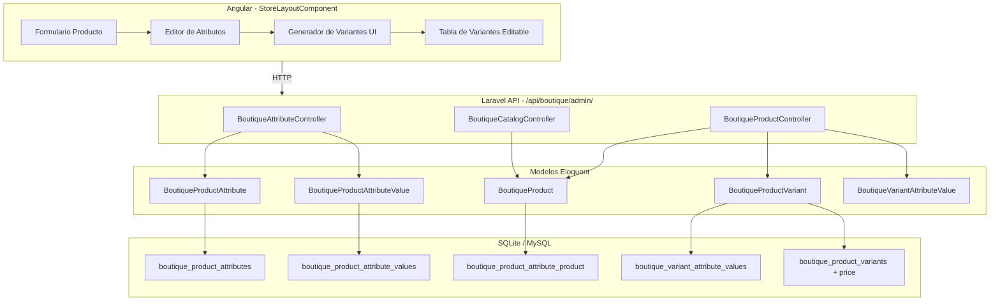
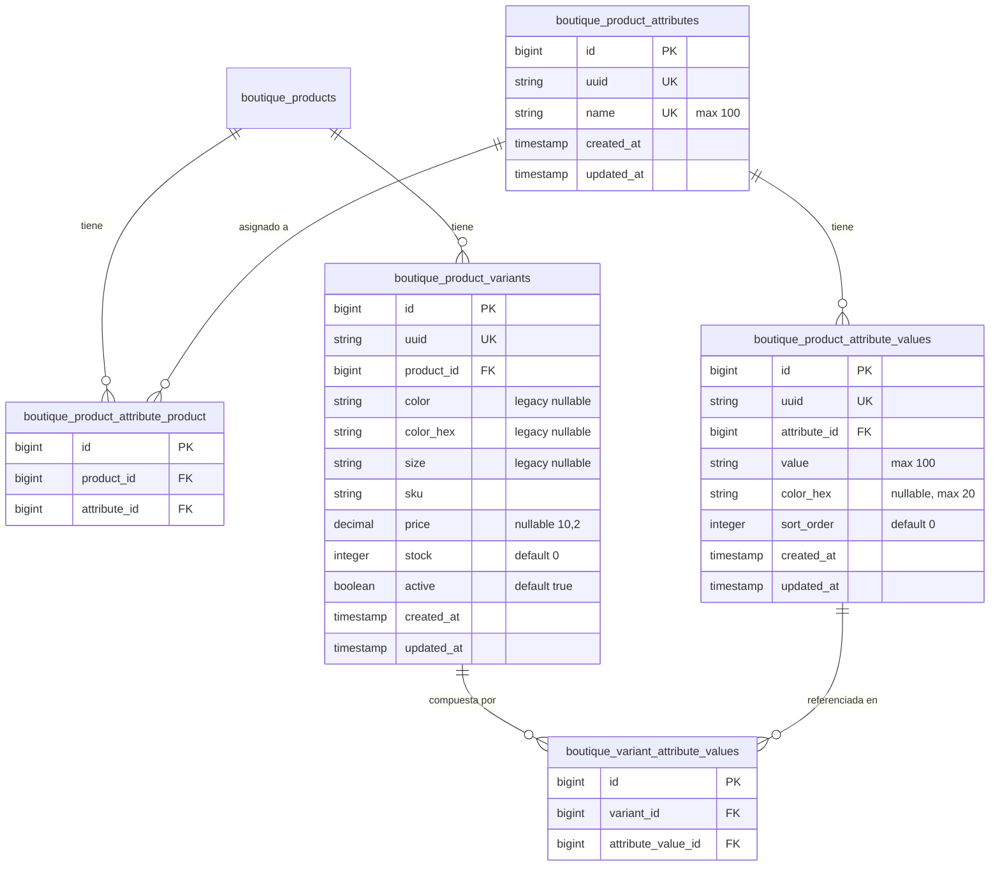

# Documento de Diseño — Sistema de Atributos y Variantes de Producto

## Resumen General

Este diseño describe la arquitectura para reemplazar el esquema fijo de variantes (color/talla) por un sistema flexible de atributos dinámicos estilo WooCommerce. El sistema permite definir atributos personalizados (Color, Talla, Material, etc.), asignarlos a productos, y generar variantes automáticamente mediante producto cartesiano. Cada variante tiene SKU, precio, stock y estado individual.

El backend se implementa en Laravel con nuevos modelos, controlador y migraciones. El frontend Angular se modifica en el `StoreLayoutComponent` existente para reemplazar el editor de variantes fijo por uno basado en atributos dinámicos.

## Arquitectura



### Decisiones de Diseño

1. **Controlador separado para atributos**: `BoutiqueAttributeController` maneja CRUD de atributos y valores independientemente del producto, permitiendo reutilización entre productos.

2. **Generación de variantes en backend**: El producto cartesiano se calcula en el servidor para garantizar integridad de datos y validar el límite de 100 variantes.

3. **Precio nullable en variantes**: El campo `price` en variantes es nullable; si es null, se usa el precio del producto padre. Esto permite herencia de precio con override opcional.

4. **Preservación de variantes existentes**: Al regenerar, se comparan combinaciones de attribute_value_ids para preservar variantes con datos personalizados (SKU, precio, stock).

5. **Campos legacy mantenidos**: Los campos `color`, `color_hex`, `size` se mantienen en la tabla de variantes para compatibilidad durante la transición.

## Componentes e Interfaces

### Backend

#### BoutiqueAttributeController

Nuevo controlador en `app/Http/Controllers/Boutique/BoutiqueAttributeController.php`.

```
POST /api/boutique/admin/attributes/list          → list()
POST /api/boutique/admin/attributes/store         → store()
POST /api/boutique/admin/attributes/update        → update()
POST /api/boutique/admin/attributes/delete        → delete()
POST /api/boutique/admin/attribute-values/store   → storeValue()
POST /api/boutique/admin/attribute-values/update  → updateValue()
POST /api/boutique/admin/attribute-values/delete  → deleteValue()
```

#### BoutiqueProductController (modificado)

Endpoints existentes modificados para soportar atributos y generación de variantes:

```
POST /api/boutique/admin/products/store           → store() — acepta attributes[]
POST /api/boutique/admin/products/update          → update() — acepta attributes[]
POST /api/boutique/admin/products/generate_variants → generateVariants()
POST /api/boutique/admin/products/update_variant   → updateVariant()
POST /api/boutique/admin/products/delete_variant   → deleteVariant()
```

#### BoutiqueCatalogController (modificado)

El endpoint `detail()` se modifica para incluir atributos y valores en la respuesta pública:

```json
{
  "product": {
    "uuid": "...",
    "name": "Camiseta Premium",
    "price": 599.00,
    "attributes": [
      {
        "uuid": "attr-uuid-1",
        "name": "Color",
        "values": [
          { "uuid": "val-uuid-1", "value": "Rojo", "color_hex": "#FF0000" },
          { "uuid": "val-uuid-2", "value": "Azul", "color_hex": "#0000FF" }
        ]
      },
      {
        "uuid": "attr-uuid-2",
        "name": "Talla",
        "values": [
          { "uuid": "val-uuid-3", "value": "S" },
          { "uuid": "val-uuid-4", "value": "M" }
        ]
      }
    ],
    "variants": [
      {
        "uuid": "var-uuid-1",
        "sku": "CAM-ROJO-S",
        "price": 599.00,
        "stock": 10,
        "active": true,
        "attribute_values": [
          { "attribute_name": "Color", "value": "Rojo", "color_hex": "#FF0000" },
          { "attribute_name": "Talla", "value": "S" }
        ]
      }
    ]
  }
}
```

### Frontend

#### StoreLayoutComponent (modificado)

Nuevas propiedades en el componente:

```typescript
// Atributos
availableAttributes: { uuid: string; name: string; values: AttributeValue[] }[] = [];
selectedProductAttributes: SelectedAttribute[] = [];
newAttributeName: string = '';

interface AttributeValue {
  uuid: string;
  value: string;
  color_hex?: string;
  sort_order: number;
  selected?: boolean;
}

interface SelectedAttribute {
  attribute_uuid: string;
  attribute_name: string;
  values: AttributeValue[];
}
```

Nuevos métodos:

```typescript
loadAttributes(): void              // Carga atributos disponibles
addAttributeToProduct(uuid): void   // Agrega atributo al producto
removeAttributeFromProduct(i): void // Quita atributo del producto
toggleAttributeValue(ai, vi): void  // Toggle selección de valor
createAttributeInline(): void       // Crea atributo nuevo inline
createValueInline(ai, value): void  // Crea valor nuevo inline
generateVariants(): void            // Llama al backend para generar
saveVariantChanges(): void          // Guarda cambios en variantes
deleteVariant(uuid): void           // Elimina variante individual
```

### Seeder de Migración

`MigrateVariantsToAttributesSeeder` en `database/seeders/`:

1. Crea atributos "Color" y "Talla" si no existen
2. Extrae valores únicos de `color` y `size` de variantes existentes
3. Crea `BoutiqueProductAttributeValue` por cada valor único
4. Preserva `color_hex` en valores de Color
5. Crea registros en `boutique_product_attribute_product`
6. Crea registros en `boutique_variant_attribute_values`


## Modelos de Datos

### Diagrama ER



### Tabla: boutique_product_attributes

| Campo | Tipo | Restricciones |
|-------|------|---------------|
| id | bigint | PK, auto-increment |
| uuid | string(36) | unique, not null |
| name | string(100) | unique, not null |
| created_at | timestamp | nullable |
| updated_at | timestamp | nullable |

### Tabla: boutique_product_attribute_values

| Campo | Tipo | Restricciones |
|-------|------|---------------|
| id | bigint | PK, auto-increment |
| uuid | string(36) | unique, not null |
| attribute_id | bigint | FK → boutique_product_attributes.id, not null |
| value | string(100) | not null |
| color_hex | string(20) | nullable |
| sort_order | integer | default 0 |
| created_at | timestamp | nullable |
| updated_at | timestamp | nullable |

Restricción unique compuesta: (attribute_id, value)

### Tabla: boutique_product_attribute_product

| Campo | Tipo | Restricciones |
|-------|------|---------------|
| id | bigint | PK, auto-increment |
| product_id | bigint | FK → boutique_products.id, ON DELETE CASCADE |
| attribute_id | bigint | FK → boutique_product_attributes.id, ON DELETE CASCADE |

Restricción unique compuesta: (product_id, attribute_id)

### Tabla: boutique_variant_attribute_values

| Campo | Tipo | Restricciones |
|-------|------|---------------|
| id | bigint | PK, auto-increment |
| variant_id | bigint | FK → boutique_product_variants.id, ON DELETE CASCADE |
| attribute_value_id | bigint | FK → boutique_product_attribute_values.id, ON DELETE CASCADE |

Restricción unique compuesta: (variant_id, attribute_value_id)

### Modificación: boutique_product_variants

Agregar columna:

| Campo | Tipo | Restricciones |
|-------|------|---------------|
| price | decimal(10,2) | nullable |

### Modelos Eloquent

#### BoutiqueProductAttribute

```php
class BoutiqueProductAttribute extends Model {
    protected $fillable = ['name'];
    protected $hidden = ['id', 'updated_at'];

    public function values() {
        return $this->hasMany(BoutiqueProductAttributeValue::class, 'attribute_id')
                    ->orderBy('sort_order');
    }

    public function products() {
        return $this->belongsToMany(BoutiqueProduct::class, 'boutique_product_attribute_product', 'attribute_id', 'product_id');
    }
}
```

#### BoutiqueProductAttributeValue

```php
class BoutiqueProductAttributeValue extends Model {
    protected $fillable = ['attribute_id', 'value', 'color_hex', 'sort_order'];
    protected $hidden = ['id', 'attribute_id', 'updated_at'];

    public function attribute() {
        return $this->belongsTo(BoutiqueProductAttribute::class, 'attribute_id');
    }

    public function variants() {
        return $this->belongsToMany(BoutiqueProductVariant::class, 'boutique_variant_attribute_values', 'attribute_value_id', 'variant_id');
    }
}
```

#### BoutiqueVariantAttributeValue (Pivote)

```php
class BoutiqueVariantAttributeValue extends Model {
    public $timestamps = false;
    protected $fillable = ['variant_id', 'attribute_value_id'];
}
```

#### BoutiqueProductVariant (modificado)

Agregar `'price'` al `$fillable` y relación:

```php
// Agregar a fillable
protected $fillable = ['product_id', 'color', 'color_hex', 'size', 'sku', 'price', 'stock', 'active'];

protected $casts = [
    'active' => 'boolean',
    'stock'  => 'integer',
    'price'  => 'decimal:2',
];

public function attributeValues() {
    return $this->belongsToMany(
        BoutiqueProductAttributeValue::class,
        'boutique_variant_attribute_values',
        'variant_id',
        'attribute_value_id'
    );
}

// Precio efectivo: variante o producto padre
public function getEffectivePriceAttribute() {
    return $this->price ?? $this->product->price;
}
```

#### BoutiqueProduct (modificado)

Agregar relaciones:

```php
public function attributes() {
    return $this->belongsToMany(
        BoutiqueProductAttribute::class,
        'boutique_product_attribute_product',
        'product_id',
        'attribute_id'
    );
}

// Todas las variantes (incluyendo inactivas) para admin
public function allVariants() {
    return $this->hasMany(BoutiqueProductVariant::class, 'product_id');
}
```

### Algoritmo de Generación de Variantes (Producto Cartesiano)

```php
public function generateVariants(BoutiqueProduct $product, array $attributeConfig): array
{
    // attributeConfig = [ ['attribute_uuid' => '...', 'value_uuids' => ['...', '...']], ... ]

    // 1. Resolver IDs de valores por atributo
    $valueSets = [];
    foreach ($attributeConfig as $config) {
        $attribute = BoutiqueProductAttribute::where('uuid', $config['attribute_uuid'])->first();
        $values = BoutiqueProductAttributeValue::whereIn('uuid', $config['value_uuids'])
            ->where('attribute_id', $attribute->id)->get();
        $valueSets[] = $values;
    }

    // 2. Calcular producto cartesiano
    $combinations = [[]];
    foreach ($valueSets as $valueSet) {
        $newCombinations = [];
        foreach ($combinations as $combo) {
            foreach ($valueSet as $value) {
                $newCombinations[] = array_merge($combo, [$value]);
            }
        }
        $combinations = $newCombinations;
    }

    // 3. Validar límite
    if (count($combinations) > 100) {
        throw new \Exception('VARIANT_LIMIT_EXCEEDED');
    }

    // 4. Obtener variantes existentes con sus value_ids
    $existingVariants = $product->allVariants()->with('attributeValues')->get();
    $existingMap = [];
    foreach ($existingVariants as $variant) {
        $key = $variant->attributeValues->pluck('id')->sort()->implode('-');
        $existingMap[$key] = $variant;
    }

    // 5. Crear/preservar variantes
    $newValueIdKeys = [];
    $resultVariants = [];
    foreach ($combinations as $combo) {
        $valueIds = collect($combo)->pluck('id')->sort();
        $key = $valueIds->implode('-');
        $newValueIdKeys[] = $key;

        if (isset($existingMap[$key])) {
            $resultVariants[] = $existingMap[$key]; // preservar
        } else {
            $skuParts = collect($combo)->pluck('value')->map(fn($v) => Str::slug($v));
            $sku = $product->sku . '-' . $skuParts->implode('-');

            $variant = BoutiqueProductVariant::create([
                'product_id' => $product->id,
                'sku' => $sku,
                'price' => null,
                'stock' => 0,
                'active' => true,
            ]);

            foreach ($combo as $value) {
                BoutiqueVariantAttributeValue::create([
                    'variant_id' => $variant->id,
                    'attribute_value_id' => $value->id,
                ]);
            }

            $resultVariants[] = $variant;
        }
    }

    // 6. Eliminar variantes que ya no aplican
    foreach ($existingMap as $key => $variant) {
        if (!in_array($key, $newValueIdKeys)) {
            BoutiqueVariantAttributeValue::where('variant_id', $variant->id)->delete();
            $variant->delete();
        }
    }

    return $resultVariants;
}
```

## Propiedades de Correctitud

*Una propiedad es una característica o comportamiento que debe mantenerse verdadero en todas las ejecuciones válidas de un sistema — esencialmente, una declaración formal sobre lo que el sistema debe hacer. Las propiedades sirven como puente entre especificaciones legibles por humanos y garantías de correctitud verificables por máquina.*

### Propiedad 1: Round-trip de CRUD de Atributos

*Para cualquier* nombre de atributo válido (no vacío, máximo 100 caracteres), crear el atributo y luego consultarlo debe retornar un registro con el mismo nombre, un uuid no vacío, y timestamps válidos. Actualizar el nombre y volver a consultar debe reflejar el nuevo nombre.

**Valida: Requerimientos 1.1, 1.2, 1.5**

### Propiedad 2: Unicidad de nombre de Atributo

*Para cualquier* nombre de atributo, crear un atributo con ese nombre y luego intentar crear otro con el mismo nombre debe fallar con código 400 y error `ATTRIBUTE_NAME_EXISTS`.

**Valida: Requerimiento 1.3**

### Propiedad 3: Listado de Atributos ordenado alfabéticamente

*Para cualquier* conjunto de atributos creados con nombres aleatorios, el endpoint de listado debe retornarlos en orden alfabético ascendente por nombre, y cada atributo debe incluir sus valores asociados.

**Valida: Requerimiento 1.4**

### Propiedad 4: Eliminación de Atributo no asignado elimina valores en cascada

*Para cualquier* atributo con N valores asociados que no está asignado a ningún producto, eliminarlo debe resultar en que ni el atributo ni sus N valores existan en el sistema.

**Valida: Requerimiento 1.6**

### Propiedad 5: Eliminación de Atributo en uso es rechazada

*Para cualquier* atributo que está asignado a al menos un producto, intentar eliminarlo debe fallar con código HTTP 409 y error `ATTRIBUTE_IN_USE`, y el atributo debe seguir existiendo.

**Valida: Requerimiento 1.7**

### Propiedad 6: Round-trip de CRUD de Valores de Atributo

*Para cualquier* atributo existente y cualquier valor válido (no vacío, máximo 100 caracteres) con color_hex y sort_order opcionales, crear el valor y consultarlo debe retornar los mismos datos. Actualizar los campos y volver a consultar debe reflejar los cambios.

**Valida: Requerimientos 2.1, 2.2, 2.4**

### Propiedad 7: Unicidad de valor dentro de un Atributo

*Para cualquier* atributo y cualquier string de valor, crear el valor una vez debe tener éxito, y crear el mismo valor de nuevo bajo el mismo atributo debe fallar con código 400 y error `VALUE_ALREADY_EXISTS`.

**Valida: Requerimiento 2.3**

### Propiedad 8: Eliminación de Valor no usado vs en uso

*Para cualquier* valor de atributo no asociado a variantes, eliminarlo debe tener éxito. *Para cualquier* valor asociado a al menos una variante, eliminarlo debe fallar con código 409 y error `VALUE_IN_USE`.

**Valida: Requerimientos 2.5, 2.6**

### Propiedad 9: Round-trip de asignación de Atributos a Producto

*Para cualquier* producto y cualquier conjunto de atributos con valores seleccionados, asignarlos al producto y luego consultar los atributos del producto debe retornar exactamente los atributos y valores asignados. Re-asignar un conjunto diferente debe sincronizar correctamente, resultando en exactamente el nuevo conjunto.

**Valida: Requerimientos 3.2, 3.3, 3.4**

### Propiedad 10: Conteo de variantes generadas es el producto cartesiano

*Para cualquier* producto con M atributos donde el atributo i tiene Ni valores seleccionados (y N1 × N2 × ... × NM ≤ 100), generar variantes debe producir exactamente N1 × N2 × ... × NM variantes, cada una representando una combinación única.

**Valida: Requerimientos 4.1, 4.5, 4.6**

### Propiedad 11: Integridad de variantes generadas

*Para cualquier* variante generada, sus registros en la tabla pivote `boutique_variant_attribute_values` deben vincularla exactamente con un valor de cada atributo asignado al producto, y los campos sku, stock (0) y active (true) deben tener sus valores por defecto.

**Valida: Requerimientos 4.2, 4.3**

### Propiedad 12: Preservación de variantes al regenerar

*Para cualquier* producto con variantes existentes que tienen SKU, precio o stock personalizados, regenerar variantes con una selección que incluya las mismas combinaciones debe preservar los datos personalizados de esas variantes, y eliminar solo las variantes cuya combinación ya no existe.

**Valida: Requerimiento 4.4**

### Propiedad 13: CRUD individual de Variantes

*Para cualquier* variante existente, actualizar sus campos (sku, price, stock, active) debe persistir los cambios correctamente. Crear una variante manual con valores de atributo válidos debe tener éxito. Eliminar una variante debe removerla junto con sus registros pivote.

**Valida: Requerimientos 5.2, 5.5, 5.6**

### Propiedad 14: Unicidad de SKU de Variante dentro del producto

*Para cualquier* producto con dos o más variantes activas, intentar actualizar el SKU de una variante al SKU de otra variante activa del mismo producto debe fallar con código 400 y error `VARIANT_SKU_DUPLICATE`.

**Valida: Requerimientos 5.3, 5.4**

### Propiedad 15: Descripción legible de combinación de atributos

*Para cualquier* variante generada a partir de valores de atributos, la consulta de variantes del producto debe incluir una descripción legible que contenga todos los valores de atributo de la combinación (ej. "Rojo / M / Algodón").

**Valida: Requerimiento 5.1**

### Propiedad 16: Stock total es la suma de stocks de variantes activas

*Para cualquier* producto con variantes, el stock total mostrado debe ser igual a la suma de los campos `stock` de todas las variantes con `active = true`.

**Valida: Requerimiento 6.8**

### Propiedad 17: Integridad de migración de datos legacy

*Para cualquier* conjunto de variantes existentes con campos `color`, `color_hex` y `size`, después de ejecutar la migración: cada valor único de color debe existir como valor del atributo "Color" con su `color_hex` preservado, cada valor único de size debe existir como valor del atributo "Talla", y cada variante debe tener registros pivote que la vinculen con sus valores de atributo correspondientes.

**Valida: Requerimientos 7.2, 7.3, 7.4**

### Propiedad 18: Resolución de precio efectivo

*Para cualquier* variante, si su campo `price` no es null, el precio efectivo debe ser el precio de la variante. Si su campo `price` es null, el precio efectivo debe ser el precio del producto padre.

**Valida: Requerimientos 8.4, 8.5**

### Propiedad 19: API pública retorna atributos y variantes activas

*Para cualquier* producto con atributos y variantes, el endpoint público de detalle debe retornar los atributos con sus valores disponibles y solo las variantes con `active = true`, cada una con su combinación de atributos, precio efectivo, stock y SKU.

**Valida: Requerimiento 8.1**

### Propiedad 20: Filtrado de variantes por selección de atributos

*Para cualquier* producto con variantes y cualquier selección parcial o completa de valores de atributos, el resultado filtrado debe contener exactamente las variantes cuyos valores de atributo coinciden con todos los valores seleccionados.

**Valida: Requerimiento 8.2**

## Manejo de Errores

| Escenario | Código HTTP | Código Error | Mensaje |
|-----------|-------------|--------------|---------|
| Nombre de atributo duplicado | 400 | ATTRIBUTE_NAME_EXISTS | El nombre del atributo ya existe |
| Valor duplicado en mismo atributo | 400 | VALUE_ALREADY_EXISTS | El valor ya existe en este atributo |
| Eliminar atributo en uso | 409 | ATTRIBUTE_IN_USE | El atributo está asignado a productos y no puede eliminarse |
| Eliminar valor en uso | 409 | VALUE_IN_USE | El valor está asociado a variantes y no puede eliminarse |
| SKU de variante duplicado | 400 | VARIANT_SKU_DUPLICATE | El SKU ya existe en otra variante activa del producto |
| Límite de variantes excedido (>100) | 400 | VARIANT_LIMIT_EXCEEDED | El número de combinaciones supera el límite de 100 variantes |
| Atributo no encontrado | 404 | ATTRIBUTE_NOT_FOUND | El atributo no existe |
| Valor de atributo no encontrado | 404 | VALUE_NOT_FOUND | El valor de atributo no existe |
| Variante no encontrada | 404 | VARIANT_NOT_FOUND | La variante no existe |
| Producto no encontrado | 404 | PRODUCT_NOT_FOUND | El producto no existe |

Todos los errores siguen el formato estándar de `ApiResponseHelper::apiError()` ya utilizado en el proyecto.

## Estrategia de Testing

### Enfoque Dual

Se utilizan tanto tests unitarios como tests basados en propiedades para cobertura completa:

- **Tests unitarios**: Casos específicos, edge cases, condiciones de error, integración entre componentes
- **Tests de propiedades**: Propiedades universales verificadas con inputs generados aleatoriamente

### Librería de Property-Based Testing

Se utilizará **PHPUnit** con el paquete **`spatie/phpunit-snapshot-assertions`** para tests unitarios y **`innmind/black-box`** o generadores manuales con loops de 100+ iteraciones para property-based testing en PHP/Laravel, dado que el ecosistema PHP no tiene una librería PBT dominante. Alternativamente, se puede usar **QuickCheck-style testing** con generadores personalizados dentro de PHPUnit.

Cada test de propiedad debe:
- Ejecutar mínimo 100 iteraciones con datos generados aleatoriamente
- Referenciar la propiedad del documento de diseño con un comentario
- Formato del tag: **Feature: product-attributes-variants, Property {número}: {título}**

### Tests Unitarios (ejemplos y edge cases)

1. Migración crea atributos "Color" y "Talla" (Req 7.1)
2. Migración agrega columna `price` a variantes (Req 7.5)
3. Migración preserva campos legacy (Req 7.6)
4. Variantes con color/size nulos se migran correctamente omitiendo campos vacíos (Req 7.7)
5. Generación rechazada cuando combinaciones > 100 (Req 4.7)
6. Variante con stock 0 se identifica como agotada (Req 8.3)
7. Endpoint público de detalle incluye estructura correcta de atributos

### Tests de Propiedades

Cada propiedad del 1 al 20 listada en la sección de Propiedades de Correctitud debe implementarse como un test de propiedad individual con mínimo 100 iteraciones. Los generadores deben producir:

- Nombres de atributos: strings alfanuméricos de 1-100 caracteres
- Valores de atributo: strings alfanuméricos de 1-100 caracteres
- Configuraciones de atributos por producto: 1-5 atributos con 1-10 valores cada uno (respetando límite de 100 combinaciones)
- Precios: decimales positivos entre 0.01 y 99999.99
- Stock: enteros entre 0 y 9999
- SKUs: strings alfanuméricos de 3-50 caracteres
