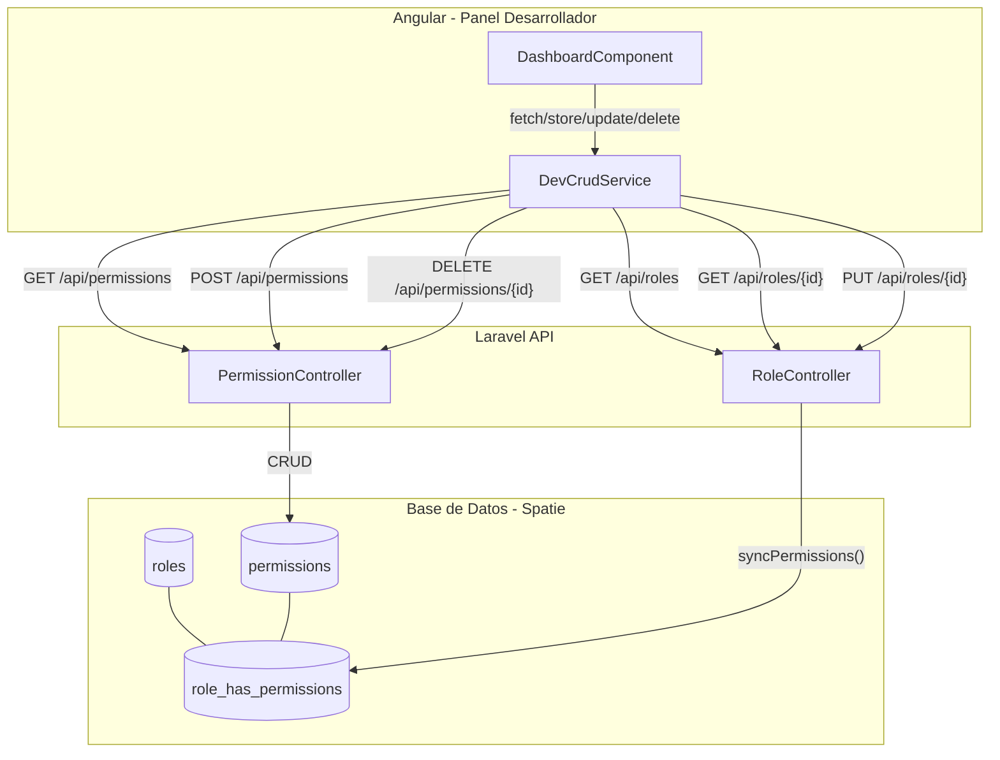

# Diseño: Gestión de Permisos y Matriz Rol-Permisos

## Resumen

Este diseño describe la implementación de dos nuevas vistas en el Panel de Desarrollador: un CRUD de permisos usando el sistema genérico existente, y una vista personalizada de matriz rol-permisos con toggles (checkboxes). La matriz muestra roles como filas y permisos como columnas, permitiendo activar/desactivar permisos por rol de forma visual. Todo se integra en el `DeveloperDashboardComponent` existente usando el patrón `activeSection`.

### Decisiones de Diseño Clave

1. **Permisos CRUD via secciones genéricas**: El CRUD de permisos se implementa como una nueva entrada en el arreglo `sections` del dashboard, reutilizando toda la infraestructura existente (tabla, modal, paginación). Los endpoints `apiResource` ya existen (`GET/POST/PUT/DELETE /api/permissions`).

2. **Matriz como vista custom**: La matriz rol-permisos NO es un CRUD estándar, así que se implementa como una sección custom dentro del template del dashboard (similar a como `'home'` tiene su propia vista). Se activa cuando `activeSection === 'role_matrix'`.

3. **Carga de datos de la matriz**: Se hacen dos llamadas paralelas: `GET /api/roles` para obtener la lista de roles, y luego `GET /api/roles/{id}` por cada rol para obtener sus permisos (ya que el `index` no incluye la relación). Los permisos se obtienen de `GET /api/permissions`.

4. **Sync completo por toggle**: Al cambiar un toggle, se calcula el arreglo completo de permisos del rol y se envía `PUT /api/roles/{id}` con `{ permissions: [...] }`. El `RoleController.update` ya usa `syncPermissions()`.

5. **Permisos de módulo (access X)**: Los permisos de tipo `access {módulo}` se tratan igual que cualquier otro permiso. Si al activar un toggle de módulo el permiso no existe, se crea primero con `POST /api/permissions` y luego se asigna al rol.

6. **Navegación**: Se agregan dos items al sidebar: "Permisos" (bajo CRUDs) y "Matriz Rol-Permisos" (como sección custom separada). La sección de permisos usa el flujo CRUD genérico; la matriz usa una vista dedicada.

## Arquitectura



## Componentes e Interfaces

### Backend

No se requieren cambios en el backend. Los controladores existentes cubren todas las operaciones necesarias:

#### RoleController (existente)
- `GET /api/roles` → `index()` — Retorna `Role::all()` como JSON array
- `GET /api/roles/{id}` → `show($id)` — Retorna rol con `permissions` cargados
- `PUT /api/roles/{id}` → `update($id)` — Acepta `{ permissions: string[] }`, ejecuta `syncPermissions()`

#### PermissionController (existente)
- `GET /api/permissions` → `index()` — Retorna `Permission::all()` como JSON array
- `POST /api/permissions` → `store()` — Crea permiso con `{ name: string }`
- `DELETE /api/permissions/{id}` → `destroy($id)` — Elimina permiso, retorna 204

### Frontend

#### 1. Sección CRUD de Permisos (en `sections` array)

Nueva entrada en el arreglo `sections` del `DeveloperDashboardComponent`:

```typescript
{
  key: 'permissions', label: 'Permisos', icon: 'vpn_key',
  endpoint: 'permissions', method: 'GET', dataKey: 'permissions',
  columns: [
    { key: 'id', label: 'ID' },
    { key: 'name', label: 'Nombre' },
    { key: 'guard_name', label: 'Guard' },
  ],
  storeEndpoint: 'permissions',
  deleteEndpoint: 'permissions', // DELETE via apiResource
  idKey: 'id',
  formFields: [
    { key: 'name', label: 'Nombre', type: 'text', required: true },
  ],
}
```

**Nota sobre el endpoint de eliminación**: El `PermissionController` usa `apiResource`, por lo que la eliminación es `DELETE /api/permissions/{id}`. El `DevCrudService.delete()` actualmente hace `POST`. Se necesita agregar un método `deleteByUrl()` al servicio o manejar la eliminación de permisos con `http.delete()` directamente. La solución más simple es agregar un método al `DevCrudService`:

```typescript
deleteById(resource: string, id: number | string): Observable<any> {
  return this.http.delete(`${this.baseUrl}/api/${resource}/${id}`, { headers: this.headers });
}
```

Y en el `DashboardComponent`, detectar cuando la sección usa `apiResource` (por ejemplo, con un flag `useApiResource: true` en la sección) para usar `deleteById` en lugar de `delete`.

#### 2. Vista Matriz Rol-Permisos (custom view)

Nuevas propiedades en el `DeveloperDashboardComponent`:

```typescript
// Matrix state
matrixRoles: any[] = [];           // [{ id, name, permissions: string[] }]
matrixPermissions: any[] = [];     // [{ id, name, guard_name }]
matrixLoading = false;
matrixError = '';
matrixSaving: Record<string, boolean> = {}; // "roleId-permId" → saving state

// Admin modules for access permissions
readonly adminModules = [
  'marketing', 'gestor', 'staff', 'receptionist', 'valuator',
  'appointment_manager', 'administrator', 'bodywork_paint_technician',
  'spare_parts', 'developer'
];
```

**Métodos principales:**

```typescript
loadMatrix(): void {
  // 1. GET /api/permissions → matrixPermissions
  // 2. GET /api/roles → lista de roles
  // 3. Para cada rol: GET /api/roles/{id} → obtener permissions
  // 4. Construir matrixRoles con permissions como array de nombres
}

isPermissionActive(role: any, permissionName: string): boolean {
  return role.permissions.includes(permissionName);
}

togglePermission(role: any, permission: any): void {
  // 1. Calcular nuevo array de permisos (agregar o quitar)
  // 2. PUT /api/roles/{role.id} con { permissions: [...] }
  // 3. Actualizar estado local en éxito
  // 4. Revertir en error
}

toggleModuleAccess(role: any, moduleName: string): void {
  // 1. Verificar si permiso "access {module}" existe
  // 2. Si no existe, POST /api/permissions para crearlo
  // 3. Luego togglePermission() normal
}
```

**Template de la matriz** (dentro del `@if` del template principal):

```html
@if (activeSection === 'role_matrix') {
  <h1 class="dev-title">Matriz Rol-Permisos</h1>
  
  @if (matrixLoading) {
    <div class="crud-loading">...</div>
  }
  
  @if (matrixError) {
    <div class="crud-empty">
      <span class="material-icons">error</span>
      <p>{{ matrixError }}</p>
      <button (click)="loadMatrix()">Reintentar</button>
    </div>
  }
  
  @if (!matrixLoading && !matrixError) {
    <!-- Permisos regulares -->
    <div class="matrix-table-wrap">
      <table class="matrix-table">
        <thead>
          <tr>
            <th class="matrix-role-header">Rol</th>
            @for (perm of matrixPermissions; track perm.id) {
              <th class="matrix-perm-header">{{ perm.name }}</th>
            }
          </tr>
        </thead>
        <tbody>
          @for (role of matrixRoles; track role.id) {
            <tr>
              <td class="matrix-role-name">{{ role.name }}</td>
              @for (perm of matrixPermissions; track perm.id) {
                <td class="matrix-cell">
                  <input type="checkbox"
                    [checked]="isPermissionActive(role, perm.name)"
                    (change)="togglePermission(role, perm)"
                    [disabled]="matrixSaving[role.id + '-' + perm.id]" />
                </td>
              }
            </tr>
          }
        </tbody>
      </table>
    </div>

    <!-- Módulos de Admin -->
    <h2 class="matrix-section-title">Módulos de Admin</h2>
    <div class="matrix-table-wrap">
      <table class="matrix-table">
        <thead>
          <tr>
            <th class="matrix-role-header">Rol</th>
            @for (mod of adminModules; track mod) {
              <th class="matrix-perm-header">{{ mod }}</th>
            }
          </tr>
        </thead>
        <tbody>
          @for (role of matrixRoles; track role.id) {
            <tr>
              <td class="matrix-role-name">{{ role.name }}</td>
              @for (mod of adminModules; track mod) {
                <td class="matrix-cell">
                  <input type="checkbox"
                    [checked]="isPermissionActive(role, 'access ' + mod)"
                    (change)="toggleModuleAccess(role, mod)"
                    [disabled]="matrixSaving[role.id + '-access-' + mod]" />
                </td>
              }
            </tr>
          }
        </tbody>
      </table>
    </div>
  }
}
```

#### 3. Navegación del Sidebar

Modificaciones al template del sidebar:

```html
<nav class="dev-nav">
  <button class="dev-nav-item" [class.active]="activeSection === 'home'" (click)="selectSection('home')">
    <span class="material-icons">dashboard</span> Dashboard
  </button>

  <p class="dev-nav-label">CRUDs</p>
  @for (s of sections; track s.key) {
    <button class="dev-nav-item" ...>...</button>
  }

  <p class="dev-nav-label">Herramientas</p>
  <button class="dev-nav-item" [class.active]="activeSection === 'role_matrix'" (click)="selectSection('role_matrix')">
    <span class="material-icons">grid_on</span> Matriz Rol-Permisos
  </button>
</nav>
```

#### 4. Lógica de `selectSection` actualizada

```typescript
selectSection(key: string): void {
  this.activeSection = key;
  // ... existing reset logic ...
  if (key === 'home') {
    // ... existing chart logic ...
  } else if (key === 'role_matrix') {
    this.loadMatrix();
  } else {
    this.loadData();
  }
}
```

#### 5. Estilos CSS para la Matriz

```css
.matrix-table-wrap {
  overflow-x: auto;
  margin-top: 16px;
}

.matrix-table {
  width: 100%;
  border-collapse: collapse;
  font-size: 13px;
}

.matrix-table th,
.matrix-table td {
  border: 1px solid #e2e8f0;
  padding: 8px 12px;
  text-align: center;
}

.matrix-role-header {
  position: sticky;
  left: 0;
  background: #f8fafc;
  text-align: left;
  min-width: 140px;
}

.matrix-perm-header {
  writing-mode: vertical-rl;
  text-orientation: mixed;
  transform: rotate(180deg);
  white-space: nowrap;
  font-size: 11px;
  padding: 12px 6px;
  min-width: 40px;
}

.matrix-role-name {
  position: sticky;
  left: 0;
  background: #fff;
  text-align: left;
  font-weight: 500;
}

.matrix-cell input[type="checkbox"] {
  width: 18px;
  height: 18px;
  cursor: pointer;
  accent-color: #1c69d4;
}

.matrix-cell input[type="checkbox"]:disabled {
  opacity: 0.5;
  cursor: wait;
}

.matrix-section-title {
  font-size: 16px;
  font-weight: 600;
  margin: 24px 0 8px;
  color: #334155;
}
```

## Modelos de Datos

### Tablas existentes (Spatie — sin cambios)

```mermaid
erDiagram
    roles {
        int id PK
        string name
        string guard_name
        timestamp created_at
        timestamp updated_at
    }
    permissions {
        int id PK
        string name
        string guard_name
        timestamp created_at
        timestamp updated_at
    }
    role_has_permissions {
        int permission_id FK
        int role_id FK
    }
    roles ||--o{ role_has_permissions : has
    permissions ||--o{ role_has_permissions : has
}
```

### Respuestas API relevantes

**GET /api/roles** → JSON array directo:
```json
[
  { "id": 1, "name": "developer", "guard_name": "web", "created_at": "...", "updated_at": "..." },
  { "id": 2, "name": "administrator", "guard_name": "web", "created_at": "...", "updated_at": "..." }
]
```

**GET /api/roles/{id}** → Rol con permisos:
```json
{
  "id": 1,
  "name": "developer",
  "guard_name": "web",
  "permissions": [
    { "id": 1, "name": "list users", "guard_name": "web", "pivot": { "role_id": 1, "permission_id": 1 } },
    { "id": 2, "name": "create users", "guard_name": "web", "pivot": { "role_id": 1, "permission_id": 2 } }
  ]
}
```

**GET /api/permissions** → JSON array directo:
```json
[
  { "id": 1, "name": "list users", "guard_name": "web", "created_at": "...", "updated_at": "..." },
  { "id": 2, "name": "create users", "guard_name": "web", "created_at": "...", "updated_at": "..." }
]
```

**PUT /api/roles/{id}** — Request body:
```json
{ "permissions": ["list users", "create users", "access marketing"] }
```

### Estado del frontend para la matriz

```typescript
interface MatrixRole {
  id: number;
  name: string;
  permissions: string[];  // array de nombres de permisos activos
}

// matrixRoles: MatrixRole[]
// matrixPermissions: Permission[] (del GET /api/permissions)
// matrixSaving: Record<string, boolean> — clave "roleId-permId" para estado de guardado por celda
```


## Correctness Properties

*A property is a characteristic or behavior that should hold true across all valid executions of a system — essentially, a formal statement about what the system should do. Properties serve as the bridge between human-readable specifications and machine-verifiable correctness guarantees.*

### Property 1: Permission list completeness

*For any* array of permissions returned by the API, the Permission_Manager table should contain exactly one row per permission, and each row should display the permission's `id`, `name`, and `guard_name`.

**Validates: Requirements 1.1, 1.2**

### Property 2: Matrix checkbox state reflects assignment

*For any* role and *for any* permission, the checkbox in the matrix at position (role, permission) should be checked if and only if the role's permissions array contains that permission name. This applies equally to regular permissions and module access permissions (prefixed with "access ").

**Validates: Requirements 4.3, 4.4, 8.2**

### Property 3: Matrix dimensions match data

*For any* set of N roles and M permissions, the matrix table should have exactly N rows and M columns (excluding the header row and role name column).

**Validates: Requirements 4.2**

### Property 4: Toggle produces correct updated permissions array

*For any* role with a current set of permissions and *for any* permission being toggled, the PUT request body should contain a `permissions` array that equals the role's previous permissions with the toggled permission added (if activating) or removed (if deactivating).

**Validates: Requirements 5.1, 5.2, 8.4**

### Property 5: Module toggle creates missing permission before assignment

*For any* admin module name where the permission `"access {module}"` does not exist in the system, toggling that module on for any role should first create the permission via `POST /api/permissions` and then include it in the role's permissions array via `PUT /api/roles/{id}`.

**Validates: Requirements 8.3**

### Property 6: Delete permission sends correct request

*For any* permission in the table, confirming its deletion should send a `DELETE /api/permissions/{id}` request using that permission's `id`.

**Validates: Requirements 3.2**

### Property 7: Create permission sends correct request

*For any* valid (non-empty) permission name, submitting the create form should send a `POST /api/permissions` request with `{ name: permissionName }`.

**Validates: Requirements 2.2**

## Error Handling

| Escenario | Comportamiento |
|---|---|
| Fallo al cargar permisos (CRUD) | Muestra "No se encontraron registros" (comportamiento genérico existente) |
| Fallo al cargar matriz | Muestra mensaje de error con botón "Reintentar" que ejecuta `loadMatrix()` |
| Fallo al crear permiso (nombre duplicado) | Muestra el mensaje de error del backend en el modal sin cerrarlo |
| Fallo al eliminar permiso | Muestra error (comportamiento genérico existente) |
| Fallo al toggle permiso en matriz | Revierte el checkbox a su estado anterior y muestra mensaje de error temporal |
| Fallo al crear permiso de módulo | No procede con la asignación; muestra error |
| Timeout en peticiones | Manejado por el `HttpClient` de Angular; se muestra error genérico |

## Testing Strategy

### Unit Tests

- Verificar que la sección `permissions` en el array `sections` tiene las columnas correctas (`id`, `name`, `guard_name`)
- Verificar que `adminModules` contiene los 10 módulos esperados
- Verificar que `isPermissionActive()` retorna `true` cuando el permiso está en el array y `false` cuando no
- Verificar que `loadMatrix()` muestra indicador de carga durante la petición
- Verificar que al fallar la carga de la matriz se muestra error con opción de reintentar
- Verificar que al fallar un toggle se revierte el estado del checkbox
- Verificar que el sidebar incluye los items "Permisos" y "Matriz Rol-Permisos"

### Property-Based Tests

Se usará una librería de property-based testing para TypeScript/JavaScript (como `fast-check`). Cada test debe ejecutar mínimo 100 iteraciones.

- **Feature: role-permissions-manager, Property 1: Permission list completeness** — Generar arrays aleatorios de permisos y verificar que el componente los muestra todos correctamente
- **Feature: role-permissions-manager, Property 2: Matrix checkbox state reflects assignment** — Generar roles con conjuntos aleatorios de permisos y verificar que `isPermissionActive()` retorna el valor correcto para cada combinación
- **Feature: role-permissions-manager, Property 3: Matrix dimensions match data** — Generar conjuntos aleatorios de N roles y M permisos y verificar que la tabla tiene las dimensiones correctas
- **Feature: role-permissions-manager, Property 4: Toggle produces correct updated permissions array** — Generar un rol con permisos aleatorios, simular un toggle, y verificar que el array resultante es correcto (add/remove)
- **Feature: role-permissions-manager, Property 5: Module toggle creates missing permission** — Generar nombres de módulos aleatorios y verificar que si el permiso no existe, se crea antes de asignar
- **Feature: role-permissions-manager, Property 6: Delete permission sends correct request** — Generar permisos aleatorios y verificar que la eliminación usa el ID correcto
- **Feature: role-permissions-manager, Property 7: Create permission sends correct request** — Generar nombres de permisos aleatorios y verificar que el POST contiene el nombre correcto
