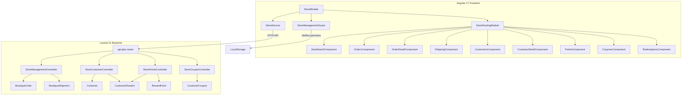
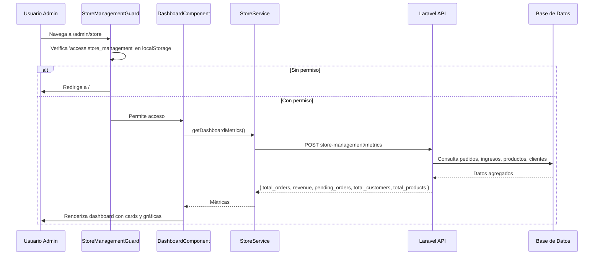
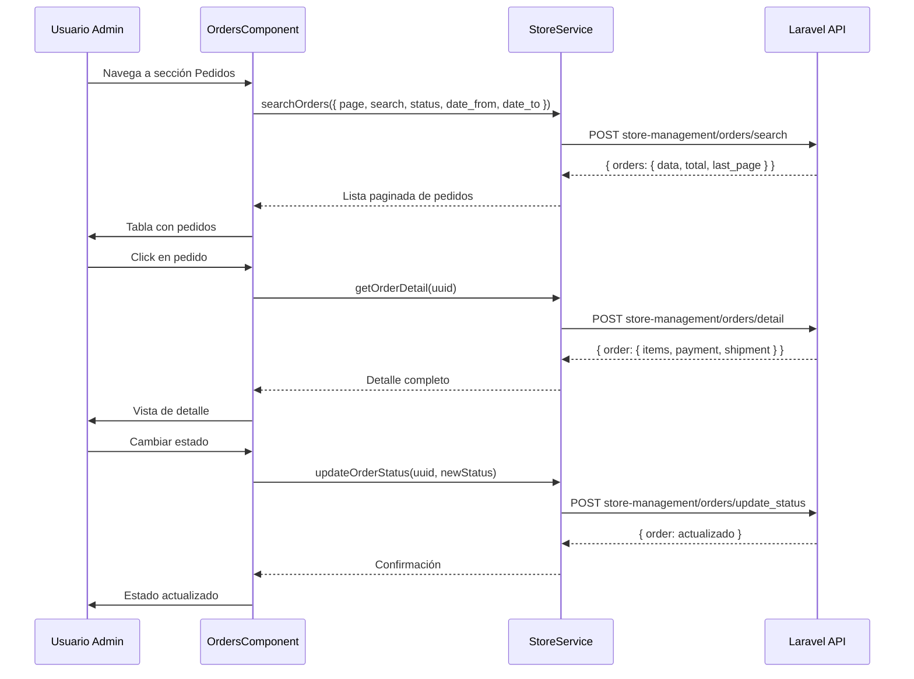
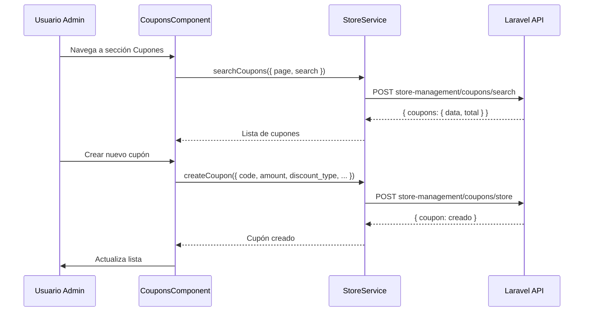

# Documento de Diseño: Panel de Gestión de Tienda (Store Management Panel)

## Resumen General

El Panel de Gestión de Tienda es un módulo administrativo dedicado dentro de la aplicación VECSA Angular/Laravel que centraliza todas las operaciones de la boutique en una interfaz unificada. A diferencia del panel de developer que contiene CRUD genéricos, este panel ofrece vistas especializadas para gestionar pedidos, envíos, clientes, puntos/rewards, cupones y redenciones de puntos.

El panel se accede mediante la ruta `/admin/store` y está protegido por un guard basado en permisos (`access store_management`), siguiendo el mismo patrón que el módulo de Benchmark. Utiliza el estilo visual homologado de VECSA: fondo blanco, color primario azul `#1c69d4`, tarjetas con `border-radius: 16px` y tipografía limpia con Material Icons.

El backend expone endpoints bajo el prefijo `store-management/` protegidos con middleware `auth:sanctum` y `permission:access store_management`, reutilizando los modelos existentes (`BoutiqueOrder`, `BoutiqueShipment`, `Customer`, `CustomerReward`, `RewardPoint`, `CustomerCoupon`) y extendiendo la funcionalidad donde sea necesario.

## Arquitectura



## Diagrama de Secuencia: Flujo Principal



## Diagrama de Secuencia: Gestión de Pedidos



## Diagrama de Secuencia: Gestión de Cupones



## Componentes e Interfaces

### Componente 1: StoreManagementGuard

**Propósito**: Proteger el acceso al módulo verificando el permiso `access store_management` en localStorage.

```typescript
@Injectable({ providedIn: 'root' })
export class StoreManagementGuard {
  constructor(private router: Router) {}

  canActivate(): boolean {
    const perms: string[] = JSON.parse(localStorage.getItem('permissions') || '[]');
    if (perms.includes('access store_management')) return true;
    const role = localStorage.getItem('role') || '';
    if (role === 'developer') return true;
    this.router.navigateByUrl('/');
    return false;
  }

  canLoad(): boolean {
    return this.canActivate();
  }
}
```

**Responsabilidades**:
- Verificar permiso `access store_management` en el array de permisos del localStorage
- Permitir acceso automático al rol `developer`
- Redirigir a `/` si no tiene permiso

### Componente 2: StoreService

**Propósito**: Servicio centralizado para todas las llamadas HTTP al backend del panel de tienda.

```typescript
@Injectable({ providedIn: 'root' })
export class StoreService {
  private apiUrl = environment.apiUrl;

  constructor(private http: HttpClient) {}

  private getHeaders(): HttpHeaders {
    const token = localStorage.getItem('user_token') || '';
    return new HttpHeaders({ Authorization: `Bearer ${token}` });
  }

  // Dashboard
  getDashboardMetrics(params?: { date_from?: string; date_to?: string }): Observable<any>;

  // Pedidos
  searchOrders(params: OrderSearchParams): Observable<any>;
  getOrderDetail(uuid: string): Observable<any>;
  updateOrderStatus(uuid: string, status: string): Observable<any>;
  generateShippingLabel(uuid: string): Observable<any>;

  // Envíos
  searchShipments(params: ShipmentSearchParams): Observable<any>;
  trackShipment(uuid: string): Observable<any>;

  // Clientes
  searchCustomers(params: CustomerSearchParams): Observable<any>;
  getCustomerDetail(uuid: string): Observable<any>;
  getCustomerOrders(customerUuid: string): Observable<any>;
  getCustomerPoints(customerUuid: string): Observable<any>;

  // Puntos
  searchPoints(params: PointsSearchParams): Observable<any>;
  adjustPoints(data: PointAdjustment): Observable<any>;

  // Cupones
  searchCoupons(params: CouponSearchParams): Observable<any>;
  createCoupon(data: CouponCreate): Observable<any>;
  updateCoupon(uuid: string, data: Partial<CouponCreate>): Observable<any>;
  deleteCoupon(uuid: string): Observable<any>;

  // Redenciones
  searchRedemptions(params: RedemptionSearchParams): Observable<any>;
  updateRedemptionStatus(uuid: string, status: string): Observable<any>;
}
```

**Responsabilidades**:
- Gestionar autenticación via token `user_token` de localStorage
- Proveer métodos tipados para cada endpoint del panel
- Manejar errores HTTP de forma centralizada

### Componente 3: DashboardComponent

**Propósito**: Vista principal con métricas de la tienda, gráficas de pedidos y accesos rápidos.

```typescript
interface DashboardStat {
  label: string;
  value: string | number;
  icon: string;
  color: string;
  loading: boolean;
}
```

**Responsabilidades**:
- Mostrar cards de métricas: total pedidos, ingresos, pedidos pendientes, clientes, productos activos
- Renderizar gráficas con ECharts: pedidos por mes, distribución de estados, ingresos por período
- Proveer navegación rápida a cada sección del panel

### Componente 4: OrdersComponent

**Propósito**: Listado y gestión de pedidos con filtros, búsqueda y paginación.

**Responsabilidades**:
- Tabla paginada con columnas: # Pedido, Cliente, Estado, Total, Fecha
- Filtros por estado, rango de fechas y búsqueda por texto
- Acciones: ver detalle, cambiar estado
- Badges de color por estado (pendiente=amarillo, pagado=verde, enviado=azul, entregado=verde oscuro, cancelado=rojo)

### Componente 5: OrderDetailComponent

**Propósito**: Vista detallada de un pedido individual.

**Responsabilidades**:
- Información del pedido: número, estado, fechas, totales
- Lista de productos del pedido con cantidades y precios
- Información de pago (método, referencia, estado)
- Información de envío (carrier, tracking, estado)
- Acciones: cambiar estado, generar guía de envío

### Componente 6: ShippingComponent

**Propósito**: Gestión centralizada de envíos.

**Responsabilidades**:
- Tabla de envíos con: # Pedido, Cliente, Carrier, Tracking, Estado, Fecha estimada
- Filtros por estado de envío y carrier
- Acción de generar guía de envío (integración Enviacom existente)
- Link a tracking externo

### Componente 7: CustomersComponent / CustomerDetailComponent

**Propósito**: Gestión de clientes de la tienda.

**Responsabilidades**:
- Lista paginada de clientes con búsqueda
- Detalle de cliente: datos personales, historial de pedidos, balance de puntos, cupones asignados
- Vista de historial de compras del cliente

### Componente 8: PointsComponent

**Propósito**: Gestión de puntos/rewards de clientes.

**Responsabilidades**:
- Lista de clientes con su balance de puntos
- Historial de movimientos de puntos por cliente
- Ajuste manual de puntos (agregar/restar) con motivo obligatorio

### Componente 9: CouponsComponent

**Propósito**: CRUD completo de cupones de descuento.

**Responsabilidades**:
- Lista de cupones con: código, monto, tipo descuento, usos, estado
- Crear cupón: código, monto, tipo (porcentaje/fijo), límite de uso, monto mínimo/máximo
- Editar y eliminar cupones
- Modal de creación/edición

### Componente 10: RedemptionsComponent

**Propósito**: Gestión de redenciones de puntos.

**Responsabilidades**:
- Lista de solicitudes de redención con: cliente, puntos, reward, estado, fecha
- Filtros por estado (pendiente, aprobada, rechazada)
- Acciones: aprobar/rechazar redención

## Modelos de Datos

### Interfaces TypeScript (Frontend)

```typescript
interface OrderSearchParams {
  page?: number;
  per_page?: number;
  search?: string;
  status?: string;
  date_from?: string;
  date_to?: string;
}

interface ShipmentSearchParams {
  page?: number;
  search?: string;
  status?: string;
  carrier?: string;
}

interface CustomerSearchParams {
  page?: number;
  search?: string;
}

interface PointsSearchParams {
  page?: number;
  search?: string;
  customer_uuid?: string;
}

interface PointAdjustment {
  customer_reward_uuid: string;
  points: number;
  reason: string;
  type: 'add' | 'subtract';
}

interface CouponSearchParams {
  page?: number;
  search?: string;
  discount_type?: string;
}

interface CouponCreate {
  code: string;
  amount: number;
  discount_type: 'percentage' | 'fixed';
  description?: string;
  usage_limit?: number;
  minimum_amount?: number;
  maximum_amount?: number;
  individual_use?: boolean;
}

interface RedemptionSearchParams {
  page?: number;
  status?: string;
  customer_uuid?: string;
}
```

**Reglas de Validación**:
- `CouponCreate.code`: requerido, único, alfanumérico con guiones, 4-20 caracteres
- `CouponCreate.amount`: requerido, > 0, si tipo es porcentaje debe ser <= 100
- `PointAdjustment.points`: requerido, > 0
- `PointAdjustment.reason`: requerido, mínimo 5 caracteres

### Modelos Backend (Existentes reutilizados)

Los siguientes modelos ya existen y se reutilizan sin modificación:
- `BoutiqueOrder` — pedidos con relaciones a items, payment, shipment
- `BoutiqueShipment` — envíos con tracking y carrier
- `BoutiqueProduct` — productos con stock, precio, categoría
- `Customer` — clientes con datos personales y relaciones a rewards
- `CustomerReward` — relación cliente-reward con puntos
- `RewardPoint` — movimientos de puntos individuales
- `CustomerCoupon` — cupones asignados a clientes
- `Reward` — definición de programas de rewards

</text>
</invoke>

## Funciones Clave con Especificaciones Formales

### Función 1: StoreManagementController::dashboard()

```php
public function dashboard(Request $request): JsonResponse
```

**Precondiciones:**
- Usuario autenticado con token válido
- Usuario tiene permiso `access store_management`

**Postcondiciones:**
- Retorna objeto con: `total_orders`, `revenue`, `pending_orders`, `total_customers`, `total_products`, `orders_by_month`, `orders_by_status`
- `revenue` solo incluye pedidos con status en ['pagado', 'en_preparacion', 'enviado', 'entregado']
- `orders_by_month` contiene los últimos 6 meses
- No usa funciones SQL específicas de MySQL (compatible con SQLite)

### Función 2: StoreCustomerController::detail()

```php
public function detail(Request $request): JsonResponse
```

**Precondiciones:**
- `uuid` proporcionado y válido
- Usuario autenticado con permiso `access store_management`

**Postcondiciones:**
- Retorna datos del cliente con: datos personales, `total_points` (suma de earned_points no redimidos), `orders` (historial de pedidos), `rewards` (programas activos), `coupons` (cupones asignados)
- Si el cliente no existe, retorna 404 con código `CUSTOMER_NOT_FOUND`

### Función 3: StorePointsController::adjust()

```php
public function adjust(Request $request): JsonResponse
```

**Precondiciones:**
- `customer_reward_uuid` válido y existente
- `points` > 0
- `type` es 'add' o 'subtract'
- `reason` no vacío, mínimo 5 caracteres
- Si `type` es 'subtract', el balance actual debe ser >= `points`

**Postcondiciones:**
- Se crea un nuevo registro en `reward_points` con los puntos ajustados
- Si `type` es 'add': `earned_points` = `points`
- Si `type` es 'subtract': `earned_points` = `-points`
- El campo `detail` contiene el `reason` proporcionado
- El campo `name` contiene 'ajuste_manual'
- Retorna el nuevo balance total del customer_reward

**Invariantes de Loop:** N/A

### Función 4: StoreCouponController::store()

```php
public function store(Request $request): JsonResponse
```

**Precondiciones:**
- `code` único en tabla `customer_coupons`, alfanumérico con guiones, 4-20 caracteres
- `amount` > 0
- `discount_type` es 'percentage' o 'fixed'
- Si `discount_type` es 'percentage', `amount` <= 100
- Si `minimum_amount` proporcionado, debe ser >= 0
- Si `maximum_amount` proporcionado, debe ser >= `minimum_amount`

**Postcondiciones:**
- Se crea registro en `customer_coupons` con UUID generado automáticamente
- `usage_count` inicializado en 0
- Retorna el cupón creado con código 201

### Función 5: StoreManagementController::searchOrders()

```php
public function searchOrders(Request $request): JsonResponse
```

**Precondiciones:**
- Usuario autenticado con permiso `access store_management`
- Parámetros opcionales: `search`, `status`, `date_from`, `date_to`, `page`, `per_page`

**Postcondiciones:**
- Retorna lista paginada de pedidos ordenados por `created_at` DESC
- Incluye relaciones: `user`, `payment`, `shipment`
- Si `search` proporcionado, filtra por `order_number` o `shipping_name` (LIKE)
- Si `status` proporcionado, filtra por estado exacto
- Si `date_from`/`date_to` proporcionados, filtra por rango de fechas
- Paginación por defecto: 15 por página

## Pseudocódigo Algorítmico

### Algoritmo: Cálculo de Métricas del Dashboard

```pascal
ALGORITHM calculateDashboardMetrics(dateFrom, dateTo)
INPUT: dateFrom (opcional), dateTo (opcional)
OUTPUT: metrics de tipo DashboardMetrics

BEGIN
  query ← BoutiqueOrder.query()
  
  IF dateFrom IS NOT NULL THEN
    query.whereDate('created_at', '>=', dateFrom)
  END IF
  
  IF dateTo IS NOT NULL THEN
    query.whereDate('created_at', '<=', dateTo)
  END IF
  
  totalOrders ← query.count()
  pendingOrders ← query.clone().where('status', 'pendiente').count()
  
  paidStatuses ← ['pagado', 'en_preparacion', 'enviado', 'entregado']
  revenue ← query.clone().whereIn('status', paidStatuses).sum('total')
  
  totalCustomers ← Customer.count()
  totalProducts ← BoutiqueProduct.where('active', true).count()
  
  // Pedidos por mes (últimos 6 meses) - Compatible SQLite
  ordersByMonth ← []
  FOR i FROM 5 DOWNTO 0 DO
    monthStart ← Carbon.now().subMonths(i).startOfMonth()
    monthEnd ← Carbon.now().subMonths(i).endOfMonth()
    monthKey ← monthStart.format('Y-m')
    monthCount ← BoutiqueOrder.whereBetween('created_at', [monthStart, monthEnd]).count()
    ordersByMonth.append({ month: monthKey, count: monthCount })
  END FOR
  
  // Pedidos por estado
  ordersByStatus ← []
  FOR EACH status IN ['pendiente', 'pagado', 'en_preparacion', 'enviado', 'entregado', 'cancelado'] DO
    statusCount ← query.clone().where('status', status).count()
    IF statusCount > 0 THEN
      ordersByStatus.append({ status: status, count: statusCount })
    END IF
  END FOR
  
  RETURN {
    total_orders: totalOrders,
    pending_orders: pendingOrders,
    revenue: ROUND(revenue, 2),
    total_customers: totalCustomers,
    total_products: totalProducts,
    orders_by_month: ordersByMonth,
    orders_by_status: ordersByStatus
  }
END
```

**Precondiciones:**
- Conexión a base de datos activa
- Tablas boutique_orders, customers, boutique_products existen

**Postcondiciones:**
- Todas las métricas son valores numéricos >= 0
- revenue está redondeado a 2 decimales
- orders_by_month contiene exactamente 6 entradas

**Invariantes de Loop:**
- En el loop de meses: todos los meses procesados son consecutivos y en orden cronológico
- En el loop de estados: cada estado se procesa exactamente una vez

### Algoritmo: Ajuste Manual de Puntos

```pascal
ALGORITHM adjustCustomerPoints(customerRewardUuid, points, type, reason)
INPUT: customerRewardUuid (string), points (number > 0), type ('add' | 'subtract'), reason (string)
OUTPUT: { success: boolean, new_balance: number }

BEGIN
  ASSERT points > 0
  ASSERT type IN ['add', 'subtract']
  ASSERT LENGTH(reason) >= 5
  
  customerReward ← CustomerReward.findByUuid(customerRewardUuid)
  
  IF customerReward IS NULL THEN
    RETURN Error(404, "Registro de reward no encontrado")
  END IF
  
  // Calcular balance actual
  currentBalance ← RewardPoint
    .where('customer_reward_id', customerReward.id)
    .sum('earned_points')
  
  IF type = 'subtract' AND currentBalance < points THEN
    RETURN Error(400, "Balance insuficiente para restar puntos")
  END IF
  
  // Determinar valor de puntos
  earnedPoints ← points
  IF type = 'subtract' THEN
    earnedPoints ← -points
  END IF
  
  // Crear movimiento
  newPoint ← RewardPoint.create({
    name: 'ajuste_manual',
    earned_points: earnedPoints,
    detail: reason,
    customer_reward_id: customerReward.id,
    redeemed: false
  })
  
  newBalance ← currentBalance + earnedPoints
  
  ASSERT newBalance >= 0
  
  RETURN { success: true, new_balance: newBalance, point: newPoint }
END
```

**Precondiciones:**
- customerRewardUuid corresponde a un registro existente
- points es un número positivo
- Si type es 'subtract', el balance actual es suficiente

**Postcondiciones:**
- Se crea exactamente un nuevo registro en reward_points
- El nuevo balance nunca es negativo
- El campo detail contiene el motivo del ajuste

**Invariantes de Loop:** N/A

### Algoritmo: Creación de Cupón

```pascal
ALGORITHM createCoupon(code, amount, discountType, description, usageLimit, minAmount, maxAmount, individualUse)
INPUT: code (string), amount (number), discountType ('percentage' | 'fixed'), opcionales...
OUTPUT: { coupon: CustomerCoupon }

BEGIN
  ASSERT LENGTH(code) >= 4 AND LENGTH(code) <= 20
  ASSERT amount > 0
  
  IF discountType = 'percentage' THEN
    ASSERT amount <= 100
  END IF
  
  IF minAmount IS NOT NULL AND maxAmount IS NOT NULL THEN
    ASSERT maxAmount >= minAmount
  END IF
  
  // Verificar unicidad del código
  existing ← CustomerCoupon.where('code', UPPER(code)).first()
  IF existing IS NOT NULL THEN
    RETURN Error(422, "El código de cupón ya existe")
  END IF
  
  coupon ← CustomerCoupon.create({
    code: UPPER(code),
    amount: amount,
    discount_type: discountType,
    description: description OR NULL,
    usage_count: 0,
    usage_limit: usageLimit OR NULL,
    minimum_amount: minAmount OR NULL,
    maximum_amount: maxAmount OR NULL,
    individual_use: individualUse OR false,
    source: 'store_management'
  })
  
  ASSERT coupon.uuid IS NOT NULL
  ASSERT coupon.usage_count = 0
  
  RETURN { coupon: coupon }
END
```

**Precondiciones:**
- code es alfanumérico con guiones, 4-20 caracteres
- code es único en la tabla
- amount > 0 y si es porcentaje, <= 100

**Postcondiciones:**
- Se crea un cupón con UUID auto-generado
- El código se almacena en mayúsculas
- usage_count se inicializa en 0
- source se establece como 'store_management'

## Ejemplo de Uso

### Frontend: Configuración del Módulo

```typescript
// store-routing.module.ts
const routes: Routes = [
  {
    path: '',
    component: StoreLayoutComponent,
    children: [
      { path: '', redirectTo: 'dashboard', pathMatch: 'full' },
      { path: 'dashboard', component: DashboardComponent },
      { path: 'orders', component: OrdersComponent },
      { path: 'orders/:uuid', component: OrderDetailComponent },
      { path: 'shipping', component: ShippingComponent },
      { path: 'customers', component: CustomersComponent },
      { path: 'customers/:uuid', component: CustomerDetailComponent },
      { path: 'points', component: PointsComponent },
      { path: 'coupons', component: CouponsComponent },
      { path: 'redemptions', component: RedemptionsComponent },
    ]
  }
];
```

### Frontend: Uso del StoreService en DashboardComponent

```typescript
@Component({ selector: 'app-store-dashboard', templateUrl: './dashboard.component.html' })
export class DashboardComponent implements OnInit {
  stats: DashboardStat[] = [
    { label: 'Total Pedidos', value: '—', icon: 'receipt_long', color: '#1c69d4', loading: true },
    { label: 'Ingresos', value: '—', icon: 'attach_money', color: '#059669', loading: true },
    { label: 'Pedidos Pendientes', value: '—', icon: 'pending_actions', color: '#f59e0b', loading: true },
    { label: 'Clientes', value: '—', icon: 'people', color: '#7c3aed', loading: true },
    { label: 'Productos Activos', value: '—', icon: 'inventory_2', color: '#dc2626', loading: true },
  ];

  constructor(private storeService: StoreService) {}

  ngOnInit(): void {
    this.storeService.getDashboardMetrics().subscribe({
      next: (res) => {
        const d = res?.data;
        this.stats[0].value = d.total_orders;
        this.stats[1].value = '$' + Number(d.revenue).toLocaleString();
        this.stats[2].value = d.pending_orders;
        this.stats[3].value = d.total_customers;
        this.stats[4].value = d.total_products;
        this.stats.forEach(s => s.loading = false);
      }
    });
  }
}
```

### Backend: Registro de Rutas

```php
// En api.php
Route::prefix('store-management')->middleware(['bandwidth_usage', 'auth:sanctum', 'permission:access store_management'])->group(function () {
    Route::post('/metrics', [StoreManagementController::class, 'dashboard']);
    
    Route::post('/orders/search', [StoreManagementController::class, 'searchOrders']);
    Route::post('/orders/detail', [StoreManagementController::class, 'orderDetail']);
    Route::post('/orders/update_status', [StoreManagementController::class, 'updateOrderStatus']);
    Route::post('/orders/generate_label', [StoreManagementController::class, 'generateLabel']);
    
    Route::post('/shipments/search', [StoreManagementController::class, 'searchShipments']);
    
    Route::post('/customers/search', [StoreCustomerController::class, 'search']);
    Route::post('/customers/detail', [StoreCustomerController::class, 'detail']);
    Route::post('/customers/orders', [StoreCustomerController::class, 'customerOrders']);
    
    Route::post('/points/search', [StorePointsController::class, 'search']);
    Route::post('/points/adjust', [StorePointsController::class, 'adjust']);
    Route::post('/points/customer_balance', [StorePointsController::class, 'customerBalance']);
    
    Route::post('/coupons/search', [StoreCouponController::class, 'search']);
    Route::post('/coupons/store', [StoreCouponController::class, 'store']);
    Route::post('/coupons/update', [StoreCouponController::class, 'update']);
    Route::post('/coupons/delete', [StoreCouponController::class, 'delete']);
    
    Route::post('/redemptions/search', [StorePointsController::class, 'searchRedemptions']);
    Route::post('/redemptions/update_status', [StorePointsController::class, 'updateRedemptionStatus']);
});
```

## Propiedades de Correctitud

*Una propiedad es una característica o comportamiento que debe mantenerse verdadero en todas las ejecuciones válidas de un sistema — esencialmente, una declaración formal sobre lo que el sistema debe hacer. Las propiedades sirven como puente entre especificaciones legibles por humanos y garantías de correctitud verificables por máquina.*

### Propiedad 1: El guard permite acceso si y solo si el usuario tiene permiso o es developer

*Para cualquier* combinación de permisos y rol de usuario, `canActivate()` retorna `true` si y solo si el array de permisos incluye `access store_management` O el rol es `developer`. En cualquier otro caso retorna `false` y redirige a `/`.

**Valida: Requisitos 1.1, 1.2, 1.3**

### Propiedad 2: Revenue solo incluye pedidos con estados pagados

*Para cualquier* conjunto de pedidos con estados variados, el cálculo de revenue del dashboard solo suma los totales de pedidos cuyo estado pertenece a `['pagado', 'en_preparacion', 'enviado', 'entregado']`.

**Valida: Requisito 2.2**

### Propiedad 3: Máquina de estados de pedidos válida

*Para cualquier* pedido en cualquier estado y cualquier estado destino, la transición es aceptada si y solo si el estado destino pertenece al conjunto de transiciones válidas del estado actual. Además, cuando el estado cambia a `en_preparacion`, `enviado` o `entregado`, el estado del envío asociado se actualiza al mismo valor.

**Valida: Requisitos 4.1, 4.2, 4.4**

### Propiedad 4: Cancelación de pedido restaura inventario

*Para cualquier* pedido con productos, al cancelar el pedido, el inventario de cada producto se incrementa en la cantidad que fue comprada en ese pedido.

**Valida: Requisito 4.3**

### Propiedad 5: Balance de puntos nunca es negativo después de un ajuste

*Para cualquier* ajuste de puntos de tipo `subtract`, si los puntos a restar son mayores al balance actual, la operación es rechazada. Si es aceptada, el balance resultante es igual al balance anterior menos los puntos restados, y siempre es >= 0.

**Valida: Requisitos 7.5, 7.7**

### Propiedad 6: Ajuste manual de puntos crea registro correcto

*Para cualquier* ajuste manual de puntos válido (puntos > 0, motivo >= 5 caracteres), el registro creado en `reward_points` tiene `name` igual a `ajuste_manual`, `earned_points` igual a los puntos (positivo si add, negativo si subtract), y `detail` igual al motivo proporcionado.

**Valida: Requisitos 7.4, 7.6**

### Propiedad 7: Validación de cupones y almacenamiento en mayúsculas

*Para cualquier* cupón creado, el código se almacena en mayúsculas, `usage_count` se inicializa en 0, el código tiene entre 4 y 20 caracteres alfanuméricos con guiones, y si el tipo es `percentage` el monto es <= 100. Si se proporcionan `minimum_amount` y `maximum_amount`, entonces `maximum_amount` >= `minimum_amount`.

**Valida: Requisitos 8.3, 8.4, 8.5, 8.6**

### Propiedad 8: Paginación retorna resultados consistentes

*Para cualquier* búsqueda paginada (pedidos, envíos, clientes, cupones, redenciones), la cantidad de resultados en `data` es menor o igual a `per_page`, y `total` es >= 0.

**Valida: Requisitos 3.5, 5.2, 9.2**

## Manejo de Errores

### Error 1: Usuario sin permiso

**Condición**: Usuario intenta acceder a `/admin/store` sin permiso `access store_management`
**Respuesta**: Guard redirige a `/` inmediatamente
**Recuperación**: El usuario debe solicitar el permiso a un administrador

### Error 2: Pedido no encontrado

**Condición**: UUID de pedido no existe en la base de datos
**Respuesta**: HTTP 404 con código `ORDER_NOT_FOUND` y mensaje descriptivo
**Recuperación**: Frontend muestra mensaje de error y permite volver a la lista

### Error 3: Transición de estado inválida

**Condición**: Se intenta cambiar el estado de un pedido a un estado no permitido
**Respuesta**: HTTP 400 con código `INVALID_STATUS_TRANSITION` y mensaje indicando la transición inválida
**Recuperación**: Frontend muestra el error y mantiene el estado actual

### Error 4: Balance insuficiente para restar puntos

**Condición**: Se intenta restar más puntos de los disponibles
**Respuesta**: HTTP 400 con código `INSUFFICIENT_BALANCE` y balance actual
**Recuperación**: Frontend muestra el balance actual y permite ajustar la cantidad

### Error 5: Código de cupón duplicado

**Condición**: Se intenta crear un cupón con un código que ya existe
**Respuesta**: HTTP 422 con código `DUPLICATE_COUPON_CODE`
**Recuperación**: Frontend resalta el campo de código y sugiere cambiar

### Error 6: Token expirado o inválido

**Condición**: El token de autenticación ha expirado o es inválido
**Respuesta**: HTTP 401 desde el middleware `auth:sanctum`
**Recuperación**: Frontend redirige al login

## Estrategia de Testing

### Testing Unitario

- Verificar que el guard permite/bloquea acceso correctamente según permisos
- Verificar cálculo de métricas del dashboard con datos conocidos
- Verificar validaciones de creación de cupones (código único, montos válidos)
- Verificar lógica de ajuste de puntos (add/subtract, balance suficiente)
- Verificar transiciones de estado de pedidos válidas e inválidas

### Testing Basado en Propiedades

**Librería**: fast-check (TypeScript) / PHPUnit con data providers (PHP)

- Propiedad: Para cualquier combinación de permisos, el guard solo permite acceso si incluye `access store_management` o rol es `developer`
- Propiedad: Para cualquier ajuste de puntos tipo 'subtract', el balance resultante nunca es negativo
- Propiedad: Para cualquier código de cupón, se almacena en mayúsculas
- Propiedad: Para cualquier búsqueda paginada, `data.length <= per_page`

### Testing de Integración

- Flujo completo: login → acceso al panel → ver dashboard → navegar a pedidos → ver detalle → cambiar estado
- Flujo de cupones: crear cupón → verificar en lista → editar → eliminar
- Flujo de puntos: buscar cliente → ver balance → ajustar puntos → verificar nuevo balance

## Consideraciones de Rendimiento

- Las consultas de métricas del dashboard deben usar `count()` y `sum()` directamente en SQL, no cargar todos los registros en memoria
- La búsqueda de pedidos usa paginación server-side (15 por página por defecto)
- Las gráficas de ECharts se inicializan con `setTimeout` para no bloquear el render inicial
- Los cálculos de pedidos por mes usan `whereBetween` en lugar de funciones SQL como `YEAR()` o `MONTH()` para compatibilidad con SQLite
- Lazy loading del módulo Angular para no afectar el bundle principal

## Consideraciones de Seguridad

- Todas las rutas protegidas con `auth:sanctum` + `permission:access store_management`
- El guard del frontend es una primera capa; la validación real ocurre en el backend
- Los ajustes manuales de puntos requieren un motivo obligatorio para auditoría
- Los UUIDs se usan en lugar de IDs numéricos en todas las APIs públicas
- El token se lee de `localStorage` con key `user_token` (patrón existente del sistema)
- Las operaciones de eliminación usan soft deletes (ya implementado en todos los modelos)

## Dependencias

### Frontend
- Angular 17 (existente)
- ECharts (existente, usado en developer dashboard)
- Angular Material Icons (existente)
- HttpClient con interceptors (existente)

### Backend
- Laravel 11 (existente)
- Spatie Permission (existente, para middleware `permission:`)
- Sanctum (existente, para autenticación API)
- Modelos Boutique existentes (BoutiqueOrder, BoutiqueShipment, etc.)
- Modelos Rewards existentes (Customer, CustomerReward, RewardPoint, CustomerCoupon)
- EnviacomService (existente, para generación de guías de envío)
- ApiResponseHelper (existente, para respuestas estandarizadas)
