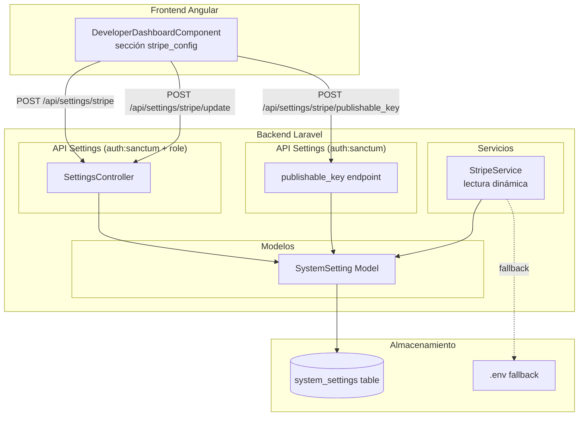
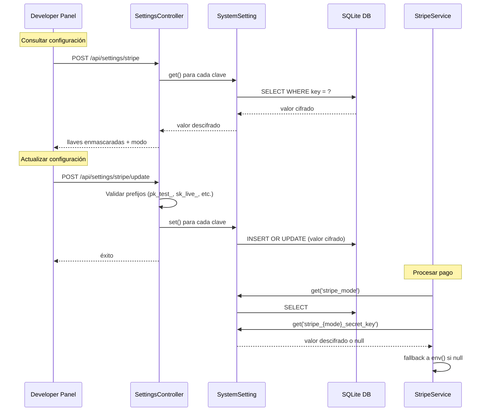

# Documento de Diseño — Configuración de Stripe con Switch Test/Producción

## Resumen General

Este documento describe el diseño técnico del módulo de configuración dinámica de Stripe para la plataforma Grupo VECSA. El sistema permite a usuarios con rol `developer` o `administrator` gestionar las llaves de Stripe (test y producción) desde el panel de desarrollador, almacenándolas cifradas en la tabla `system_settings`. El `StripeService` existente se modifica para leer dinámicamente las llaves activas desde la base de datos con fallback al `.env`, permitiendo cambiar entre modo test y producción sin reiniciar el servidor.

El módulo se integra con el panel developer existente (`DeveloperDashboardComponent`) como una nueva sección `stripe_config`, siguiendo el patrón de `activeSection` ya establecido.

---

## Arquitectura

### Diagrama de Arquitectura



### Flujo de Datos



---

## Componentes e Interfaces

### Backend

#### 1. Migración: `create_system_settings_table`

Crea la tabla `system_settings` con prefijo `app_vecsa_` siguiendo la convención del proyecto.

#### 2. Modelo: `SystemSetting`

Ubicación: `app/Models/SystemSetting.php`

```php
interface SystemSettingInterface {
    public static function get(string $key, mixed $default = null): mixed;
    public static function set(string $key, ?string $value): void;
    public static function getEncrypted(string $key, mixed $default = null): mixed;
    public static function setEncrypted(string $key, ?string $value): void;
}
```

- `get()` / `set()`: lectura/escritura de valores en texto plano (ej: `stripe_mode`).
- `getEncrypted()` / `setEncrypted()`: lectura/escritura con `encrypt()`/`decrypt()` de Laravel para llaves secretas y webhook secrets.
- Las llaves publicables (`pk_test_*`, `pk_live_*`) se almacenan sin cifrar.
- Las llaves secretas (`sk_test_*`, `sk_live_*`) y webhook secrets (`whsec_*`) se almacenan cifradas.

#### 3. Controlador: `SettingsController`

Ubicación: `app/Http/Controllers/Settings/SettingsController.php`

Endpoints:

| Método | Ruta | Middleware | Descripción |
|--------|------|-----------|-------------|
| POST | `/api/settings/stripe` | `auth:sanctum`, `role:developer\|administrator` | Retorna configuración actual |
| POST | `/api/settings/stripe/update` | `auth:sanctum`, `role:developer\|administrator` | Actualiza configuración |
| POST | `/api/settings/stripe/publishable_key` | `auth:sanctum` | Retorna llave publicable activa |

Respuesta de consulta (`stripe`):
```json
{
  "status": 200,
  "data": {
    "stripe_mode": "test",
    "stripe_test_publishable_key": "pk_test_abc123...",
    "stripe_test_secret_key": "••••••••a1b2",
    "stripe_test_webhook_secret": "••••••••c3d4",
    "stripe_live_publishable_key": "pk_live_xyz789...",
    "stripe_live_secret_key": "••••••••e5f6",
    "stripe_live_webhook_secret": "••••••••g7h8"
  }
}
```

Payload de actualización (`stripe/update`):
```json
{
  "stripe_mode": "test",
  "stripe_test_publishable_key": "pk_test_...",
  "stripe_test_secret_key": "sk_test_...",
  "stripe_test_webhook_secret": "whsec_...",
  "stripe_live_publishable_key": "pk_live_...",
  "stripe_live_secret_key": "sk_live_...",
  "stripe_live_webhook_secret": "whsec_..."
}
```

Lógica de enmascaramiento: para llaves secretas y webhook secrets, retornar `••••••••` + últimos 4 caracteres. Las llaves publicables se retornan completas.

Lógica de campos vacíos: si un campo llega vacío o no se incluye en el request, se conserva el valor existente en la base de datos.

#### 4. Modificación: `StripeService`

El constructor actual:
```php
public function __construct()
{
    $this->secretKey = env('STRIPE_SECRET_KEY', '');
    $this->webhookSecret = env('STRIPE_WEBHOOK_SECRET', '');
}
```

Se modifica a:
```php
public function __construct()
{
    $mode = SystemSetting::get('stripe_mode', 'test');
    $this->secretKey = SystemSetting::getEncrypted("stripe_{$mode}_secret_key")
        ?? env('STRIPE_SECRET_KEY', '');
    $this->webhookSecret = SystemSetting::getEncrypted("stripe_{$mode}_webhook_secret")
        ?? env('STRIPE_WEBHOOK_SECRET', '');
}
```

Esto garantiza que cada instanciación del servicio (por request) resuelve las llaves actuales.

#### 5. Validación de prefijos

Reglas de validación en el `SettingsController`:

| Campo | Prefijo requerido |
|-------|------------------|
| `stripe_test_publishable_key` | `pk_test_` |
| `stripe_test_secret_key` | `sk_test_` |
| `stripe_test_webhook_secret` | `whsec_` |
| `stripe_live_publishable_key` | `pk_live_` |
| `stripe_live_secret_key` | `sk_live_` |
| `stripe_live_webhook_secret` | `whsec_` |

Se implementa con reglas `starts_with` de Laravel en un FormRequest o validación inline. Los campos vacíos se excluyen de la validación (solo se validan si se envían con contenido).

### Frontend

#### 6. Sección `stripe_config` en DeveloperDashboardComponent

Se agrega un nuevo botón en la sección "Herramientas" del sidebar del panel developer, siguiendo el patrón existente de `role_matrix` y `benchmark`:

```html
<button class="dev-nav-item" [class.active]="activeSection === 'stripe_config'" (click)="selectSection('stripe_config')">
  <span class="material-icons">credit_card</span>
  Configuración Stripe
</button>
```

La sección incluye:
- Toggle para alternar entre modo `test` y `live`
- Badge indicador: verde para test, rojo para producción
- Campos de entrada para llaves de test (publishable, secret, webhook)
- Campos de entrada para llaves de producción (publishable, secret, webhook)
- Botón "Guardar Configuración"
- Notificaciones de éxito/error

Los campos de llaves secretas muestran el valor enmascarado recibido del backend. Al editar, el usuario escribe la llave completa. Si deja el campo con el valor enmascarado (sin cambios), el backend lo ignora y conserva el valor existente.

---

## Modelos de Datos

### Tabla: `system_settings`

| Columna | Tipo | Restricciones | Descripción |
|---------|------|--------------|-------------|
| `id` | bigint unsigned | PK, auto-increment | ID interno |
| `key` | varchar(255) | UNIQUE, NOT NULL | Clave de configuración |
| `value` | text | NULLABLE | Valor (texto plano o cifrado) |
| `created_at` | timestamp | NULLABLE | Fecha de creación |
| `updated_at` | timestamp | NULLABLE | Fecha de actualización |

Claves utilizadas por este feature:

| Key | Tipo de valor | Cifrado |
|-----|--------------|---------|
| `stripe_mode` | `test` o `live` | No |
| `stripe_test_publishable_key` | `pk_test_...` | No |
| `stripe_test_secret_key` | `sk_test_...` | Sí |
| `stripe_test_webhook_secret` | `whsec_...` | Sí |
| `stripe_live_publishable_key` | `pk_live_...` | No |
| `stripe_live_secret_key` | `sk_live_...` | Sí |
| `stripe_live_webhook_secret` | `whsec_...` | Sí |

### Modelo: `SystemSetting`

```
SystemSetting
├── table: app_vecsa_system_settings
├── fillable: [key, value]
├── hidden: [id]
├── static get(key, default): mixed
├── static set(key, value): void
├── static getEncrypted(key, default): mixed
└── static setEncrypted(key, value): void
```

No requiere UUID, soft deletes ni relaciones. Es un modelo utilitario key-value.

---

## Propiedades de Correctitud

*Una propiedad es una característica o comportamiento que debe mantenerse verdadero en todas las ejecuciones válidas de un sistema — esencialmente, una declaración formal sobre lo que el sistema debe hacer. Las propiedades sirven como puente entre especificaciones legibles por humanos y garantías de correctitud verificables por máquina.*

### Propiedad 1: Round-trip de cifrado de llaves secretas

*Para cualquier* valor de llave secreta (secret key o webhook secret), almacenarlo con `setEncrypted()` y luego leerlo con `getEncrypted()` debe retornar el valor original sin modificaciones.

**Valida: Requisitos 1.3, 1.4**

### Propiedad 2: Round-trip de almacenamiento key-value

*Para cualquier* par clave-valor válido, almacenarlo con `SystemSetting::set()` y luego leerlo con `SystemSetting::get()` debe retornar el valor original.

**Valida: Requisito 1.1**

### Propiedad 3: Enmascaramiento correcto según tipo de llave

*Para cualquier* configuración de Stripe almacenada, al consultar vía el endpoint, las llaves secretas y webhook secrets deben retornarse enmascaradas (solo últimos 4 caracteres visibles), mientras que las llaves publicables deben retornarse completas sin enmascarar.

**Valida: Requisitos 2.4, 2.5**

### Propiedad 4: Preservación de campos vacíos en actualización

*Para cualquier* configuración existente y cualquier solicitud de actualización donde algunos campos estén vacíos o ausentes, los campos vacíos deben conservar sus valores previos en la base de datos.

**Valida: Requisito 2.6**

### Propiedad 5: Resolución de llave publicable según modo activo

*Para cualquier* modo activo (`test` o `live`) y cualquier par de llaves publicables configuradas, el endpoint `publishable_key` debe retornar exactamente la llave publicable correspondiente al modo activo.

**Valida: Requisitos 3.3, 3.4**

### Propiedad 6: Resolución de llaves en StripeService según modo

*Para cualquier* modo activo y cualquier conjunto de llaves configuradas en la base de datos, `StripeService` debe usar la `secret_key` y `webhook_secret` correspondientes al modo activo. Si no existen en la base de datos, debe usar los valores del `.env` como fallback.

**Valida: Requisitos 4.1, 4.3, 4.4**

### Propiedad 7: Resolución dinámica por instanciación

*Para cualquier* secuencia de cambios de configuración en la base de datos, cada nueva instanciación de `StripeService` debe reflejar los valores más recientes sin necesidad de reiniciar el servidor.

**Valida: Requisito 4.5**

### Propiedad 8: Validación de prefijos de llaves

*Para cualquier* campo de llave de Stripe y cualquier string, la validación debe aceptar el string si y solo si comienza con el prefijo correcto para ese campo (`pk_test_`, `pk_live_`, `sk_test_`, `sk_live_`, `whsec_`). Los campos vacíos se excluyen de la validación.

**Valida: Requisitos 6.1, 6.2, 6.3, 6.4, 6.5, 6.6**

### Propiedad 9: Autorización de endpoints

*Para cualquier* usuario autenticado cuyo rol no sea `developer` ni `administrator`, los endpoints de consulta y actualización de configuración de Stripe deben retornar un error 403.

**Valida: Requisitos 2.3, 2.7**

---

## Manejo de Errores

| Escenario | Código HTTP | Código Error | Mensaje |
|-----------|-------------|-------------|---------|
| Usuario no autenticado | 401 | `UNAUTHENTICATED` | No autenticado |
| Usuario sin rol autorizado | 403 | `FORBIDDEN` | No tienes permisos para acceder a esta configuración |
| Llave con prefijo inválido | 422 | `VALIDATION_ERROR` | El campo {campo} debe comenzar con {prefijo} |
| Error al descifrar valor corrupto | 500 | `DECRYPT_ERROR` | Error al leer la configuración. Contacta al administrador |
| Error general del servidor | 500 | `SETTINGS_ERROR` | Error al procesar la configuración |

El `SystemSetting::getEncrypted()` debe capturar `DecryptException` y retornar `null` (triggering el fallback al `.env`) en lugar de propagar la excepción, para mantener la resiliencia del sistema.

---

## Estrategia de Testing

### Testing Dual

Se utilizan tanto tests unitarios como tests basados en propiedades para cobertura completa.

### Tests Unitarios

Enfocados en ejemplos específicos, edge cases y puntos de integración:

- Verificar que `stripe_mode` por defecto es `test` cuando no hay configuración
- Verificar que el endpoint `publishable_key` retorna vacío cuando no hay llave configurada
- Verificar que el fallback al `.env` funciona cuando la DB no tiene llaves
- Verificar respuesta 403 para un usuario con rol `staff`
- Verificar que el endpoint de consulta retorna la estructura JSON esperada
- Verificar que `DecryptException` se maneja gracefully

### Tests Basados en Propiedades

Librería: **PHPUnit** con generadores custom (Laravel no tiene una librería PBT estándar, se implementan loops con datos aleatorios generados por `Faker`).

Configuración: mínimo 100 iteraciones por propiedad.

Cada test debe estar etiquetado con un comentario referenciando la propiedad del diseño:

```
/** Feature: stripe-config-manager, Property 1: Round-trip de cifrado de llaves secretas */
/** Feature: stripe-config-manager, Property 2: Round-trip de almacenamiento key-value */
/** Feature: stripe-config-manager, Property 3: Enmascaramiento correcto según tipo de llave */
/** Feature: stripe-config-manager, Property 4: Preservación de campos vacíos en actualización */
/** Feature: stripe-config-manager, Property 5: Resolución de llave publicable según modo activo */
/** Feature: stripe-config-manager, Property 6: Resolución de llaves en StripeService según modo */
/** Feature: stripe-config-manager, Property 7: Resolución dinámica por instanciación */
/** Feature: stripe-config-manager, Property 8: Validación de prefijos de llaves */
/** Feature: stripe-config-manager, Property 9: Autorización de endpoints */
```

Cada propiedad de correctitud se implementa con un único test basado en propiedades que genera datos aleatorios y verifica la propiedad universal.
