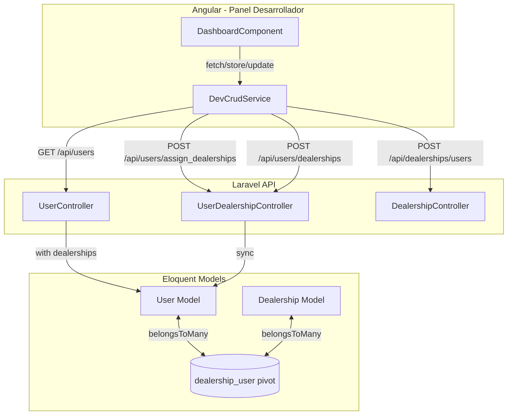
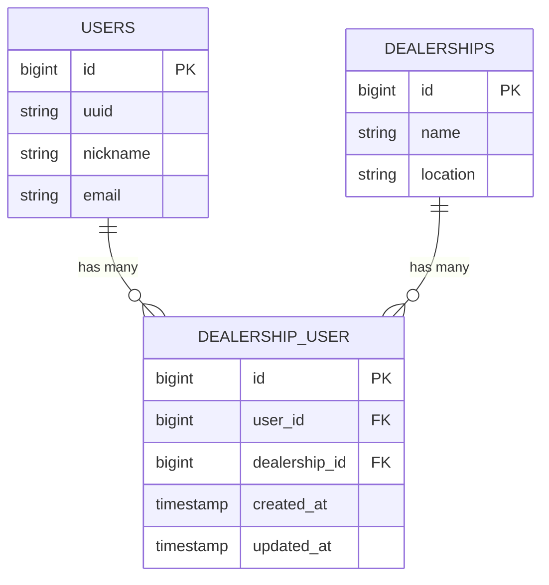

# Diseño: Asignación de Usuarios a Sucursales

## Resumen

Este diseño describe la implementación de la relación muchos-a-muchos entre usuarios y sucursales en el sistema VECSA. Incluye una tabla pivote nueva (`app_vecsa_dealership_user`), endpoints API para gestionar asignaciones, modificaciones al listado de usuarios para incluir información de sucursales, un nuevo tipo de campo `multi-select` en el sistema de formularios del panel de desarrollador, y un filtro por sucursal en la lista de usuarios.

### Decisiones de Diseño Clave

1. **Sync vs. Attach/Detach**: Se usa `sync()` de Laravel para las asignaciones. Esto reemplaza todas las asignaciones previas en una sola operación, simplificando la lógica del frontend (enviar siempre el estado completo).

2. **Identificadores**: La API acepta `dealership_ids` como arreglo de IDs numéricos (no UUIDs) porque el modelo Dealership no tiene campo UUID — usa `id` como identificador primario visible. El User se identifica por `user_uuid`.

3. **Multi-select como nuevo tipo de campo**: El sistema de formularios genérico (`FormField`) solo soporta tipos simples. Se agrega `multi-select` como nuevo tipo, con carga dinámica de opciones desde un endpoint.

4. **Filtro client-side vs server-side**: El filtro por sucursal se implementa client-side (igual que el filtro de roles existente) ya que los usuarios se cargan paginados con 15 registros por página y las sucursales se incluyen en cada registro.

## Arquitectura



## Componentes e Interfaces

### Backend

#### 1. Migración: `create_dealership_user_table`

Nueva migración para la tabla pivote `app_vecsa_dealership_user`.

```php
Schema::create(env('DB_TABLE_PREFIX', '') . 'dealership_user', function (Blueprint $table) {
    $table->id();
    $table->foreignId('user_id')->constrained(env('DB_TABLE_PREFIX', '') . 'users');
    $table->foreignId('dealership_id')->constrained(env('DB_TABLE_PREFIX', '') . 'dealerships');
    $table->timestamps();
    $table->unique(['user_id', 'dealership_id']);
});
```

#### 2. Modelo User — nueva relación `dealerships()`

```php
public function dealerships()
{
    return $this->belongsToMany(
        Dealership::class,
        env('DB_TABLE_PREFIX', '') . 'dealership_user',
        'user_id',
        'dealership_id'
    );
}
```

#### 3. Modelo Dealership — nueva relación `users()`

```php
public function users()
{
    return $this->belongsToMany(
        User::class,
        env('DB_TABLE_PREFIX', '') . 'dealership_user',
        'dealership_id',
        'user_id'
    );
}
```

#### 4. UserDealershipController (nuevo)

Controlador dedicado para las operaciones de asignación:

| Método | Endpoint | Descripción |
|--------|----------|-------------|
| `assignDealerships` | `POST /api/users/assign_dealerships` | Sincroniza sucursales de un usuario |
| `getUserDealerships` | `POST /api/users/dealerships` | Lista sucursales de un usuario |

```php
// assignDealerships
public function assignDealerships(Request $request)
{
    // Valida user_uuid (required, exists) y dealership_ids (array de IDs existentes)
    // Busca User por UUID
    // $user->dealerships()->sync($dealershipIds)
    // Retorna lista actualizada de dealerships
}

// getUserDealerships
public function getUserDealerships(Request $request)
{
    // Valida user_uuid (required, exists)
    // Retorna $user->dealerships
}
```

#### 5. Modificación a UserController::index()

Agregar eager loading de dealerships y incluir los nombres en la respuesta:

```php
$users = User::whereHas('userProfile')->with('dealerships:id,name')->paginate(15);

$users->getCollection()->transform(function ($user) {
    $profile = $user->getRoleProfile();
    $user->role = $profile['role'];
    $user->profile = $profile['profile'];
    $user->dealership_names = $user->dealerships->pluck('name')->implode(', ');
    return $user;
});
```

#### 6. Modificación a DealershipController — nuevo método `users()`

```php
public function users(Request $request)
{
    // Valida dealership_id (required, exists)
    // Retorna Dealership::find($id)->users()->with('userProfile')->paginate(15)
}
```

#### 7. Rutas nuevas

```php
// En el grupo users (auth:sanctum)
Route::post('/assign_dealerships', [UserDealershipController::class, 'assignDealerships'])
    ->middleware('role:administrator|developer');
Route::post('/dealerships', [UserDealershipController::class, 'getUserDealerships'])
    ->middleware('role:administrator|developer');

// En el grupo dealerships
Route::post('/users', [DealershipController::class, 'users'])
    ->middleware('auth:sanctum');
```

### Frontend

#### 1. Nuevo tipo `multi-select` en FormField

Extender la interfaz `FormField` en `dev-crud.service.ts`:

```typescript
export interface FormField {
  key: string;
  label: string;
  type: 'text' | 'number' | 'email' | 'password' | 'select' | 'textarea' | 'checkbox' | 'multi-select';
  required?: boolean;
  options?: { value: string; label: string }[];
  // Para multi-select con carga dinámica
  optionsEndpoint?: string;
  optionsMethod?: 'GET' | 'POST';
  optionsDataKey?: string;
  optionsValueKey?: string;
  optionsLabelKey?: string;
}
```

#### 2. Renderizado del multi-select en el template

Agregar un bloque en el modal del dashboard para el tipo `multi-select`:

```html
@if (field.type === 'multi-select') {
  <div class="multi-select-container">
    @for (opt of field.options || dynamicOptions[field.key] || []; track opt.value) {
      <label class="multi-select-option">
        <input type="checkbox" [checked]="isMultiSelected(field.key, opt.value)"
          (change)="toggleMultiSelect(field.key, opt.value)" />
        {{ opt.label }}
      </label>
    }
  </div>
}
```

#### 3. Lógica de multi-select en el componente

```typescript
// Nuevas propiedades
dynamicOptions: Record<string, { value: string; label: string }[]> = {};

// Métodos
isMultiSelected(key: string, value: string): boolean {
  return Array.isArray(this.modalData[key]) && this.modalData[key].includes(value);
}

toggleMultiSelect(key: string, value: string): void {
  if (!Array.isArray(this.modalData[key])) this.modalData[key] = [];
  const idx = this.modalData[key].indexOf(value);
  if (idx >= 0) this.modalData[key].splice(idx, 1);
  else this.modalData[key].push(value);
}

loadDynamicOptions(field: FormField): void {
  if (field.optionsEndpoint) {
    this.crud.fetch(field.optionsEndpoint, field.optionsMethod || 'POST', {}).subscribe({
      next: (res: any) => {
        const data = res?.data?.[field.optionsDataKey!] || res?.data || [];
        const items = Array.isArray(data) ? data : [];
        this.dynamicOptions[field.key] = items.map((item: any) => ({
          value: String(item[field.optionsValueKey || 'id']),
          label: item[field.optionsLabelKey || 'name'],
        }));
      },
    });
  }
}
```

#### 4. Modificación a la sección `users` en sections array

Agregar columna de sucursales y campo multi-select:

```typescript
// En columns, agregar:
{ key: 'dealership_names', label: 'Sucursales' }

// En formFields, agregar:
{
  key: 'dealership_ids', label: 'Sucursales', type: 'multi-select',
  optionsEndpoint: 'dealerships/search', optionsMethod: 'POST',
  optionsDataKey: 'dealerships', optionsValueKey: 'id', optionsLabelKey: 'name',
}
```

#### 5. Filtro por sucursal

Agregar un segundo filtro (similar al de roles) en la sección de usuarios:

```typescript
dealershipFilter = '';
dealershipOptions: { value: string; label: string }[] = [];
```

El filtro tendrá opciones: "Todas", "Sin sucursal", y cada sucursal disponible. Se carga dinámicamente al entrar a la sección de usuarios.

#### 6. Flujo de guardado con asignación

Al guardar un usuario (create/edit), después de la operación principal exitosa, si `dealership_ids` está presente, se hace una segunda llamada a `POST /api/users/assign_dealerships` con el `user_uuid` y `dealership_ids`.

## Modelos de Datos

### Tabla pivote: `app_vecsa_dealership_user`

| Columna | Tipo | Restricciones |
|---------|------|---------------|
| id | bigint | PK, auto-increment |
| user_id | bigint | FK → users.id, NOT NULL |
| dealership_id | bigint | FK → dealerships.id, NOT NULL |
| created_at | timestamp | nullable |
| updated_at | timestamp | nullable |

**Índice único**: `(user_id, dealership_id)` — previene duplicados.

### Relaciones actualizadas



### Respuesta API modificada — GET /api/users

```json
{
  "status": 200,
  "message": "Usuarios obtenidos exitosamente",
  "data": {
    "current_page": 1,
    "data": [
      {
        "uuid": "abc-123",
        "nickname": "admin_test",
        "email": "admin@vecsa.com",
        "role": "administrator",
        "dealership_names": "bmw puebla angelópolis, bmw pachuca",
        "dealerships": [
          { "id": 1, "name": "bmw puebla angelópolis" },
          { "id": 2, "name": "bmw pachuca" }
        ]
      }
    ],
    "last_page": 3,
    "total": 42
  }
}
```

### Payload — POST /api/users/assign_dealerships

```json
{
  "user_uuid": "abc-123",
  "dealership_ids": [1, 3, 5]
}
```

### Respuesta — POST /api/users/dealerships

```json
{
  "status": 200,
  "message": "Sucursales del usuario obtenidas",
  "data": [
    { "id": 1, "name": "bmw puebla angelópolis" },
    { "id": 3, "name": "bmw oaxaca" }
  ]
}
```


## Correctness Properties

*Una propiedad es una característica o comportamiento que debe mantenerse verdadero en todas las ejecuciones válidas de un sistema — esencialmente, una declaración formal sobre lo que el sistema debe hacer. Las propiedades sirven como puente entre especificaciones legibles por humanos y garantías de corrección verificables por máquina.*

### Property 1: Sync round-trip

*For any* user and *for any* subset of existing dealership IDs, syncing that subset via `assign_dealerships` and then querying via `users/dealerships` should return exactly the same set of dealership IDs (order-independent).

**Validates: Requirements 1.2, 1.3, 2.1, 2.2**

### Property 2: Sync is idempotent

*For any* user and *for any* set of dealership IDs, syncing the same set twice should produce the same result as syncing it once — the user's dealerships should be identical after both operations.

**Validates: Requirements 2.1**

### Property 3: Authorization enforcement

*For any* authenticated user whose roles do not include `administrator` or `developer`, calling `POST /api/users/assign_dealerships` should return a 403 Forbidden response, and the target user's dealership assignments should remain unchanged.

**Validates: Requirements 2.6**

### Property 4: User list includes dealership data

*For any* user returned by `GET /api/users`, if that user has dealerships assigned, the response object should contain a `dealership_names` string and a `dealerships` array whose names match the assigned dealerships.

**Validates: Requirements 3.1**

### Property 5: Dealership filter correctness

*For any* list of users and *for any* selected dealership filter value: if a specific dealership is selected, every user in the filtered result must have that dealership in their assignments; if "sin sucursal" is selected, every user in the filtered result must have zero dealership assignments.

**Validates: Requirements 5.2, 5.4**

### Property 6: Dealership users query consistency

*For any* dealership, the set of users returned by `POST /api/dealerships/users` should be exactly the set of users who have that dealership in their assignments (as verified by each user's `dealerships` relation).

**Validates: Requirements 6.1**

## Manejo de Errores

| Escenario | Código HTTP | Mensaje | Acción |
|-----------|-------------|---------|--------|
| `user_uuid` no existe en `assign_dealerships` | 404 | "Usuario no encontrado" | Retornar error, no modificar datos |
| `user_uuid` no existe en `users/dealerships` | 404 | "Usuario no encontrado" | Retornar error |
| `dealership_ids` contiene ID inexistente | 422 | "Error de validación" con detalle del campo | Retornar error, no modificar datos |
| `dealership_ids` no es un arreglo | 422 | "Error de validación" | Retornar error |
| Usuario no autenticado | 401 | "Unauthenticated" | Middleware Sanctum rechaza |
| Usuario sin rol admin/developer en asignación | 403 | "Forbidden" | Middleware de rol rechaza |
| `dealership_id` no existe en `dealerships/users` | 404 | "Sucursal no encontrada" | Retornar error |
| Error interno del servidor | 500 | "Error al procesar la solicitud" | Log del error, respuesta genérica |

### Validación de Request

Para `assign_dealerships`:
```php
'user_uuid' => 'required|string|exists:users,uuid',
'dealership_ids' => 'present|array',
'dealership_ids.*' => 'integer|exists:' . env('DB_TABLE_PREFIX', '') . 'dealerships,id',
```

Para `users/dealerships`:
```php
'user_uuid' => 'required|string|exists:users,uuid',
```

Para `dealerships/users`:
```php
'dealership_id' => 'required|integer|exists:' . env('DB_TABLE_PREFIX', '') . 'dealerships,id',
```

## Estrategia de Testing

### Enfoque Dual

Se utilizan tanto tests unitarios como tests basados en propiedades para cobertura completa.

### Tests Unitarios (PHPUnit)

Cubren ejemplos específicos, edge cases y condiciones de error:

- **Migración**: Verificar que la tabla pivote se crea con las columnas correctas
- **Relaciones**: Verificar que `User::dealerships()` y `Dealership::users()` retornan `BelongsToMany`
- **Soft delete**: Verificar que al soft-delete un usuario, los registros pivote permanecen
- **Soft delete dealership**: Verificar que al soft-delete una sucursal, los registros pivote permanecen
- **Auth 401**: Verificar que endpoints sin token retornan 401
- **Auth 403**: Verificar que usuario con rol `client` no puede asignar sucursales
- **404 user**: Verificar que UUID inexistente retorna 404
- **422 validation**: Verificar que dealership_id inexistente retorna 422
- **Sync vacío**: Verificar que enviar `dealership_ids: []` remueve todas las asignaciones
- **Filtro "Todas"**: Verificar que sin filtro se muestran todos los usuarios

### Tests Basados en Propiedades (PHPUnit + custom generators)

Dado que el ecosistema PHP no tiene una librería PBT madura como QuickCheck, se implementarán usando **PHPUnit con loops de iteración** y generadores aleatorios personalizados (faker + random subsets). Cada test ejecutará mínimo 100 iteraciones.

Cada test de propiedad debe incluir un comentario de referencia:

```php
// Feature: user-dealership-assignment, Property 1: Sync round-trip
// For any user and for any subset of existing dealership IDs, syncing then querying returns the same set
```

**Propiedades a implementar:**

1. **Property 1: Sync round-trip** — Generar usuario aleatorio, subset aleatorio de dealerships, sync, query, verificar igualdad de conjuntos.
2. **Property 2: Sync idempotent** — Generar usuario y subset, sync dos veces, verificar resultado idéntico.
3. **Property 3: Authorization** — Generar usuario con rol aleatorio no-admin, intentar assign, verificar 403.
4. **Property 4: User list includes dealerships** — Generar usuarios con asignaciones aleatorias, GET /api/users, verificar que cada usuario tiene dealership_names correcto.
5. **Property 5: Filter correctness** — Generar usuarios con asignaciones variadas, aplicar filtro aleatorio, verificar que todos los resultados cumplen el criterio.
6. **Property 6: Dealership users query** — Generar asignaciones aleatorias, consultar por dealership, verificar que los usuarios retornados son exactamente los asignados.

**Tag format:**
```
Feature: user-dealership-assignment, Property {N}: {title}
```

**Configuración:** Cada test de propiedad ejecuta 100 iteraciones con datos generados aleatoriamente usando `Faker` y `array_rand` para subsets de dealerships.
